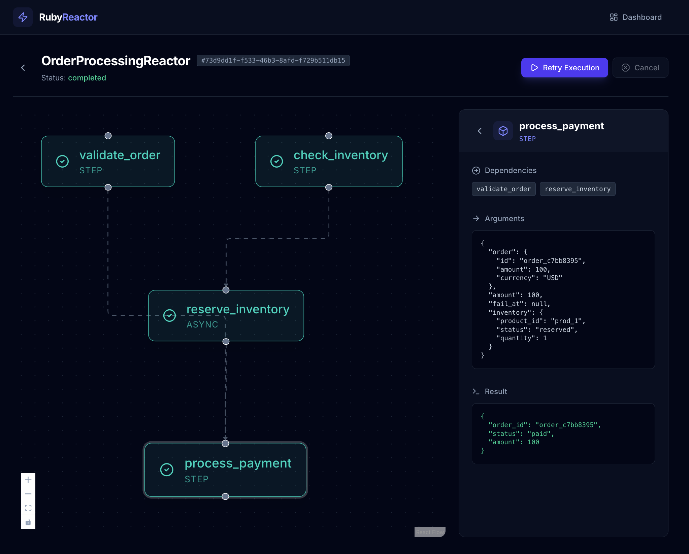
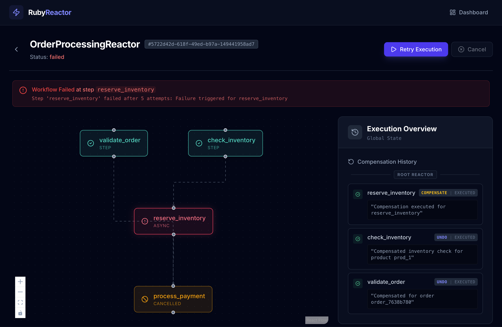

[](https://badge.fury.io/rb/ruby_reactor)
[](https://github.com/arturictus/ruby_reactor/actions)  <!-- if you have CI -->
[](https://github.com/rubocop/rubocop)
[](https://rubygems.org/gems/ruby_reactor)

# RubyReactor

A dynamic, dependency-resolving saga orchestrator for Ruby. Ruby Reactor implements the Saga pattern with compensation-based error handling and DAG-based execution planning. It leverages **Sidekiq** for asynchronous execution and **Redis** for state persistence.



## Why Ruby Reactor?

Building complex business transactions often results in spaghetti code or brittle "god classes." Ruby Reactor solves this by implementing the **Saga Pattern** in a lightweight, developer-friendly package. It lets you define workflows as clear, dependency-driven steps without the boilerplate of heavy enterprise frameworks.

The key value is **Reliability**: if any part of your workflow fails, Ruby Reactor automatically triggers compensation logic to undo previous steps, ensuring your system never ends up in a corrupted half-state. Whether you're coordinating microservices or monolith modules, you get atomic-like consistency with background processing built-in.

## Features

- **DAG-based Execution**: Steps are executed based on their dependencies, allowing for parallel execution of independent steps.
- **Async Execution**: Steps can be executed asynchronously in the background using Sidekiq.
- **Map & Parallel Execution**: Iterate over collections in parallel with the `map` step, distributing work across multiple workers.
- **Retries**: Configurable retry logic for failed steps, with exponential backoff.
- **Compensation**: Automatic rollback of completed steps when a failure occurs.
- **Interrupts**: Pause and resume workflows to wait for external events (webhooks, user approvals).
- **Input Validation**: Integrated with `dry-validation` for robust input checking.
- **Distributed Locks, Semaphores, Rate Limits & Periods**: Coordinate across processes with Redis-backed primitives — exclusive locks for at-most-one-runner, semaphores for capacity caps, fixed-window rate limits for external APIs (single or multi-window like "3/sec AND 100/min"), and `with_period` to dedup reactors to once per calendar bucket (once per day/month/year/etc). Async jobs snooze on contention with smart `retry_after` instead of consuming retry budget.

## Comparison

| Feature                  | Ruby Reactor | dry-transaction | Trailblazer | Custom Sidekiq Jobs |
|--------------------------|--------------|-----------------|-------------|---------------------|
| DAG/Parallel execution   | Yes          | No              | Limited     | Manual              |
| Auto compensation/undo   | Yes          | No              | Manual      | Manual              |
| Interrupts (pause/resume)| Yes          | No              | No          | Manual              |
| Locks / sem / rate / per | Yes          | No              | No          | Manual              |
| Built-in web dashboard   | Yes          | No              | No          | No                  |
| Async with Sidekiq       | Yes          | No              | Limited     | Yes                 |

## Real-World Use Cases

- **E-commerce Checkout**: Orchestrate inventory reservation, payment authorization, and shipping label generation. If payment fails, automatically release inventory and cancel the shipping request.
- **Data Import Pipelines**: Ingest optional massive CSVs using `map` steps to validate and upsert records in parallel. If data validation fails for a chunk, fail fast or collect errors while letting valid chunks succeed.
- **Subscription Billing**: Coordinate Stripe charges, invoice email generation, and internal entitlement updates. Use interrupts to pause the workflow when 3rd-party APIs are required to continue the workflow or when specific customer approval is needed.

## Table of Contents
- [Features](#features)
- [Comparison](#comparison)
- [Real-World Use Cases](#real-world-use-cases)
- [Installation](#installation)
- [Configuration](#configuration)
- [Quick Start](#quick-start)
- [Web Dashboard](#web-dashboard)
  - [Rails Installation](#rails-installation)
- [Usage](#usage)
  - [Basic Example: User Registration](#basic-example-user-registration)
  - [Async Execution](#async-execution)
    - [Full Reactor Async](#full-reactor-async)
    - [Step-Level Async](#step-level-async)
  - [Interrupts (Pause & Resume)](#interrupts-pause--resume)
  - [Locks & Semaphores](#locks--semaphores)
  - [Map & Parallel Execution](#map--parallel-execution)
    - [Map with Dynamic Source (ActiveRecord)](#map-with-dynamic-source-activerecord)
  - [Input Validation](#input-validation)
  - [Complex Workflows with Dependencies](#complex-workflows-with-dependencies)
  - [Error Handling and Compensation](#error-handling-and-compensation)
  - [Using Pre-defined Schemas](#using-pre-defined-schemas)
  - [Testing](#testing)
- [Documentation](#documentation)
- [Future improvements](#future-improvements)
- [Development](#development)
- [Contributing](#contributing)
- [Code of Conduct](#code-of-conduct)

## Installation

Add this line to your application's Gemfile:

```ruby
gem 'ruby_reactor'
```

And then execute:

    $ bundle install

Or install it yourself as:

    $ gem install ruby_reactor

## Configuration

Configure RubyReactor with your Sidekiq and Redis settings:

```ruby
RubyReactor.configure do |config|
  # Redis configuration for state persistence
  config.storage.adapter = :redis
  config.storage.redis_url = ENV.fetch("REDIS_URL", "redis://localhost:6379/0")
  config.storage.redis_options = { timeout: 1 }

  # Sidekiq configuration for async execution
  config.sidekiq_queue = :default
  config.sidekiq_retry_count = 3

  # Lock contention snooze behavior for async reactors. When a Sidekiq worker
  # cannot acquire a lock or semaphore, it re-enqueues itself with this delay
  # (plus jitter) up to `lock_snooze_max_attempts` times before giving up.
  config.lock_snooze_base_delay = 5
  config.lock_snooze_jitter = 5
  config.lock_snooze_max_attempts = 20

  # Logger configuration
  config.logger = Logger.new($stdout)
end
```


## Quick Start

```ruby
class HelloReactor < RubyReactor::Reactor
  step :greet do
    run { Success("Hello from Ruby Reactor!") }
  end
  returns :greet
end

result = HelloReactor.run
puts result.value  # => "Hello from Ruby Reactor!"
```

## Web Dashboard

RubyReactor ships with a built-in web dashboard to inspect reactor executions, view logs, and retry failed steps. The dashboard is a Rack app (a [Roda](https://roda.jeremyevans.net/) application) bundled inside the gem with its pre-compiled JS/CSS assets — no extra install or asset build step is required.

### Rails Installation

Add the gem to your `Gemfile`:

```ruby
gem "ruby_reactor"
```

Then mount the dashboard in your `config/routes.rb`:

```ruby
Rails.application.routes.draw do
  # ... other routes
  mount RubyReactor::Web::Application => "/ruby_reactor"
end
```

That's it — visit `/ruby_reactor` and the UI loads. `RubyReactor::Web::Application` is autoloaded by Zeitwerk on first reference, so no extra `require` is needed.

### Rack / Sinatra / Standalone

Because it's a plain Rack app, you can mount it anywhere `call(env)` is accepted:

```ruby
# config.ru
require "ruby_reactor/web/application"
run RubyReactor::Web::Application
```



You can secure the dashboard using standard Rails authentication methods (e.g., wrapping the `mount` line in an `authenticate` block with Devise, or in a `constraints` block).

## Usage

RubyReactor allows you to define complex workflows as "reactors" with steps that can depend on each other, handle failures with compensations, and validate inputs.

### Basic Example: User Registration

```ruby
require 'ruby_reactor'

class UserRegistrationReactor < RubyReactor::Reactor
  # Define inputs with optional validation
  input :email
  input :password

  # Define steps with their dependencies
  step :validate_email do
    argument :email, input(:email)

    run do |args, context|
      if args[:email] && args[:email].include?('@')
        Success(args[:email].strip)
      else
        Failure("Email must contain @")
      end
    end
  end

  step :hash_password do
    argument :password, input(:password)

    run do |args, context|
      require 'digest'
      hashed = Digest::SHA256.hexdigest(args[:password])
      Success(hashed)
    end
  end

  step :create_user do
    # Arguments can reference results from other steps
    argument :email, result(:validate_email)
    argument :password_hash, result(:hash_password)

    run do |args, context|
      user = {
        id: rand(10000),
        email: args[:email],
        password_hash: args[:password_hash],
        created_at: Time.now
      }
      Success(user)
    end

    compensate do |error, args, context|
      Notify.to(args[:email])
      Success()
    end
  end

  step :notify_user do
    argument :email, result(:validate_email)
    wait_for :create_user

    run do |args, _context|
      Email.send!(args[:email], "verify your email")
      Success()
    end

    compensate do |error, args, context|
      Email.send("support@acme.com", "Email verification for #{args[:email]} couldn't be sent")
      Success()
    end
  end
  # Specify which step's result to return
  returns :create_user
end

# Run the reactor
result = UserRegistrationReactor.run(
  email: 'alice@example.com',
  password: 'secret123'
)

if result.success?
  puts "User created: #{result.value[:email]}"
else
  puts "Failed: #{result.error}"
end
```

### Async Execution

Execute reactors in the background using Sidekiq.

#### Full Reactor Async

```ruby
class AsyncReactor < RubyReactor::Reactor
  async true # Entire reactor runs in background

  step :long_running_task do
    run { perform_heavy_work }
  end
end

# Returns immediately with AsyncResult
result = AsyncReactor.run(params)
```

#### Step-Level Async

You can also mark individual steps as async. Execution will proceed synchronously until the first async step is encountered, at which point the reactor execution is offloaded to a background job.

```ruby
class CreateUserReactor < RubyReactor::Reactor
  input :params

  step :validate_inputs do
    run { |args| validate(args[:params]) }
  end

  step :create_user do
    argument :params, result(:validate_inputs)
    run { |args| User.create(args[:params]) }
  end

  # From here on will run async
  step :open_account do
    async true
    argument :user, result(:create_user)
    run { |args| Bank.open_account(args[:user]) }
  end

  step :report_new_user do
    async true
    argument :user, result(:create_user)
    wait_for :open_account
    run { |args| Analytics.track(args[:user]) }
  end
end

# Usage
def create(params)
   # Returns an AsyncResult immediately when 'open_account' is reached
   result = CreateUserReactor.run(params)
   
   # Access synchronous results immediately
   user = result.intermediate_results[:create_user]
   
   # do something with user
end
```

### Interrupts (Pause & Resume)

Pause execution to wait for external events like webhooks or user approvals.

```ruby
class ApprovalReactor < RubyReactor::Reactor
  step :submit_request do
    run { |args| RequestService.submit(args) }
  end

  interrupt :wait_for_manager do
    wait_for :submit_request
    # Resume using this ID
    correlation_id { |ctx| "req-#{ctx.result(:submit_request)[:id]}" }
  end

  step :process_decision do
    argument :decision, result(:wait_for_manager)
    run do |args| 
      args[:decision] == 'approved' ? Success() : Failure("Rejected")
    end
  end
end

# Usage:
# 1. Start execution
execution = ApprovalReactor.run(params) # => Returns Paused status

# 2. Later, resume it via correlation ID
ApprovalReactor.continue_by_correlation_id(
  correlation_id: "req-123",
  payload: "approved",
  step_name: :wait_for_manager
)
```

### Locks & Semaphores

Coordinate across processes with Redis-backed primitives:

- **`with_lock`** — at-most-one runner per key at a time (concurrency control).
- **`with_semaphore`** — cap total concurrent runners per key (capacity control).
- **`with_rate_limit`** — fixed-window rate limit, single or multi-window ("3/sec AND 100/min").
- **`with_period`** — run at most once per calendar bucket (dedup / once-per-day, once-per-month, etc).

```ruby
class RefundOrderReactor < RubyReactor::Reactor
  input :order_id

  # Only one refund per order at a time. Auto-extend keeps the TTL fresh while
  # the reactor runs, so long steps cannot let the lock expire mid-flight.
  with_lock(ttl: 60) { |inputs| "order:#{inputs[:order_id]}" }

  step :refund do
    argument :order_id, input(:order_id)
    run { |args| PaymentGateway.refund(args[:order_id]) }
  end
end

class GeocodeReactor < RubyReactor::Reactor
  input :address

  # At most 5 geocode calls in flight across the fleet.
  with_semaphore(limit: 5) { |inputs| "geocode_api" }

  step :geocode do
    argument :address, input(:address)
    run { |args| Geocoder.lookup(args[:address]) }
  end
end

class MonthlyBillingReactor < RubyReactor::Reactor
  input :org_id

  # Run at most once per UTC month per org. Subsequent calls in the same month
  # return RubyReactor::Skipped without executing any step. Pair with
  # with_lock for strict at-most-one even under concurrent racers.
  with_period(every: :month) { |inputs| "monthly_billing:#{inputs[:org_id]}" }

  step :build do
    argument :org_id, input(:org_id)
    run { |args| Billing.generate(args[:org_id]) }
  end
end

class ChargeReactor < RubyReactor::Reactor
  input :account_id

  # Respect upstream Stripe rate limits: 3/sec and 100/min.
  # Async workers snooze for exactly retry_after seconds instead of
  # consuming Sidekiq retry budget.
  with_rate_limit(
    limits: { second: 3, minute: 100 }
  ) { |inputs| "stripe:#{inputs[:account_id]}" }

  step :charge do
    argument :account_id, input(:account_id)
    run { |args| Stripe.charge(args[:account_id]) }
  end
end
```

On contention:

- **Inline** (`Reactor.run`) raises `RubyReactor::Lock::AcquisitionError` / `RubyReactor::Semaphore::AcquisitionError` / `RubyReactor::RateLimit::ExceededError`.
- **Async** (Sidekiq) snoozes the job via `perform_in(delay, ...)`. For rate limits the delay is the error's `retry_after_seconds` (precise wakeup); for locks/semaphores it's `lock_snooze_base_delay + jitter`. Snoozes do not count against the Sidekiq retry budget. After `lock_snooze_max_attempts` snoozes the context is marked failed.

On dedup hits (period gate already marked), the reactor returns a `RubyReactor::Skipped` result instead — no steps run, no exception:

```ruby
result = MonthlyBillingReactor.run(org_id: 42)
result.success?  # true (Skipped is a Success subclass)
result.skipped?  # true on dedup hit, false otherwise
```

A step's `run` block can also return `RubyReactor.Skipped(reason: "...")` to halt the reactor cleanly — remaining steps don't execute, **and already-completed steps are NOT compensated**. Use it when the rest of the workflow is unnecessary and partial progress should be kept (`Failure` is for "stop and roll back").

```ruby
step :ensure_active do
  argument :user, result(:fetch_user)
  run do |args|
    next RubyReactor.Skipped(reason: "user_opted_out") if args[:user].opted_out?
    RubyReactor.Success(args[:user])
  end
end
```

See [Locks, Semaphores, Rate Limits & Periods](documentation/locks_and_semaphores.md) for re-entrancy, auto-extend, multi-window quotas, bucket semantics, owner identity, snooze tuning, and operational notes.

### Map & Parallel Execution

Process collections in parallel using the `map` step:

```ruby
class DataProcessingReactor < RubyReactor::Reactor
  input :items

  map :process_items do
    source input(:items)
    argument :item, element(:process_items)
    
    # Enable async execution with batching
    async true, batch_size: 50

    step :transform do
      argument :item, input(:item)
      run { |args| transform_item(args[:item]) }
    end

    returns :transform
  end
end
```

By using `async true` with `batch_size`, the system applies **Back Pressure** to efficiently manage resources. [Read more about Back Pressure & Resource Management](documentation/data_pipelines.md#back-pressure--resource-management).

`batch_size` is optional: with `async true` alone, RubyReactor fans out one worker per element (defaulting the batch size to the full source size) and aggregates the outcomes into a `ResultEnumerator` — convenient for small collections, but with no back pressure. See [Async Without `batch_size`](documentation/data_pipelines.md#async-without-batch_size).

#### Map with Dynamic Source (ActiveRecord)

You can use a block for `source` to dynamically fetch data, such as from ActiveRecord queries. The result is wrapped in a `ResultEnumerator` for easy access to successes and failures.

```ruby
map :archive_old_users do
  argument :days, input(:days)

  # Dynamic source using ActiveRecord
  source do |args|
    User.where("last_login_at < ?", args[:days].days.ago)
  end
  
  argument :user, element(:archive_old_users)
  async true, batch_size: 100

  step :archive do
    argument :user, input(:user)
    run { |args| args[:user].archive! }
  end
  
  returns :archive
end

step :summary do
  argument :results, result(:archive_old_users)
  run do |args|
    puts "Archived: #{args[:results].successes.count}"
    puts "Failed: #{args[:results].failures.count}"
    Success()
  end
end
```

### Input Validation

RubyReactor integrates with dry-validation for input validation:

```ruby
class ValidatedUserReactor < RubyReactor::Reactor
  input :name do
    required(:name).filled(:string, min_size?: 2)
  end

  input :email do
    required(:email).filled(:string)
  end

  input :age do
    required(:age).filled(:integer, gteq?: 18)
  end

  # Optional inputs
  input :bio, optional: true do
    optional(:bio).maybe(:string, max_size?: 100)
  end

  step :create_profile do
    argument :name, input(:name)
    argument :email, input(:email)
    argument :age, input(:age)
    argument :bio, input(:bio)

    run do |args, context|
      profile = {
        name: args[:name],
        email: args[:email],
        age: args[:age],
        bio: args[:bio] || "No bio provided",
        created_at: Time.now
      }
      Success(profile)
    end
  end

  returns :create_profile
end

# Valid input
result = ValidatedUserReactor.run(
  name: "Alice Johnson",
  email: "alice@example.com",
  age: 25,
  bio: "Software developer"
)

# Invalid input - will return validation errors
result = ValidatedUserReactor.run(
  name: "A",  # Too short
  email: "",  # Empty
  age: 15     # Too young
)
```

### Complex Workflows with Dependencies

Steps can depend on results from multiple other steps:

```ruby
class OrderProcessingReactor < RubyReactor::Reactor
  input :user_id
  input :product_ids, validate: ->(ids) { ids.is_a?(Array) && ids.any? }

  step :validate_user do
    argument :user_id, input(:user_id)

    run do |args, context|
      # Check if user exists and has permission to purchase
      user = find_user(args[:user_id])
      user ? Success(user) : Failure("User not found")
    end
  end

  step :validate_products do
    argument :product_ids, input(:product_ids)

    run do |args, context|
      products = args[:product_ids].map { |id| find_product(id) }
      if products.all?
        Success(products)
      else
        Failure("Some products not found")
      end
    end
  end

  step :calculate_total do
    argument :products, result(:validate_products)

    run do |args, context|
      total = args[:products].sum { |p| p[:price] }
      Success(total)
    end
  end

  step :check_inventory do
    argument :products, result(:validate_products)

    run do |args, context|
      available = args[:products].all? { |p| p[:stock] > 0 }
      available ? Success(true) : Failure("Out of stock")
    end
  end

  step :process_payment do
    argument :user, result(:validate_user)
    argument :total, result(:calculate_total)

    run do |args, context|
      # Process payment logic here
      payment_id = process_payment(args[:user][:id], args[:total])
      Success(payment_id)
    end

    undo do |error, args, context|
      # Refund payment on failure
      refund_payment(args[:payment_id])
      Success()
    end
  end

  step :create_order do
    argument :user, result(:validate_user)
    argument :products, result(:validate_products)
    argument :payment_id, result(:process_payment)

    run do |args, context|
      order = create_order_record(args[:user], args[:products], args[:payment_id])
      Success(order)
    end

    undo do |error, args, context|
      # Cancel order and update inventory
      cancel_order(args[:order][:id])
      Success()
    end
  end

  step :update_inventory do
    argument :products, result(:validate_products)

    run do |args, context|
      args[:products].each { |p| decrement_stock(p[:id]) }
      Success(true)
    end

    undo do |error, args, context|
      # Restock products
      args[:products].each { |p| increment_stock(p[:id]) }
      Success()
    end
  end

  step :send_confirmation do
    argument :user, result(:validate_user)
    argument :order, result(:create_order)

    run do |args, context|
      send_email(args[:user][:email], "Order confirmed", order_details(args[:order]))
      Success(true)
    end
  end

  returns :send_confirmation
end
```

### Error Handling and Compensation

When a step fails, RubyReactor automatically undoes completed steps in reverse order, compensate only runs in the failing step and backwalks the executed steps undo blocks:

```ruby
class TransactionReactor < RubyReactor::Reactor
  input :from_account
  input :to_account
  input :amount

  step :validate_accounts do
    argument :from_account, input(:from_account)
    argument :to_account, input(:to_account)

    run do |args, context|
      from = find_account(args[:from_account])
      to = find_account(args[:to_account])

      if from && to && from != to
        Success({from: from, to: to})
      else
        Failure("Invalid accounts")
      end
    end
  end

  step :check_balance do
    argument :accounts, result(:validate_accounts)
    argument :amount, input(:amount)

    run do |args, context|
      if args[:accounts][:from][:balance] >= args[:amount]
        Success(args[:accounts])
      else
        Failure("Insufficient funds")
      end
    end
  end

  step :debit_account do
    argument :accounts, result(:check_balance)
    argument :amount, input(:amount)

    run do |args, context|
      debit(args[:accounts][:from][:id], args[:amount])
      Success(args[:accounts])
    end

    undo do |error, args, context|
      # Credit the amount back
      credit(args[:accounts][:from][:id], args[:amount])
      Success()
    end
  end

  step :credit_account do
    argument :accounts, result(:debit_account)
    argument :amount, input(:amount)

    run do |args, context|
      credit(args[:accounts][:to][:id], args[:amount])
      Success({transaction_id: generate_transaction_id()})
    end

    undo do |error, args, context|
      # Debit the amount back from recipient
      debit(args[:accounts][:to][:id], args[:amount])
      Success()
    end
  end

  step :notify do
    argument :accounts, result(:validate_accounts)
    wait_for :credit_account, :debit_account

    run do |args, context|
      Notify.to(args[:accounts][:from])
      Notify.to(args[:accounts][:to])
    end
     
  end

  returns :credit_account
end

# If credit_account fails, RubyReactor will:
# 1. Compensate credit_account (debit the recipient)
# 2. Undo debit_account (credit the sender)
# Result: Complete rollback of the transaction
```

### Using Pre-defined Schemas

You can use existing dry-validation schemas:

```ruby
require 'dry/schema'

user_schema = Dry::Schema.Params do
  required(:user).hash do
    required(:name).filled(:string, min_size?: 2)
    required(:email).filled(:string)
    optional(:phone).maybe(:string)
  end
end

class SchemaValidatedReactor < RubyReactor::Reactor
  input :user, validate: user_schema

  step :process_user do
    argument :user, input(:user)

    run do |args, context|
      Success(args[:user])
    end
  end

  returns :process_user
end
```

### Testing

RubyReactor provides testing utilities for RSpec. See the [Testing with RSpec](documentation/testing.md) guide for comprehensive documentation.

```ruby
RSpec.describe PaymentReactor do
  it "processes payment successfully" do
    subject = test_reactor(PaymentReactor, order_id: 123, amount: 99.99)
    
    expect(subject).to be_success
    expect(subject).to have_run_step(:charge_card).after(:validate_order)
    expect(subject.step_result(:charge_card)).to include(status: "completed")
  end

  it "handles payment failures with mocked steps" do
    subject = test_reactor(PaymentReactor, order_id: 123, amount: 99.99)
      .mock_step(:charge_card) { Failure("Card declined") }
    
    expect(subject).to be_failure
    expect(subject.error).to include("Card declined")
  end
end
```

## Documentation

For detailed documentation, see the following guides:

### [Core Concepts](documentation/core_concepts.md)
Learn about the fundamental building blocks of RubyReactor: Reactors, Steps, Context, and Results. Understand how steps are defined, how data flows between them, and how the context maintains state throughout execution.

### [DAG (Directed Acyclic Graph)](documentation/DAG.md)
Deep dive into how RubyReactor manages dependencies. This guide explains how the Directed Acyclic Graph is constructed to ensure steps execute in the correct topological order, enabling automatic parallelization of independent steps.

### [Async Reactors](documentation/async_reactors.md)
Explore the two asynchronous execution models: Full Reactor Async and Step-Level Async. Learn how RubyReactor leverages Sidekiq for background processing, non-blocking execution, and scalable worker management.

### [Composition](documentation/composition.md)
Discover how to build complex, modular workflows by composing reactors within other reactors. This guide covers inline composition, class-based composition, and how to manage dependencies between composed workflows.

### [Data Pipelines](documentation/data_pipelines.md)
Master the `map` feature for processing collections. Learn about parallel execution, batch processing for large datasets, and error handling strategies like fail-fast vs. partial result collection.

### [Retry Configuration](documentation/retry_configuration.md)
Configure robust retry policies for your steps. This guide details the available backoff strategies (exponential, linear, fixed), how to configure retries at the reactor or step level, and how async retries work without blocking workers.

### [Interrupts](documentation/interrupts.md)
Learn how to pause and resume reactors to handle long-running processes, manual approvals, and asynchronous callbacks. Patterns for correlation IDs, timeouts, and payload validation.

### [Testing with RSpec](documentation/testing.md)
Comprehensive guide to testing reactors with RubyReactor's testing utilities. Learn about the `TestSubject` class for reactor execution and introspection, step mocking for isolating dependencies, testing nested and composed reactors, and custom RSpec matchers like `be_success`, `have_run_step`, and `have_retried_step`.

### [Locks, Semaphores, Rate Limits & Periods](documentation/locks_and_semaphores.md)

Coordinate access to shared resources across processes with Redis-backed primitives: exclusive locks (`with_lock`), concurrency-limiting semaphores (`with_semaphore`), fixed-window rate limits with multi-window quotas (`with_rate_limit`), and calendar-bucketed dedup (`with_period`, returning `Skipped` results). Covers re-entrancy across composed reactors, TTL auto-extend, inline-vs-async contention behavior, smart `retry_after` snoozes for rate limits, snooze tuning, the token-based semaphore safety model, and once-per-day/month/year scheduling patterns.

### Examples
- [Order Processing](documentation/examples/order_processing.md) - Complete order processing workflow example
- [Payment Processing](documentation/examples/payment_processing.md) - Payment handling with compensation
- [Inventory Management](documentation/examples/inventory_management.md) - Inventory management system example

## Future improvements

- [X] Global id to serialize ActiveRecord classes
- [X] Descriptive errors
- [X] `map` step to iterate over arrays in parallel
- [X] `compose` special step to execute reactors as step
- [X] `interrupt` to pause and resume reactors
- [ ] Middlewares
- [ ] Async ruby to parallelize same level steps
- [x] Web dashboard to inspect reactor results and errors
- [ ] Multiple storage adapters
  - [X] Redis
  - [ ] ActiveRecord
- [ ] Multiple Async adapters
  - [X] Sidekiq
  - [ ] ActiveJob
- [ ] OpenTelemetry support
- [X] locks

## Development

After checking out the repo, run `bin/setup` to install dependencies. Then, run `rake spec` to run the tests. You can also run `bin/console` for an interactive prompt that will allow you to experiment.

To install this gem onto your local machine, run `bundle exec rake install`. To release a new version, update the version number in `version.rb`, and then run `bundle exec rake release`, which will create a git tag for the version, push git commits and the created tag, and push the `.gem` file to [rubygems.org](https://rubygems.org).

### Running Redis for the test suite

The gem's RSpec suite expects Redis on port `6780` (see [spec/spec_helper.rb](spec/spec_helper.rb)). Start it via Docker Compose:

```bash
docker compose up -d redis-test
```

Then run the suite:

```bash
bundle exec rspec
```

Stop it when done:

```bash
docker compose stop redis-test
```

### Running the demo Rails app

The demo Rails app under [demo_app/](demo_app/) has its own Redis (port `6380`) and bind-mounts the repo so edits to `lib/` are live. Two ways to run it:

**Option A — fully containerized (Redis + Rails + Sidekiq):**

```bash
docker compose up demo-redis demo-app demo-sidekiq
```

App available at <http://localhost:3789>.

**Option B — Redis in Docker, Rails on host:**

```bash
docker compose up -d demo-redis

cd demo_app
bin/rails db:prepare
REDIS_URL=redis://localhost:6380/1 bin/rails server
# in another shell, if you need Sidekiq:
REDIS_URL=redis://localhost:6380/1 bundle exec sidekiq
```

To run the demo app specs:

```bash
cd demo_app
bundle exec rspec
```

Tear everything down:

```bash
docker compose down          # stop containers
docker compose down -v       # also remove demo_redis_data + bundle_cache volumes
```

## Contributing

Bug reports and pull requests are welcome on GitHub at https://github.com/arturictus/ruby_reactor. This project is intended to be a safe, welcoming space for collaboration, and contributors are expected to adhere to the [code of conduct](https://github.com/arturictus/ruby_reactor/blob/main/CODE_OF_CONDUCT.md).

## Code of Conduct

Everyone interacting in the RubyReactor project's codebases, issue trackers, chat rooms and mailing lists is expected to follow the [code of conduct](https://github.com/arturictus/ruby_reactor/blob/main/CODE_OF_CONDUCT.md).
