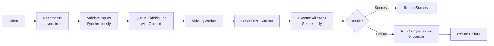
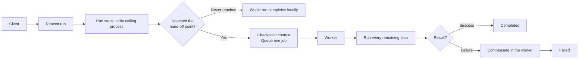

# Async Reactors

RubyReactor supports four ways to move work off the calling process: **Full Reactor Async** (the whole reactor runs in a worker), **Background Hand-off** (`background after:` / `before:` — one declared cut point, after which the rest of the reactor runs in a worker), **`async_step`** (one step's work as its own job, while the reactor keeps going), and **`async_reactor`** (a whole nested reactor running independently). Both models use Sidekiq for background processing with non-blocking retry mechanisms.

## Overview

Async execution provides several benefits:

- **Non-blocking**: Workers are freed during retry delays
- **Scalable**: Better resource utilization with large worker pools
- **Reliable**: Automatic retry with configurable backoff strategies
- **Observable**: Full visibility into execution state and retry attempts

## Full Reactor Async

When a reactor is marked as `async true`, the entire execution happens in a Sidekiq worker, including input validation.

### Configuration

```ruby
class OrderProcessingReactor < RubyReactor::Reactor
  async true  # Enable full reactor async

  step :validate_order do
    run { validate_order_logic }
  end

  step :process_payment do
    run { process_payment_logic }
  end

  step :send_confirmation do
    run { send_confirmation_logic }
  end
end
```

### Execution Flow

```ruby
# Synchronous call returns immediately
async_result = OrderProcessingReactor.run(order_id: 123)

# Check status later
case async_result.status
when :pending
  puts "Execution is queued"
when :running
  puts "Execution is in progress"
when :success
  puts "Execution completed successfully"
  result = async_result.result
when :failed
  puts "Execution failed: #{async_result.error}"
end
```

### Architecture



```
Client → Reactor.run() → Queue Job → Sidekiq Worker → Execute All Steps
```

## Background Hand-off (`background`)

A reactor can name **one** point where execution stops running in the caller's
process and is handed to a worker. Everything before it runs in the caller;
everything after it runs in a single background job.

The cut point is nameable from either side:

```ruby
class OrderProcessingReactor < RubyReactor::Reactor
  step :validate_order, ValidateOrderStep do
    argument :order_id, input(:order_id)
  end

  step :process_payment do
    run { |args, _ctx| process_payment_logic(args) }
  end

  step :update_inventory do
    run { |args, _ctx| update_inventory_logic(args) }
  end

  # :validate_order is the LAST step to run in the calling process.
  background after: :validate_order
end
```

```ruby
  # :process_payment is the FIRST step to run in the worker.
  # In this linear chain, identical to `after: :validate_order`.
  background before: :process_payment
```

**Which step does each form pin?**

| Form | Guarantee about the step it names |
|---|---|
| `after: :x` | `:x` runs in the calling process, and is the last to do so |
| `before: :x` | `:x` runs in the worker, and is the first to do so; it never runs in the caller |

In a linear chain the two coincide. **In a DAG they do not** — if `:audit` and
`:ship` both depend on `:prepare` and neither depends on the other, then
`after: :audit` keeps `:audit` local and sends `:ship` to the worker, while
`before: :ship` does the reverse. Pick whichever step you actually need pinned.

> **Migrating from `async true`:** the per-step `async` flag has been removed. It
> was ambiguous — only the **first** flagged step in a reactor ever took effect
> and every later one was silently ignored. Using it now raises at class-definition
> time. The exact replacement for a flagged step `:x` is `background before: :x`,
> which reproduces the old behavior precisely (`:x` and everything after it move
> to the worker). The same applies to `async` inside a `compose` block.

### Rules (all enforced at class-definition time)

- At most one `background` declaration per reactor.
- Exactly one of `after:` / `before:` — both, or neither, raises.
- The named step must already be defined in the class.
- `background` cannot be combined with whole-reactor `async true`: the reactor
  already runs entirely in a worker, so a cut point inside it would be
  meaningless.

### Runtime behavior

- The trigger is **reaching the named step**, not the declaration's lexical
  position — put `background` anywhere in the class body.
- A step skipped by a `where` / `guard` never triggers the hand-off; the run
  simply completes in the calling process. No step is stranded, because the
  hand-off only ever relocates work that has not run yet.
- In a DAG, any independent step that became ready and executed before the
  trigger fired has already run locally. Everything not yet executed at the
  trigger moment moves to the worker.
- Compensation is unchanged. A worker-side failure compensates exactly as a
  same-process failure does — `background` changes *where* code runs, never the
  saga contract.
- Inside the worker the hand-off never re-triggers.
- `before:` naming the very first step is legal, and is **not** the same as
  whole-reactor `async true`: input validation still happens in the calling
  process, so invalid inputs fail the caller synchronously.

### Execution flow

```ruby
# Runs :validate_order here, then hands off.
async_result = OrderProcessingReactor.run(order_id: 123)
async_result.execution_id # => reload later to inspect the outcome
```



## `async_step` — one step, dispatched on its own

`background` relocates the *rest* of a reactor. `async_step` is different: it
dispatches **one step's work** to its own job and lets the reactor keep running
every other ready step in the calling process.

```ruby
class SignupReactor < RubyReactor::Reactor
  input :email

  async_step :send_email do
    argument :to, input(:email)
    run { |args| Mailer.welcome(args[:to]).deliver_now; Success(:sent) }
  end

  # Does NOT wait for :send_email — it has no dependency on it.
  step :record_signup do
    argument :email, input(:email)
    run { |args| Success(Signup.create!(email: args[:email])) }
  end

  # DOES wait, because it reads the result.
  step :confirm_delivery do
    argument :delivery, result(:send_email)
    run { |args| Success("confirmed #{args[:delivery]}") }
  end
end
```

`async_step` takes the same block DSL as `step` — `argument`, `run`,
`compensate`, `undo`, `retries`, `validate_args`, `validate_output` all behave
identically. Only *where the body runs* changes.

### Reading the result

Referencing `result(:async_step_name)` is what makes a step wait. The wait is a
**notified wait**: the finishing worker writes its durable outcome and then
publishes a completion signal, and the waiting step wakes on that signal (with a
coarse fallback re-check in case the signal is lost). It is always bounded by
`RubyReactor.configuration.async_wait_timeout` (default 30s) — never an
unbounded wait.

- On **success**, the reader receives the same raw value a same-process step
  would have produced.
- On **failure**, the reader receives the `Failure` **object itself**. A
  same-process failure would have halted the reactor before any reader ran, so
  there is no synchronous behavior to mirror — handing over the `Failure` is what
  lets the reader inspect it and decide.

```ruby
step :confirm_delivery do
  argument :delivery, result(:send_email)
  run do |args|
    if args[:delivery].is_a?(RubyReactor::Failure)
      Failure(args[:delivery].error)  # opt in: this fails the reactor and compensates
    else
      Success(args[:delivery])
    end
  end
end
```

### Compensation is opt-in

**If an `async_step` fails and nothing reads its result, the reactor is not
compensated.** This is deliberate, not a gap: the unit was dispatched precisely
so the reactor would not depend on it. A later step that reads the result and
returns `Failure` triggers compensation normally — so no failure is ever
unrecoverable, it is just not automatic.

`compensate` / `undo` blocks declared on an `async_step` still register; they run
only if the failure is surfaced into the parent's compensation path this way.

### Other behavior

- `returns :async_step_name` raises at class-definition time — a reactor's return
  value must come from a step that ran in the calling process.
- Dispatch is **not** suppressed inside a worker: an `async_step` declared after
  a `background` point still gets its own job there.
- The step's work runs **outside** the reactor's `lock` / `semaphore` /
  `rate_limit` windows — those are held by the process running the reactor's own
  steps. A step body needing mutual exclusion must arrange it itself.
- A reference is recorded on the parent's context and rendered as an
  `async_step` node in the dashboard.
- On recovery, a dispatch that already happened is **re-attached**, never
  re-dispatched: the durable record written before the enqueue is also the
  re-attach marker, so a crash cannot duplicate the side effect.

## `async_reactor` — a whole nested reactor, running independently

```ruby
class SignupReactor < RubyReactor::Reactor
  input :user_id

  # Fire-and-forget: nothing reads it, so its failure never affects this reactor.
  async_reactor :backfill_profile, ProfileBackfillReactor do
    argument :user_id, input(:user_id)
  end

  async_reactor :provision_account, AccountProvisioningReactor do
    argument :user_id, input(:user_id)
  end

  step :verify do
    argument :account, result(:provision_account)   # blocks until the child is terminal
    run do |args|
      args[:account].success? ? Success(args[:account].value) : Failure(args[:account].error)
    end
  end
end
```

The child runs as an ordinary, independently addressable reactor execution. It is
linked to the parent by execution id — visible and drillable in the dashboard —
but **excluded from the parent's compensation graph**, on the same opt-in model
as `async_step`. A reader receives the child's real `Success` / `Failure`, not
the enqueue-time `AsyncResult`.

See [Composition](composition.md) for when to reach for `compose` instead.

### Dispatch-time safeguards

Dispatch reuses the full pre-enqueue sequence of a top-level async run rather
than a raw enqueue, because three things matter before the child exists:

1. **The child's inputs are validated**, in the parent's process. The worker's
   resume path never validates, so skipping this would start a child on garbage.
   A validation failure fails **the dispatching step** — normal saga handling in
   the parent, deliberately distinct from the child's own execution failing.
2. **An ordering nonce is assigned** if the child declares `with_ordered_lock`,
   so ordering matches caller order rather than worker pickup order.
3. **The child's context is persisted** before the job is enqueued.

### Locks across the async boundary

**Lock ownership is never shared between a parent and an `async_reactor` child.**
The two run concurrently, so sharing an owner would put both inside the critical
section at once — mutual exclusion silently broken, which is worse than a stall.
Owner-based reentrancy remains a `compose`-only property.

That leaves one guaranteed deadlock, and it is caught at **dispatch time**: if
the child declares an exclusive `lock` (or a `semaphore` with `limit: 1`) whose
resolved key matches one the dispatching execution currently holds, the dispatch
step fails immediately with an error naming the key and both reactors. Fix it, in
order of preference:

1. **Use `compose`** if the child belongs inside the parent's critical section
   and its result is needed — waiting for it means the work is sequential anyway.
2. **Narrow the lock keys**, if parent and child actually protect different
   resources.
3. **Restructure** so the locked reactor never reads the child's result —
   fire-and-forget, verifying in the child itself or in a successor reactor
   outside the lock window.

Transitive cycles across separate executions are out of the guard's reach.
Acquire keys in a consistent order; the `async_wait_timeout` bound is the backstop.

### Other behavior

- A child **paused at an interrupt is not terminal**. A reader keeps waiting and
  hits the timeout unless the child is resumed within the bound.
- `returns :async_reactor_name` raises at class-definition time.
- The child is an ordinary recoverable execution — the existing sweeper and
  durability machinery cover its crash recovery with no new mechanism.

## Waiting on dispatched work

Both `async_step` and `async_reactor` results are read through the same
`result(:name)` helper, and both use the same bounded notified wait:

| Knob | Default | Meaning |
|---|---|---|
| `RubyReactor.configuration.async_wait_timeout` | `30` (seconds) | How long a step blocks reading a dispatched result before failing with `Error::AsyncWaitTimeoutError` |

There is no per-reactor or per-reference override — one global value. The wait's
fallback re-check interval is derived from it (`timeout / 10`, clamped to 1..5s)
rather than configured; it is a latency backstop for a lost notification, not a
tuning surface.

30 seconds is chosen to comfortably exceed dispatch → worker pickup → completion
for a small unit under a healthy queue, while staying under the request and job
timeouts of typical hosts, so a stuck wait fails loudly on your terms instead of
being killed from outside. Raise it if your dispatched work is legitimately
slower.

Reading a **synchronous** step's result is completely unaffected — the wait only
engages for a name the context carries an async reference for.

## Retry Configuration

Both async models support sophisticated retry mechanisms with non-blocking job requeuing.

### Step-Level Retry

```ruby
class PaymentProcessingReactor < RubyReactor::Reactor
  async true

  step :validate_payment do
    retries max_attempts: 3, backoff: :exponential, base_delay: 1.second
    run { validate_payment_logic }
  end

  step :charge_card, async: true do
    retries max_attempts: 5, backoff: :linear, base_delay: 5.seconds
    run { charge_card_logic }
  end

  step :update_records do
    # No retry - critical step
    run { update_records_logic }
  end
end
```

### Reactor-Level Defaults

```ruby
class PaymentProcessingReactor < RubyReactor::Reactor
  async true

  # Set defaults for all steps
  retry_defaults max_attempts: 3, backoff: :exponential, base_delay: 2.seconds

  step :validate_payment do
    # Inherits reactor defaults (3 attempts, exponential backoff)
    run { validate_payment_logic }
  end

  step :charge_card do
    # Override defaults for this step
    retries max_attempts: 5, backoff: :linear, base_delay: 10.seconds
    run { charge_card_logic }
  end
end
```

## Retry Strategies

### Backoff Algorithms

- **`:exponential`**: Delay doubles with each attempt (1s, 2s, 4s, 8s...)
- **`:linear`**: Delay increases linearly (5s, 10s, 15s, 20s...)
- **`:fixed`**: Same delay for each attempt (5s, 5s, 5s, 5s...)

## Error Handling and Compensation

Async reactors support full compensation and rollback in the worker context:

```ruby
class OrderProcessingReactor < RubyReactor::Reactor
  async true

  step :process_payment do
    run { process_payment_logic }

    undo do |payment_id:, **|
      # Runs in worker if execution fails later
      PaymentService.refund(payment_id)
    end

    compensate do |payment_id:, **|
      # Runs in worker if execution fails later
      PaymentService.refund(payment_id)
    end
  end

  step :update_inventory do
    run { update_inventory_logic }

    compensate do |order:, **|
      # Runs in worker on failure
      InventoryService.restore(order)
    end
  end
end
```

## Monitoring and Observability

### Job Visibility

Retries are visible in Sidekiq web UI with:
- Step name and attempt number
- Retry delay and timing
- Success/failure status
- Execution context

## Configuration

### Sidekiq Worker Setup

```ruby
# config/sidekiq.rb
require 'ruby_reactor/worker'

RubyReactor.configure do |config|
  config.sidekiq_queue = :default
  config.sidekiq_retry_count = 3
  config.logger = Logger.new('log/ruby_reactor.log')
end
```

## Performance Considerations

### Worker Pool Sizing

- **Full Reactor Async**: Size pool based on total reactor throughput
- **Background Hand-off / `async_step` / `async_reactor`**: size the pool for how often work is dispatched

### Context Size Limits

- Redis has job size limits (~512MB)
- TODO: Large contexts are automatically compressed
- Consider external storage for very large execution states

### Monitoring Metrics

Track these key metrics:
- Retry attempt counts per step
- Average retry delays
- Success rates after retries
- Worker utilization during peak loads
