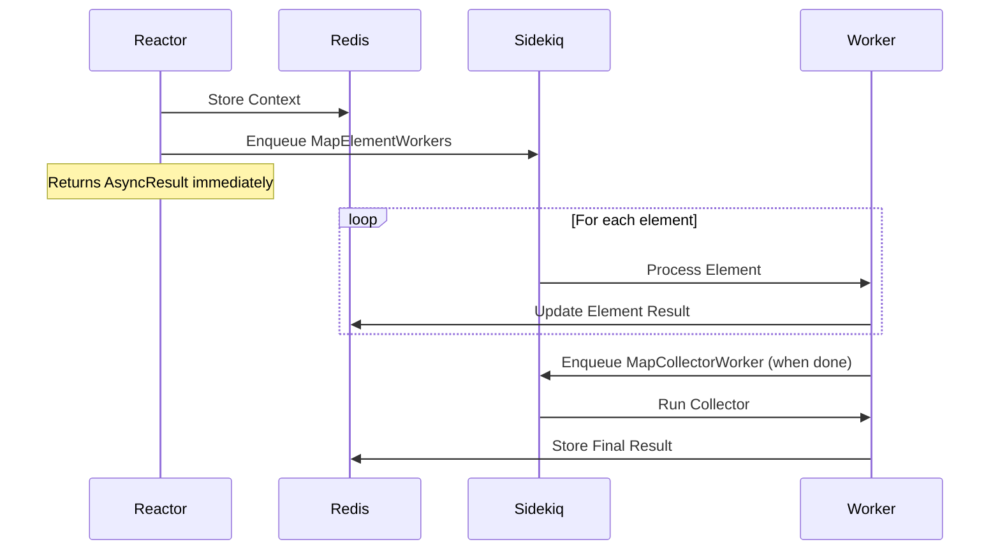
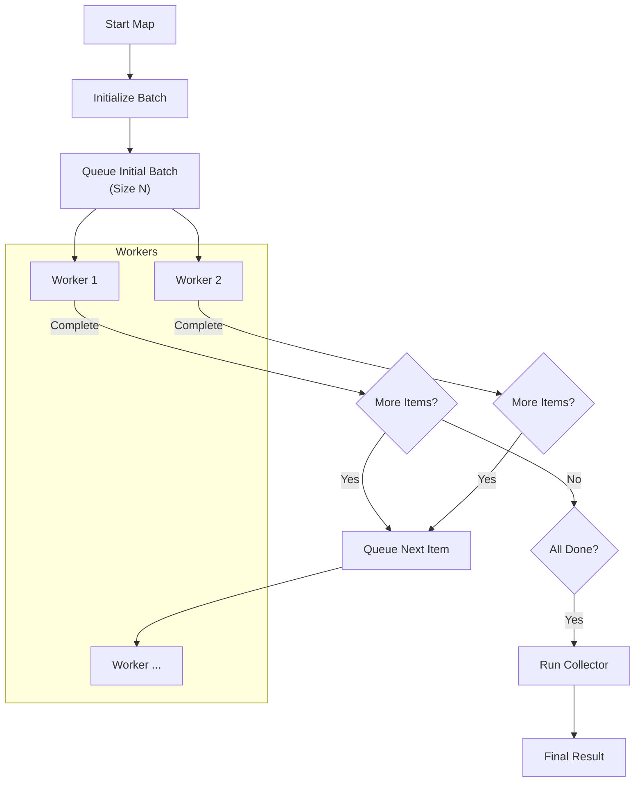

# Data Pipelines

RubyReactor provides powerful data pipeline capabilities through the `map` feature, allowing you to process collections of data efficiently. This system supports both synchronous and asynchronous execution, batch processing, and robust error handling.

## Overview

The data pipeline system is built around the `map` step, which iterates over an input collection and processes each element through a defined sub-reactor or inline steps.

Key features:
- **Parallel Processing**: Execute steps asynchronously via Sidekiq
- **Batch Control**: Manage system load with configurable batch sizes
- **Error Handling**: Choose between failing fast or collecting partial results
- **Retries**: Configure granular retry policies for individual steps
- **Aggregation**: Collect and transform results after processing

## Basic Usage

The simplest form of a data pipeline is an inline `map` step that processes elements synchronously.

```ruby
class UserTransformationReactor < RubyReactor::Reactor
  input :users

  map :transformed_users do
    source input(:users)
    argument :user, element(:transformed_users)

    # Define steps to run for each element
    step :normalize do
      argument :user, input(:user)
      run do |args, _|
        user = args[:user]
        Success({
          name: user[:name].strip,
          email: user[:email].downcase
        })
      end
    end

    # The result of this step becomes the result for the element
    returns :normalize
  end
end
```

## Async Execution

For long-running or resource-intensive tasks, you can offload processing to background jobs using Sidekiq.

To enable async execution, simply add the `async true` directive to your map definition.

```ruby
map :process_orders do
  source input(:orders)
  argument :order, element(:process_orders)
  
  # Enable async execution via Sidekiq
  async true

  step :charge_card do
    argument :order, input(:order)
    run { PaymentService.charge(args[:order]) }
  end

  returns :charge_card
end
```

### Execution Flow



## Batch Processing

When processing large datasets asynchronously, you can control the parallelism using `batch_size`. This limits how many Sidekiq jobs are enqueued simultaneously, preventing system overload.

```ruby
map :bulk_import do
  source input(:records)
  argument :record, element(:bulk_import)
  
  # Process only 50 records at a time
  async true, batch_size: 50

  step :import_record do
    # ...
  end
end
```

**How it works:**
1. The system initially enqueues `batch_size` jobs.
2. As each job completes, it triggers the next job in the queue.
3. This maintains a steady stream of processing without flooding the queue.

## Error Handling

You can control how the pipeline reacts to failures using the `fail_fast` option.

### Fail Fast (Default)

By default (`fail_fast true`), the entire map operation fails immediately if any single element fails.

```ruby
map :strict_processing do
  source input(:items)
  # ...
  fail_fast true # Default
end
```

### Collecting Partial Results

If you want to process all elements regardless of failures, set `fail_fast false`. You can then use a `collect` block to handle successes and failures separately.

```ruby
map :resilient_processing do
  source input(:items)
  argument :item, element(:resilient_processing)
  
  # Continue processing even if some items fail
  fail_fast false

  step :risky_operation do
    # ...
  end

  returns :risky_operation

  # Aggregate results
  collect do |results|
    # results is an array of Result objects (Success or Failure)
    successful = results.select(&:success?).map(&:value)
    failed = results.select(&:failure?).map(&:error)

    {
      processed: successful,
      errors: failed,
      success_rate: successful.length.to_f / results.length
    }
  end
end
```

## Retry Configuration

You can configure retries for individual steps within a map. This is particularly useful for transient failures (e.g., network timeouts) in async pipelines.

```ruby
map :reliable_processing do
  source input(:urls)
  argument :url, element(:reliable_processing)
  async true

  step :fetch_data do
    argument :url, input(:url)

    # Retry up to 3 times with exponential backoff
    retries max_attempts: 3, backoff: :exponential, base_delay: 1.second

    run do |args, _|
      # If this raises or returns Failure, it will be retried
      HttpClient.get(args[:url])
    end
  end

  returns :fetch_data
end
```

### Retry Behavior

- **Async Mode**: Retries are handled by requeuing the Sidekiq job with a delay. This is non-blocking and efficient.
- **Sync Mode**: Retries happen immediately within the execution thread (blocking).

## Visualization

### Async Batch Execution


