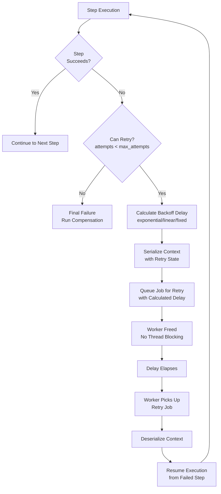

# Retry Configuration

RubyReactor provides flexible, non-blocking retry mechanisms that requeue jobs instead of blocking worker threads. Retry policies are configured per step; a step with no `retries` runs once.

## Overview

The retry system offers:

- **Non-blocking retries on Async**: Jobs are requeued with calculated delays
- **Multiple backoff strategies**: Exponential, linear, and fixed delays
- **Step-level control**: Different retry policies for different steps
- **Full observability**: Complete visibility into retry attempts

### Retry Flow Architecture



## Basic Retry Configuration

### Declaring retries on a step class (preferred)

A step class declares its retry policy next to the call it protects, the same way it declares
its inputs and locks. Every reactor that uses the step gets the policy, with no wiring:

```ruby
class ChargeCard < RubyReactor::Step
  with_lock { |i| "card:#{i[:card_token]}" }
  input :card_token, :string
  retries max_attempts: 3, backoff: :exponential, base_delay: 5.seconds

  def run = Success(PaymentService.charge(inputs[:card_token]))
end

class PaymentReactor < RubyReactor::Reactor
  background all: true
  input :card_token

  step :charge_card, ChargeCard do
    argument :card_token, input(:card_token)
  end
end
```

A subclass inherits its parent's policy; declaring `retries` in the subclass changes only the
subclass.

### Inline steps

An inline step declares `retries` in its block, with the same keywords:

```ruby
class PaymentReactor < RubyReactor::Reactor
  background all: true

  step :charge_card do
    retries max_attempts: 3, backoff: :exponential, base_delay: 5.seconds
    run { PaymentService.charge(card_token, amount) }
  end
end
```

`retries` works the same way in `async_step`, `compose` and `async_reactor` blocks.

### Where a step's policy comes from

A step's effective policy is resolved in this order:

1. `retries` in the reactor's step block;
2. otherwise `retries` on the step class (declared or inherited);
3. otherwise none: the step runs once.

The reactor itself has no retry setting. You can look the result up:

```ruby
PaymentReactor.steps[:charge_card].retry_config  # => {max_attempts: 3, backoff: :exponential, base_delay: 5}
PaymentReactor.steps[:charge_card].retry_source  # => :step_class (or :step_block, :none)
```

### One declaration per step

Declaring `retries` both on a step class and in the reactor's step block for that class is
ambiguous, so it is refused when the reactor class is defined:

```ruby
step :charge_card, ChargeCard do   # ChargeCard declares `retries`
  retries max_attempts: 5
end
# => RubyReactor::Error::ValidationError:
#    "PaymentReactor step :charge_card declares `retries` inline, but ChargeCard declares it too.
#     Keep ONE: ... To vary the policy per workflow, subclass ChargeCard and declare `retries` there."
```

To use a different policy in one workflow, subclass the step:

```ruby
class ChargeCardBatch < ChargeCard
  retries max_attempts: 10, backoff: :linear, base_delay: 1.minute
end
```

A class step that declares no `retries` can still be given a policy in the step block.

### Direct calls run once

`ChargeCard.run(args)` (or `.call`) never retries, whatever `retries` says: only a reactor
coordinates retries. A direct call runs the step once and returns its `Failure` to the caller.
This differs from locks: a direct call does take the step's `with_lock` / `with_semaphore`
declarations.

> Step-level coordination contention (`with_lock`, etc. — see [Locks, Semaphores, Rate Limits, Periods & Ordered Locks](locks_and_semaphores.md#step-scoped-coordination)) is separate from retries: a contention park has its own counter and its own bound (`lock_snooze_max_attempts`), and never consumes a step's `max_attempts`.

## Retry Parameters

`retries` with no arguments means `max_attempts: 3, backoff: :exponential, base_delay: 1`.
Values are checked when the step is declared, and an invalid one raises `ArgumentError` naming
the step, the option and the value.

### max_attempts
Maximum number of execution attempts (including the initial attempt). Must be an `Integer`
`>= 1`; `max_attempts: 1` means "never retry".

```ruby
retries max_attempts: 5  # 1 initial + 4 retries = 5 total attempts
```

### backoff
The backoff strategy for calculating delays between retry attempts.

**Options** (anything else raises `ArgumentError`):
- `:exponential` (default): Delay doubles with each attempt
- `:linear`: Delay increases linearly
- `:fixed`: Same delay for each attempt

### base_delay

The base delay for retry calculations. Can be a number (seconds) or ActiveSupport duration.
Must be `>= 0`.

```ruby
retries base_delay: 5.seconds
retries base_delay: 300  # 5 minutes in seconds
```

## Backoff Strategies

### Exponential Backoff

Delay doubles with each retry attempt. Best for external services that may be temporarily overloaded.

```ruby
retries max_attempts: 4, backoff: :exponential, base_delay: 1.second
# Delays: 1s, 2s, 4s (total: 7 seconds)
```

**Use cases:**
- API rate limiting
- Temporary service unavailability
- Network timeouts

### Linear Backoff

Delay increases linearly with each attempt. Provides predictable, gradually increasing delays.

```ruby
retries max_attempts: 4, backoff: :linear, base_delay: 5.seconds
# Delays: 5s, 10s, 15s (total: 30 seconds)
```

**Use cases:**
- Database connection issues
- Resource contention
- Gradual backpressure

### Fixed Backoff

Same delay between each retry attempt. Simplest strategy with predictable timing.

```ruby
retries max_attempts: 4, backoff: :fixed, base_delay: 10.seconds
# Delays: 10s, 10s, 10s (total: 30 seconds)
```

**Use cases:**
- Simple retry scenarios
- When timing precision matters
- Testing environments

## Idempotency

### What is Idempotency?

An operation is idempotent if executing it multiple times produces the same result as executing it once.

### Idempotent vs Non-Idempotent Operations

**Idempotent operations (safe to retry):**
- Reading data
- Updating records with same values
- Sending notifications (with deduplication)
- Idempotent API calls

**Non-idempotent operations (unsafe to retry):**
- Creating new records
- Charging payments (without deduplication)
- Sending unique messages
- File system operations

### Best Practices

1. **Design for idempotency**: Structure operations to be safely retryable
2. **Use idempotency keys**: For payments, orders, etc.
3. **Test thoroughly**: Verify retry behavior doesn't cause issues

## Advanced Configuration

### Complex Retry Scenarios

```ruby
class OrderProcessingReactor < RubyReactor::Reactor
  async true

  step :validate_order do
    # Quick validation - no `retries`, so it runs once
    run { validate_order_exists(order_id) }
  end

  step :check_inventory do
    # Inventory checks can be retried
    retries max_attempts: 5, backoff: :linear, base_delay: 1.second
    run { check_inventory_availability(order) }
  end

  step :reserve_inventory do
    # Inventory reservation - must be idempotent
    retries max_attempts: 3, backoff: :fixed, base_delay: 5.seconds
    run { InventoryService.reserve_items(order.items) }

    compensate do
      # Release reservation on failure
      InventoryService.release_reservation(order.items)
    end
  end

  step :process_payment do
    # Payment processing - critical, fewer retries
    retries max_attempts: 2, backoff: :exponential, base_delay: 10.seconds
    run { PaymentService.charge(order.total, order.card_token) }

    compensate do |payment_id:|
      # Refund on failure
      PaymentService.refund(payment_id) if payment_id
    end
  end

  step :confirm_order do
    # Final confirmation - must succeed
    retries max_attempts: 3, backoff: :exponential, base_delay: 2.seconds
    run { OrderService.mark_completed(order_id) }
  end
end
```

### Conditional Retry Logic

For more complex retry logic, you can implement custom retry handlers:

```ruby
class CustomRetryReactor < RubyReactor::Reactor
  async true

  step :call_external_api do
    retries max_attempts: 5, backoff: :exponential, base_delay: 1.second
    run do
      result = ExternalAPI.call
      # Raise specific errors based on response
      case result.status
      when 429  # Rate limited
        Failure(RateLimitError.new(result) retryable: true)
      when 500  # Server error
        Failure(ServerError.new(result) retryable: true)
      when 400  # Bad request
        Failure(ValidationError.new(result) retryable: false)
      else
        result
      end
    end
  end
end
```

## Monitoring and Observability

### Retry Metrics

Track these important metrics:

```ruby
# In your monitoring system
retry_attempt_count(step_name)
retry_success_rate(step_name)
average_retry_delay(step_name)
retry_timeout_count(step_name)
```


### Sidekiq Web UI

Retry jobs are visible in Sidekiq web interface with:
- Step name and attempt number
- Failure reason and stack trace
- Scheduled retry time
- Job arguments and context

## Performance Considerations

### Retry Storm Prevention

Avoid retry storms by:

1. **Reasonable delays**: Don't use very short base delays
2. **Limited attempts**: Set appropriate max_attempts limits
3. **Circuit breakers**: Implement circuit breaker patterns for external services
4. **Rate limiting**: Consider rate limiting at the application level

### Resource Usage

- **Worker threads**: Retries don't block workers, improving utilization
- **Memory**: Context serialization adds memory overhead
- **Redis**: Job storage and queue management
- **Database**: Potential increased load from idempotent operations

### Tuning Guidelines

```ruby
# Fast-retry scenario (API calls)
retries max_attempts: 3, backoff: :exponential, base_delay: 1.second

# Slow-retry scenario (batch processing)
retries max_attempts: 5, backoff: :linear, base_delay: 5.minutes

# Critical operations (payments)
retries max_attempts: 2, backoff: :fixed, base_delay: 30.seconds
```

## Error Types and Handling

### Retryable Errors

```ruby
class NetworkTimeoutError < StandardError
  def retryable?
    true
  end
end

class ValidationError < StandardError
  def retryable?
    false  # Don't retry validation errors
  end
end
```

## Testing Retry Behavior

### Unit Testing

```ruby
RSpec.describe PaymentReactor do
  it "retries failed payment with exponential backoff" do
    allow(PaymentService).to receive(:charge)
      .and_raise(NetworkError.new("Timeout"))
      .and_raise(NetworkError.new("Timeout"))
      .and_return(payment_result)

    expect(PaymentService).to receive(:charge).exactly(3).times

    result = PaymentReactor.run(card_token: "tok_123", amount: 100)

    expect(result).to be_success
    expect(result.step_results[:charge_card][:payment_id]).to eq("pay_123")
  end
end
```

### Integration Testing

```ruby
describe "Retry integration" do
  it "handles real Sidekiq retry scenarios" do
    # Test with actual Sidekiq worker
    Sidekiq::Testing.fake! do
      result = FailingReactor.run(input: "test")

      # Verify job was queued for retry
      expect(RubyReactor::Adapters::Sidekiq::Worker.jobs.size).to eq(1)

      # Process the retry
      RubyReactor::Adapters::Sidekiq::Worker.drain

      # Verify final success
      expect(result).to be_success
    end
  end
end
```

## Migrating from `retry_defaults`

Reactor-wide `retry_defaults` has been removed. It was snapshotted when each step was declared,
so it silently applied only to steps declared *after* the `retry_defaults` line. Calling it now
raises `RubyReactor::Error::DeprecatedDslError` when the reactor class is defined.

Move the values onto each step that should retry. A step without `retries` runs once.

```ruby
# Before
class PaymentReactor < RubyReactor::Reactor
  retry_defaults max_attempts: 3, backoff: :exponential, base_delay: 2.seconds

  step :validate_card do
    run { validate_card_details }
  end

  step :charge_card do
    run { PaymentService.charge(card_token, amount) }
  end
end

# After
class PaymentReactor < RubyReactor::Reactor
  step :validate_card do
    # No `retries`: runs once
    run { validate_card_details }
  end

  step :charge_card do
    retries max_attempts: 3, backoff: :exponential, base_delay: 2.seconds
    run { PaymentService.charge(card_token, amount) }
  end
end
```

`max_attempts: 0` is not a valid value: write `max_attempts: 1` (or omit `retries`) for a step
that must never retry.
