# DAG Execution and Saga Patterns in RubyReactor

RubyReactor uses Directed Acyclic Graphs (DAGs) to manage step dependencies and implements saga patterns for reliable distributed transactions. This document explains how DAG execution works and how saga patterns ensure consistency across complex workflows.

## Directed Acyclic Graphs (DAGs)

A DAG is a graph with directed edges and no cycles, ensuring that step dependencies can be resolved in a deterministic order.

### DAG Structure

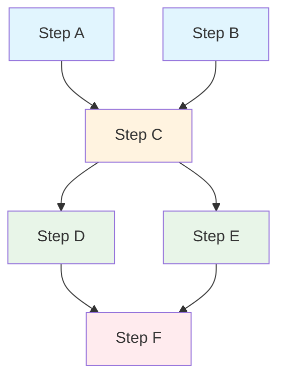

**Legend:**
- 🔵 Independent steps (can run in parallel)
- 🟡 Dependent steps (wait for prerequisites)
- 🟢 Ready to execute
- 🔴 Final step

### DAG Execution Algorithm

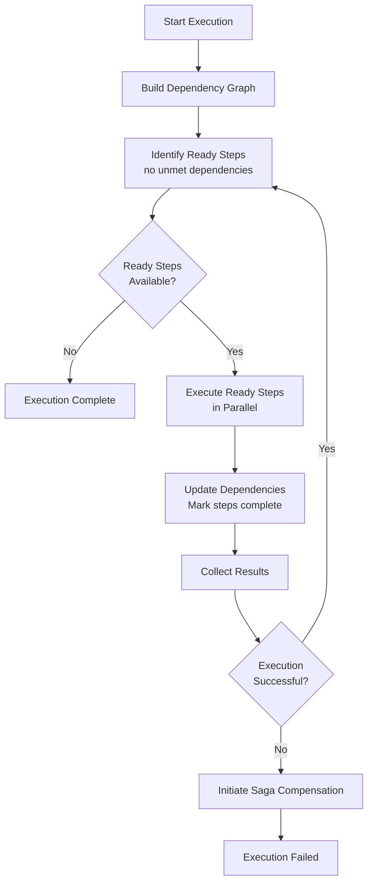

### Dependency Resolution

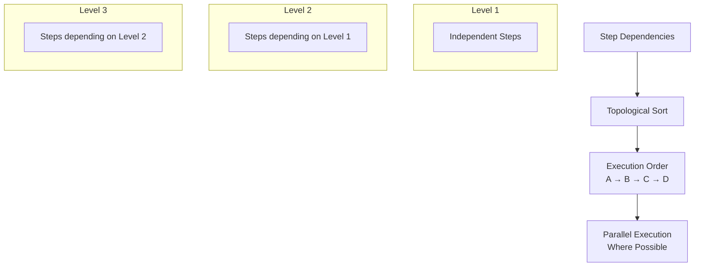

## Saga Patterns

RubyReactor implements saga patterns to ensure consistency across distributed operations. Sagas provide transactional semantics for long-running business processes.

### Saga Execution Flow

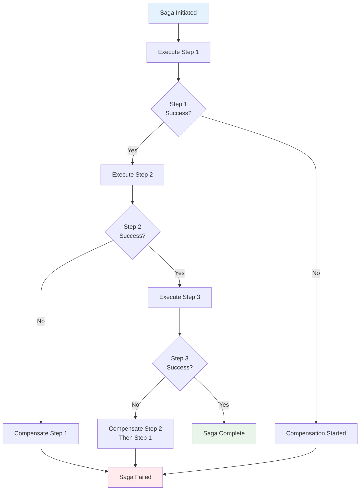

### Compensation Strategies

#### Backward Recovery (Rollback)

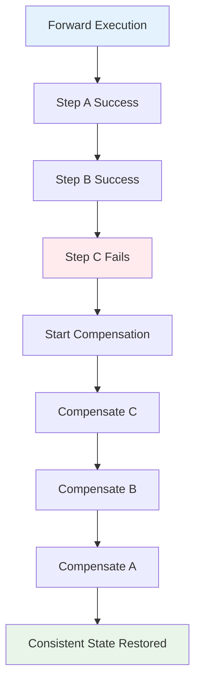

#### Forward Recovery (Retry)

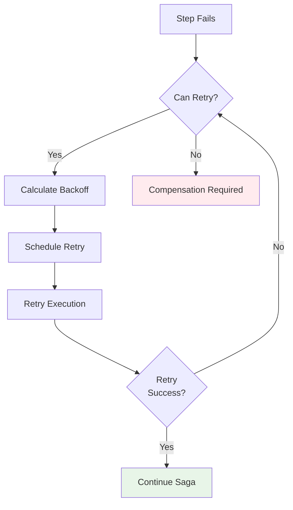

## Complex Saga Scenarios

### Order Processing Saga

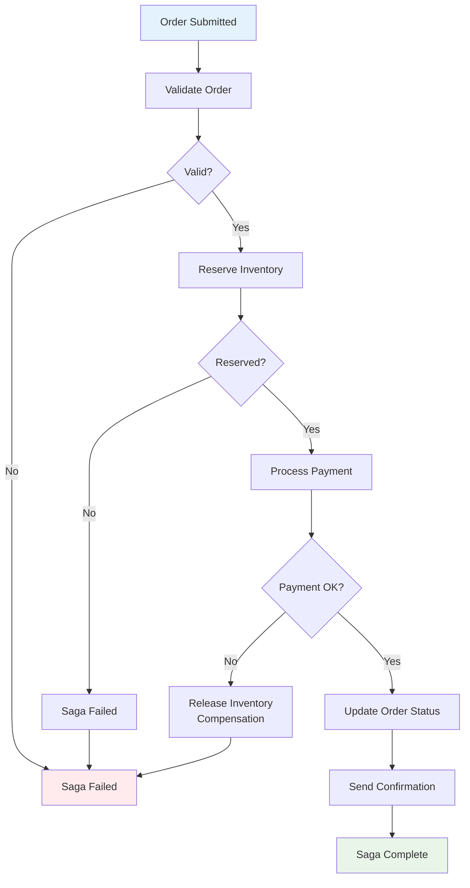

### Payment Processing with Multiple Attempts

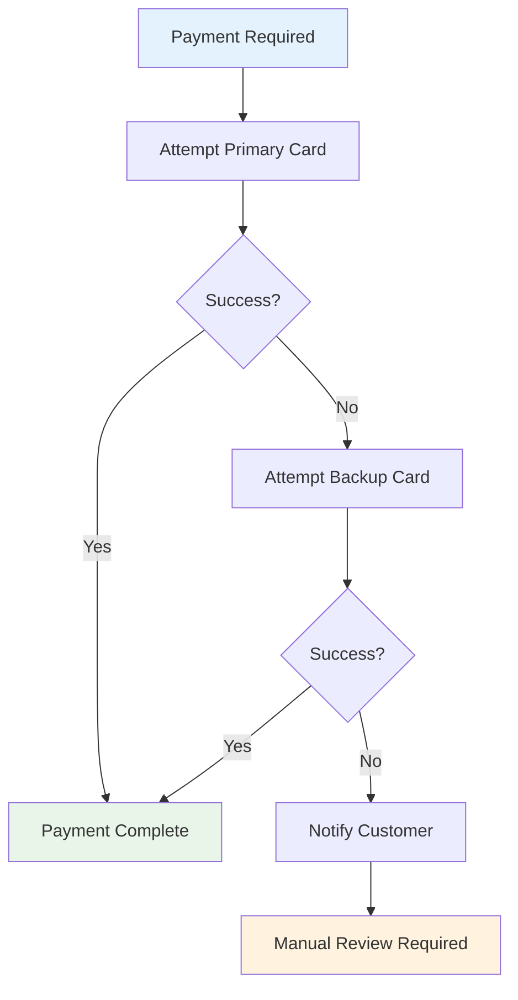

## DAG + Saga Integration

RubyReactor combines DAG execution with saga patterns for complex workflows:

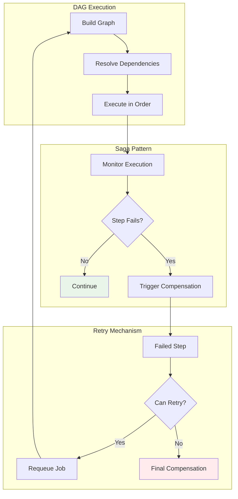

## Execution States

### Step States

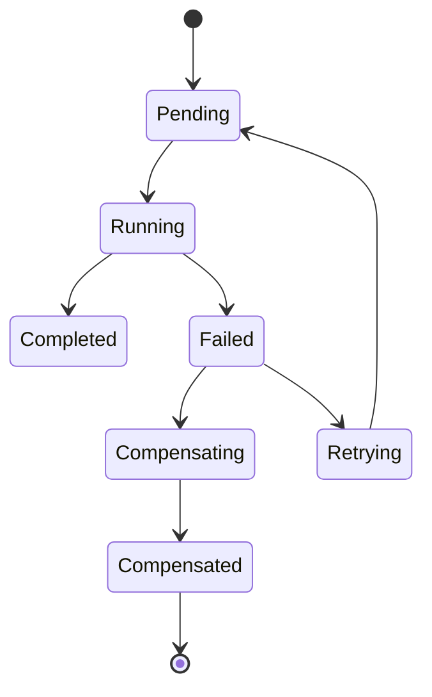

### Saga States

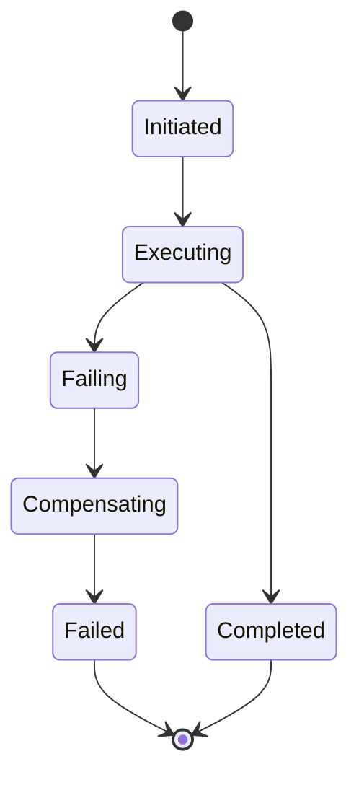

## Error Handling Patterns

### Cascading Compensation

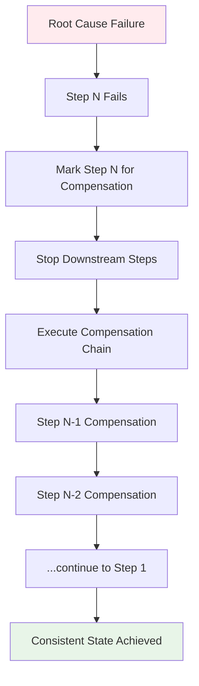

### Partial Success Handling

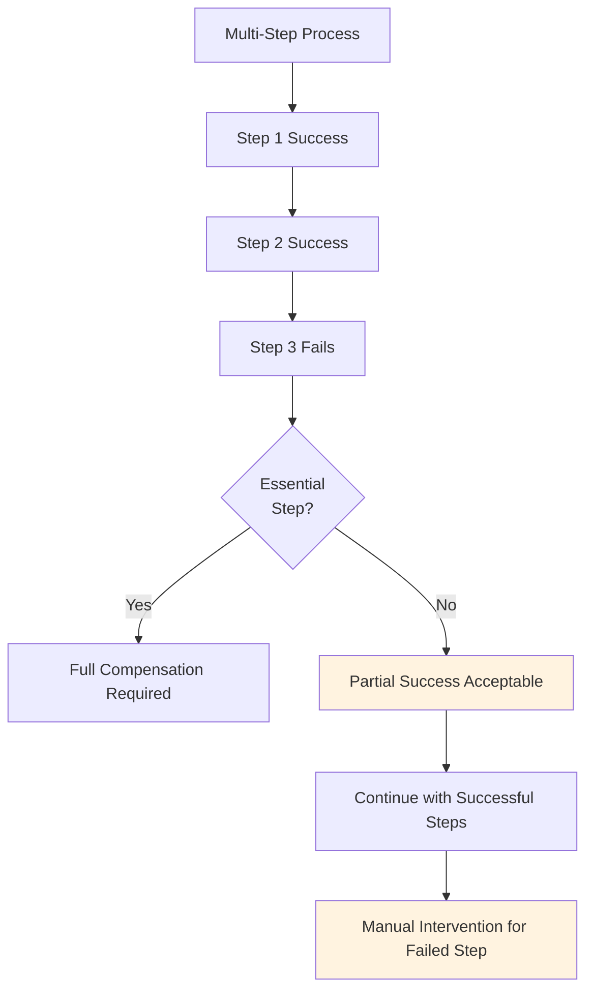

## Performance Considerations

### Parallel Execution in DAGs

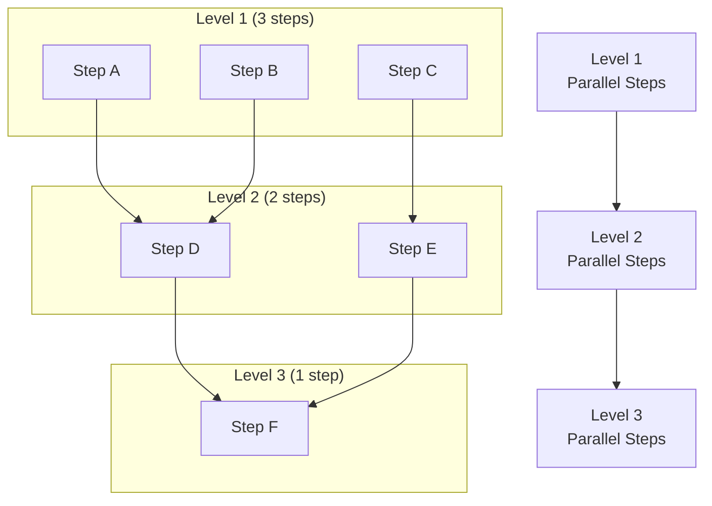

### Saga Overhead

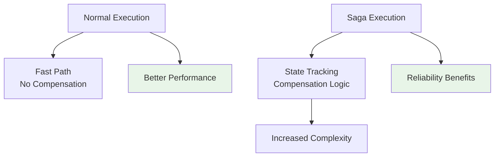

## Monitoring and Observability

### Saga Metrics

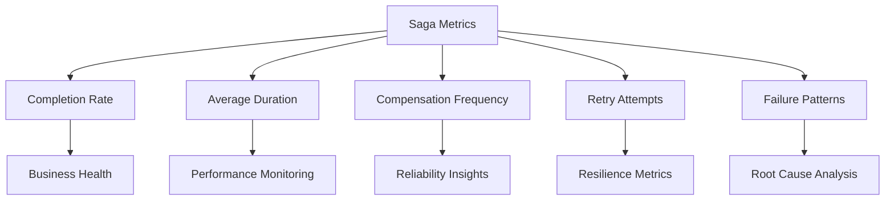

### DAG Execution Monitoring

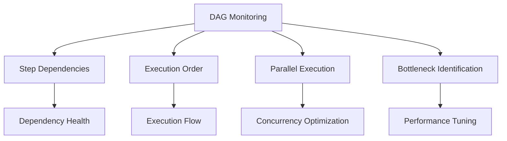

## Best Practices

### DAG Design

1. **Keep it Simple**: Minimize dependencies to maximize parallelism
2. **Clear Dependencies**: Make step relationships explicit
3. **Avoid Cycles**: Ensure DAG remains acyclic
4. **Test Execution Order**: Verify topological sort produces expected order

### Saga Implementation

1. **Idempotent Operations**: Design steps to be safely retryable
2. **Compensation Logic**: Always implement proper undo operations
3. **State Tracking**: Maintain sufficient state for compensation
4. **Timeout Handling**: Set appropriate timeouts for long-running sagas

### Error Handling

1. **Graceful Degradation**: Handle partial failures appropriately
2. **Circuit Breakers**: Prevent cascade failures
3. **Monitoring**: Track saga health and failure patterns
4. **Recovery Procedures**: Document manual recovery processes

## Implementation Examples

### Simple DAG with Saga

```ruby
class OrderProcessingReactor < RubyReactor::Reactor
  async true

  step :validate_order do
    run { validate_order_logic }
  end

  step :reserve_inventory do
    argument :order, result(:validate_order)
    run do |args, _context|
      reserve_inventory_logic(args[:order])
    end

    compensate do
      # Release reservation
      release_inventory_logic
    end
  end

  step :process_payment do
    argument :inventory_result, result(:reserve_inventory)
    run do |args, _context|
      process_payment_logic(args[:inventory_result])
    end

    compensate do
      # Refund payment
      refund_payment_logic
    end
  end

  step :confirm_order do
    argument :payment_result, result(:process_payment)
    run do |args, _context|
      confirm_order_logic(args[:payment_result])
    end
  end
end
```

### Complex DAG with Parallel Execution

```ruby
class ComplexWorkflowReactor < RubyReactor::Reactor
  async true

  # Level 1 - Independent steps
  step :validate_input do
    run { validate_input_logic }
  end

  step :check_permissions do
    run { check_permissions_logic }
  end

  # Level 2 - Depends on level 1
  step :process_data do
    argument :validation_result, result(:validate_input)
    argument :permissions_result, result(:check_permissions)
    run do |args, _context|
      process_data_logic(args[:validation_result], args[:permissions_result])
    end
  end

  # Level 3 - Parallel steps depending on level 2
  step :send_notification do
    argument :data_result, result(:process_data)
    run do |args, _context|
      send_notification_logic(args[:data_result])
    end
  end

  step :update_audit_log do
    argument :data_result, result(:process_data)
    run do |args, _context|
      update_audit_log_logic(args[:data_result])
    end
  end

  # Level 4 - Depends on level 3
  step :cleanup do
    argument :notification_result, result(:send_notification)
    argument :audit_result, result(:update_audit_log)
    run do |args, _context|
      cleanup_logic(args[:notification_result], args[:audit_result])
    end
  end
end
```

This DAG allows `send_notification` and `update_audit_log` to execute in parallel after `process_data` completes, demonstrating how RubyReactor maximizes concurrency while maintaining dependency ordering
