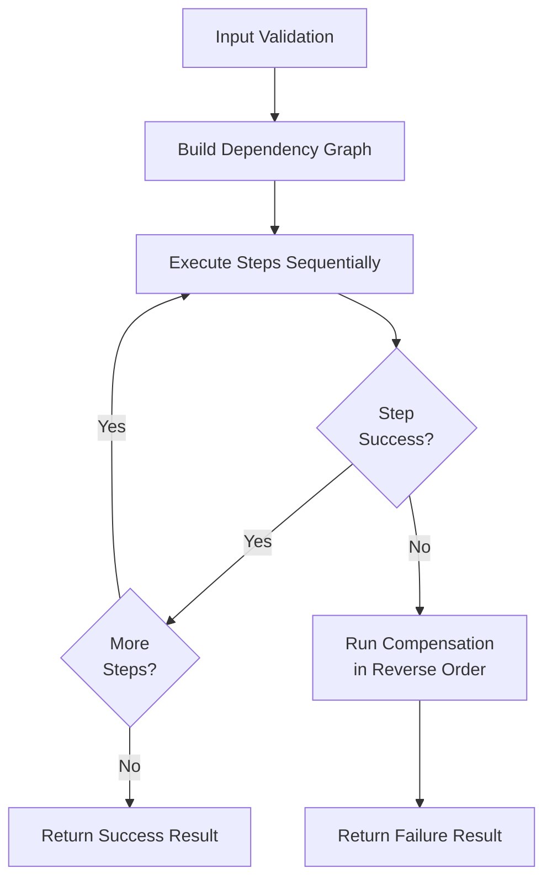
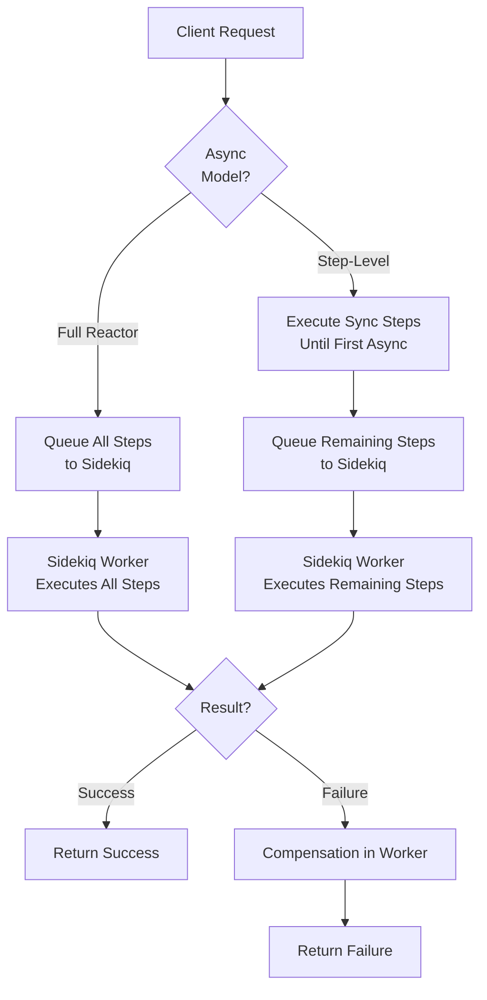

# RubyReactor Documentation

RubyReactor is a powerful Ruby framework for building reliable, sequential business processes with built-in error handling, compensation, and rollback capabilities.

## Table of Contents

- [Getting Started](getting_started.md)
- [Core Concepts](core_concepts.md)
- [DAG Execution and Saga Patterns](DAG.md)
- [Async Reactors](async_reactors.md)
- [Retry Configuration](retry_configuration.md)
- [Migration Guide](migration_guide.md)
- [Examples](examples/)
  - [Order Processing](examples/order_processing.md)
  - [Payment Processing](examples/payment_processing.md)
  - [Inventory Management](examples/inventory_management.md)
- [API Reference](api_reference.md)

## Quick Start

```ruby
require 'ruby_reactor'

class OrderProcessingReactor < RubyReactor::Reactor
  step :validate_order do
    run { validate_order_logic }
  end

  step :process_payment do
    run { process_payment_logic }
  end

  step :send_confirmation do
    run { send_email_confirmation }
  end
end

# Execute synchronously
result = OrderProcessingReactor.run(order_id: 123)
```

## Key Features

- **Sequential Execution**: Steps execute in dependency order
- **Error Handling**: Automatic compensation and rollback on failures
- **Async Support**: Full reactor async or step-level async execution
- **Non-Blocking Retries**: Job requeuing instead of blocking workers
- **Sidekiq Integration**: Seamless background processing
- **Retry Configuration**: Flexible retry policies per step
- **Idempotency Support**: Built-in idempotent operation handling

## Architecture

RubyReactor provides two execution models:

1. **Synchronous**: All steps execute in the current thread
2. **Asynchronous**: Steps execute in Sidekiq workers with non-blocking retries

### Execution Flow



### Async Execution Models



- **Full Reactor Async**: Entire reactor executes in background
- **Step-Level Async**: Handoff to background at first async step

## Error Handling

RubyReactor provides comprehensive error handling:

- **Step Failures**: Automatic retry with configurable backoff
- **Compensation**: Undo operations for failed steps
- **Rollback**: Complete transaction rollback on critical failures
- **Non-Blocking**: Workers freed during retry delays

## Performance

- **Zero Blocking**: No threads blocked during retry delays
- **Scalable**: Linear scaling with worker pool size
- **Efficient**: Optimized context serialization and deserialization

## Requirements

- Ruby 2.7+
- Redis (for async execution)
- Sidekiq (for background processing)

## Installation

Add to your Gemfile:

```ruby
gem 'ruby_reactor'
```

## Contributing

See [CONTRIBUTING.md](../CONTRIBUTING.md) for development setup and contribution guidelines.</content>
<parameter name="filePath">/Users/artur.panach/dev/republic/ruby_reactor/docs/README.md