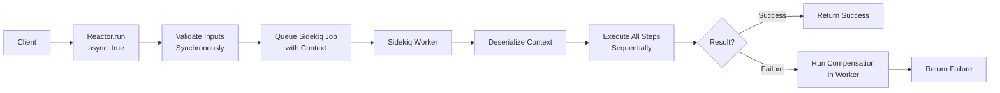
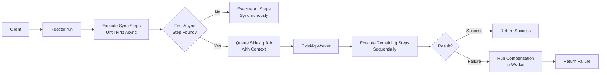

# Async Reactors

RubyReactor supports two asynchronous execution models: **Full Reactor Async** and **Step-Level Async**. Both models use Sidekiq for background processing with non-blocking retry mechanisms.

## Overview

Async execution provides several benefits:

- **Non-blocking**: Workers are freed during retry delays
- **Scalable**: Better resource utilization with large worker pools
- **Reliable**: Automatic retry with configurable backoff strategies
- **Observable**: Full visibility into execution state and retry attempts

## Full Reactor Async

When a reactor is marked as `async true`, the entire execution happens in a Sidekiq worker, including input validation.

### Configuration

```ruby
class OrderProcessingReactor < RubyReactor::Reactor
  async true  # Enable full reactor async

  step :validate_order do
    run { validate_order_logic }
  end

  step :process_payment do
    run { process_payment_logic }
  end

  step :send_confirmation do
    run { send_confirmation_logic }
  end
end
```

### Execution Flow

```ruby
# Synchronous call returns immediately
async_result = OrderProcessingReactor.run(order_id: 123)

# Check status later
case async_result.status
when :pending
  puts "Execution is queued"
when :running
  puts "Execution is in progress"
when :success
  puts "Execution completed successfully"
  result = async_result.result
when :failed
  puts "Execution failed: #{async_result.error}"
end
```

### Architecture



```
Client → Reactor.run() → Queue Job → Sidekiq Worker → Execute All Steps
```

## Step-Level Async

Individual steps can be marked as `async: true`. Execution runs synchronously until the first async step, then hands off to a Sidekiq worker for all remaining execution.

### Configuration

```ruby
class OrderProcessingReactor < RubyReactor::Reactor
  step :validate_order do
    # Runs synchronously
    run { validate_order_logic }
  end

  step :process_payment, async: true do
    # First async step - triggers handoff to worker
    run { process_payment_logic }
  end

  step :update_inventory do
    # Runs in worker after handoff
    run { update_inventory_logic }
  end

  step :send_confirmation do
    # Runs in same worker
    run { send_confirmation_logic }
  end
end
```

### Execution Flow

```ruby
# Runs validate_order synchronously, then hands off
async_result = OrderProcessingReactor.run(order_id: 123)

# All remaining steps execute in a single worker
# Compensation and rollback work within the worker context
```

### Architecture



```
Client → Reactor.run() → Sync Steps → Queue Job → Worker → Remaining Steps
```

## Retry Configuration

Both async models support sophisticated retry mechanisms with non-blocking job requeuing.

### Step-Level Retry

```ruby
class PaymentProcessingReactor < RubyReactor::Reactor
  async true

  step :validate_payment do
    retries max_attempts: 3, backoff: :exponential, base_delay: 1.second
    run { validate_payment_logic }
  end

  step :charge_card, async: true do
    retries max_attempts: 5, backoff: :linear, base_delay: 5.seconds
    run { charge_card_logic }
  end

  step :update_records do
    # No retry - critical step
    run { update_records_logic }
  end
end
```

### Reactor-Level Defaults

```ruby
class PaymentProcessingReactor < RubyReactor::Reactor
  async true

  # Set defaults for all steps
  retry_defaults max_attempts: 3, backoff: :exponential, base_delay: 2.seconds

  step :validate_payment do
    # Inherits reactor defaults (3 attempts, exponential backoff)
    run { validate_payment_logic }
  end

  step :charge_card do
    # Override defaults for this step
    retries max_attempts: 5, backoff: :linear, base_delay: 10.seconds
    run { charge_card_logic }
  end
end
```

## Retry Strategies

### Backoff Algorithms

- **`:exponential`**: Delay doubles with each attempt (1s, 2s, 4s, 8s...)
- **`:linear`**: Delay increases linearly (5s, 10s, 15s, 20s...)
- **`:fixed`**: Same delay for each attempt (5s, 5s, 5s, 5s...)

## Error Handling and Compensation

Async reactors support full compensation and rollback in the worker context:

```ruby
class OrderProcessingReactor < RubyReactor::Reactor
  async true

  step :process_payment do
    run { process_payment_logic }

    undo do |payment_id:, **|
      # Runs in worker if execution fails later
      PaymentService.refund(payment_id)
    end

    compensate do |payment_id:, **|
      # Runs in worker if execution fails later
      PaymentService.refund(payment_id)
    end
  end

  step :update_inventory do
    run { update_inventory_logic }

    compensate do |order:, **|
      # Runs in worker on failure
      InventoryService.restore(order)
    end
  end
end
```

## Monitoring and Observability

### Job Visibility

Retries are visible in Sidekiq web UI with:
- Step name and attempt number
- Retry delay and timing
- Success/failure status
- Execution context

## Configuration

### Sidekiq Worker Setup

```ruby
# config/sidekiq.rb
require 'ruby_reactor/worker'

RubyReactor.configure do |config|
  config.sidekiq_queue = :default
  config.sidekiq_retry_count = 3
  config.logger = Logger.new('log/ruby_reactor.log')
end
```

## Performance Considerations

### Worker Pool Sizing

- **Full Reactor Async**: Size pool based on total reactor throughput
- **Step-Level Async**: Size pool based on async step frequency

### Context Size Limits

- Redis has job size limits (~512MB)
- TODO: Large contexts are automatically compressed
- Consider external storage for very large execution states

### Monitoring Metrics

Track these key metrics:
- Retry attempt counts per step
- Average retry delays
- Success rates after retries
- Worker utilization during peak loads
