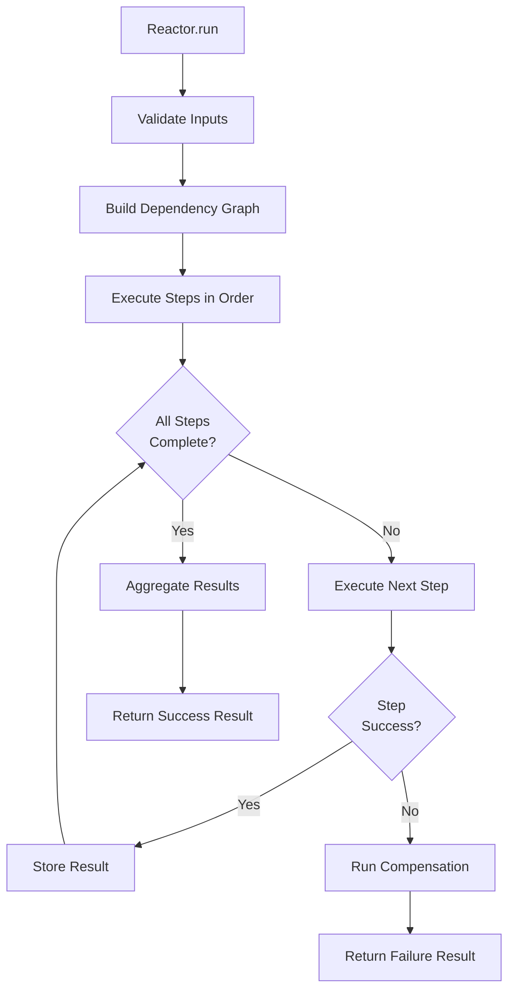
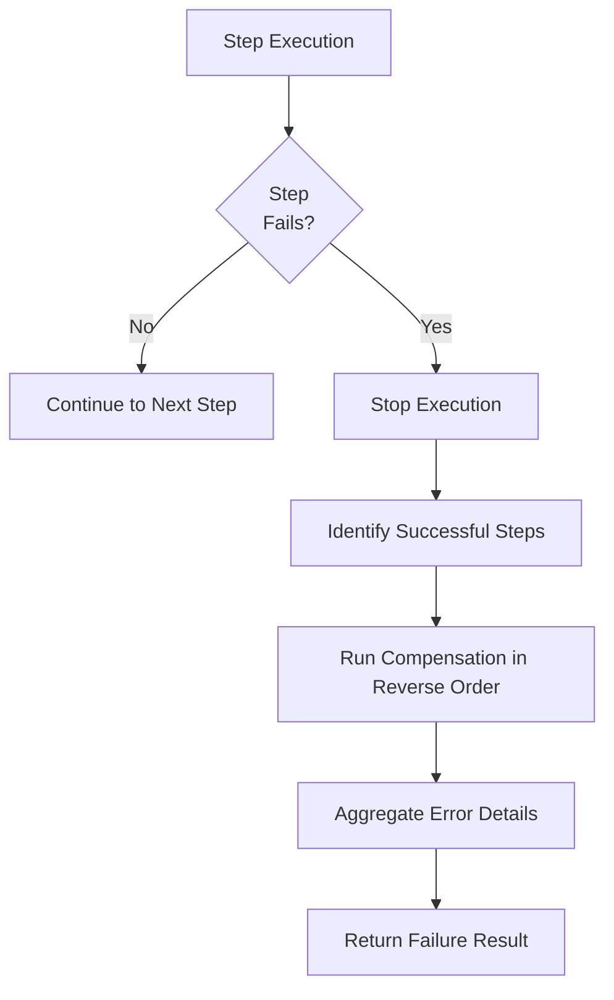

# Core Concepts

Understanding RubyReactor's core concepts is essential for building reliable sequential business processes.

## Reactor

A Reactor is the main execution unit that orchestrates steps in a specific order.

```ruby
class OrderProcessingReactor < RubyReactor::Reactor
  # Reactor definition
end
```

**Key Characteristics:**
- **Sequential Execution**: Steps run one after another in dependency order
- **Error Handling**: Automatic rollback on failures
- **Compensation**: Undo operations for failed steps
- **Result Aggregation**: Collects results from all steps

## Steps

Steps are the individual units of work within a reactor. Each step has a name and implementation.

```ruby
step :validate_order do
  run do |order_id|
    # Step implementation
    order = Order.find(order_id)
    raise "Order not found" unless order
    Success({ order: order })
  end
end
```

**Step Components:**
- **Name**: Unique identifier (symbol)
- **Implementation**: The `run` block containing business logic
- **Dependencies**: Other steps that must complete first
- **Compensation**: Undo logic for rollback scenarios

## Context

Context holds the execution state throughout the reactor lifecycle.

```ruby
context = RubyReactor::Context.new(order_id: 123, customer_id: 456)
```

**Context Contents:**
- **Inputs**: Original parameters passed to `Reactor.run()`
- **Intermediate Results**: Outputs from completed steps
- **Completed Steps**: Set of successfully finished step names
- **Step Results**: Final outputs from each step
- **Execution Metadata**: Job IDs, timestamps, reactor class info

## Dependencies

Steps can depend on other steps, creating a directed acyclic graph (DAG) of execution.

```ruby
step :validate_order do
  run { validate_order_logic }
end

step :process_payment do
  argument :order, result(:validate_order)
  run do |args, _context|
    process_payment_for_order(args[:order])
  end
end

step :send_confirmation do
  argument :payment_result, result(:process_payment)
  run do |args, _context|
    payment_result = args[:payment_result]
    send_confirmation_email(payment_result[:order], payment_result[:payment_id])
  end
end
```

**Dependency Resolution:**
- Topological sorting ensures correct execution order
- Parallel execution of independent steps (when available)
- Validation prevents circular dependencies

## Results

Every reactor execution returns a comprehensive result object.

```ruby
result = OrderProcessingReactor.run(order_id: 123)

# Overall status
result.success?        # => true/false
result.failure?        # => true/false

# Step outputs
result.step_results    # => { validate_order: {...}, process_payment: {...} }
result.intermediate_results  # => Hash of all step outputs

# Execution tracking
result.completed_steps # => #<Set: {:validate_order, :process_payment}>
result.inputs          # => { order_id: 123 }

# Error information
result.error           # => Exception object if failed
```

## Error Handling

RubyReactor provides sophisticated error handling with automatic compensation.

### Step Failures

When a step fails, execution stops and compensation begins:

```ruby
step :process_payment do
  run do
    # This might fail
    PaymentService.charge(amount, token)
  end

  compensate do |payment_id: nil, **|
    # Undo the payment if it was created
    PaymentService.refund(payment_id) if payment_id
  end
end
```

### Compensation Order

Compensation runs in reverse order of successful steps:

```
Step A succeeds → Step B succeeds → Step C fails
                    ↓
         Compensate C → Compensate B → Compensate A
```

### Error Types

- **StepExecutionError**: Business logic failures
- **DependencyError**: Missing required dependencies
- **ValidationError**: Input validation failures
- **CompensationError**: Compensation logic failures

## Execution Models

### Synchronous Execution

```ruby
result = Reactor.run(inputs)
# Blocks until completion
# Returns Result object immediately
```

**Characteristics:**
- Blocking execution in current thread
- Immediate results
- Simple error handling
- Limited scalability

### Asynchronous Execution

```ruby
async_result = Reactor.run(inputs)
# Returns immediately
# Check status later

case async_result.status
when :success
  result = async_result.result
when :failed
  error = async_result.error
end
```

**Characteristics:**
- Non-blocking execution
- Background processing with Sidekiq
- Retry capabilities
- Better scalability

## Step Arguments

Steps receive arguments through keyword arguments, with automatic dependency injection.

```ruby
step :validate_order do
  run do |order_id:, customer_id:|
    # Direct access to reactor inputs
    order = Order.find_by(id: order_id, customer_id: customer_id)
    Success({ order: order })
  end
end

step :process_payment do
  argument :order_data, result(:validate_order)

  run do |args, _context|
    # Access results from previous steps
    order = args[:order_data][:order]
    payment = PaymentService.charge(order.total, order.card_token)
    Success({ payment_id: payment.id })
  end
end
```

**Argument Resolution:**
1. **Step Results**: Outputs from completed dependent steps
2. **Reactor Inputs**: Original inputs passed to `run()`
3. **Intermediate Results**: Accumulated outputs from all steps

## Compensation

Compensation provides transactional semantics for business processes.

### Basic Compensation

```ruby
step :reserve_inventory do
  run do |items:|
    reservation_id = InventoryService.reserve(items)
    Success({ reservation_id: reservation_id })
  end

  compensate do |reservation_id:, **|
    # Release the reservation
    InventoryService.release(reservation_id)
  end
end
```

### Compensation Context

Compensation blocks receive the same arguments as the run block, plus any intermediate results.

```ruby
step :complex_operation do
  run do |input:|
    # Complex multi-step operation
    temp_file = create_temp_file(input)
    result = process_file(temp_file)
    final_result = save_result(result)

    Success({
      temp_file: temp_file,
      result: final_result
    })
  end

  compensate do |temp_file:, result:, **|
    # Clean up in reverse order
    delete_result(result) if result
    delete_temp_file(temp_file) if temp_file
  end
end
```

## Validation

Input validation ensures data integrity before execution.

### Built-in Validation

```ruby
class OrderReactor < RubyReactor::Reactor
  input :order_id, validate: -> do
    required(:order_id).filled(:integer, gt?: 0)
  end
end
```

### Custom Validators

```ruby
class OrderReactor < RubyReactor::Reactor
  input :order, validate: -> do
    required(:order).hash do
      required(:id).filled(:integer, gt?: 0)
      required(:total).filled(:decimal, gt?: 0)
      required(:items).filled(:array, min_size?: 1)
    end
  end
end
```

## Dependency Graph

RubyReactor builds a dependency graph to determine execution order.

### Graph Construction

```ruby
# Explicit dependencies
step :a do; end
step :b do; argument :a_result, result(:a); end
step :c do; argument :a_result, result(:a); end
step :d do; argument :b_result, result(:b); argument :c_result, result(:c); end

# Execution order: a → [b,c] → d
```

### Cycle Detection

```ruby
# This would raise DependencyError
step :a do; argument :b_result, result(:b); end
step :b do; argument :a_result, result(:a); end  # Circular dependency!
```

## Execution Flow

### Normal Execution



1. **Input Validation**: Validate reactor inputs
2. **Graph Building**: Construct dependency graph
3. **Step Execution**: Execute steps in dependency order
4. **Result Aggregation**: Collect all step outputs
5. **Return Result**: Return comprehensive result object

### Error Execution



1. **Step Failure**: A step raises an exception
2. **Stop Execution**: Halt remaining steps
3. **Compensation**: Run compensation blocks in reverse order
4. **Rollback**: Return failure result with error details

## Threading Model

### Synchronous
- Single-threaded execution
- Blocking operations halt the entire process
- Simple debugging and monitoring

### Asynchronous
- Multi-threaded execution via Sidekiq
- Non-blocking retry mechanisms
- Complex monitoring and debugging

## Best Practices

### Step Design

1. **Single Responsibility**: Each step should do one thing well
2. **Idempotency**: Design steps to be safely retryable when possible
3. **Error Handling**: Use appropriate exception types
4. **Resource Management**: Clean up resources in compensation blocks

### Dependency Management

1. **Minimize Dependencies**: Keep the dependency graph simple
2. **Clear Naming**: Use descriptive step names
3. **Logical Grouping**: Group related steps together

### Error Handling

1. **Specific Exceptions**: Use custom exception classes
2. **Compensation Logic**: Always provide compensation for state changes
3. **Logging**: Log important events and errors
4. **Monitoring**: Track success/failure rates

### Performance

1. **Efficient Steps**: Keep individual steps fast
2. **Async for Slow Ops**: Use async for I/O bound operations
3. **Resource Limits**: Set appropriate timeouts and limits
4. **Caching**: Cache expensive operations when safe</content>
<parameter name="filePath">/Users/artur.panach/dev/republic/ruby_reactor/docs/core_concepts.md