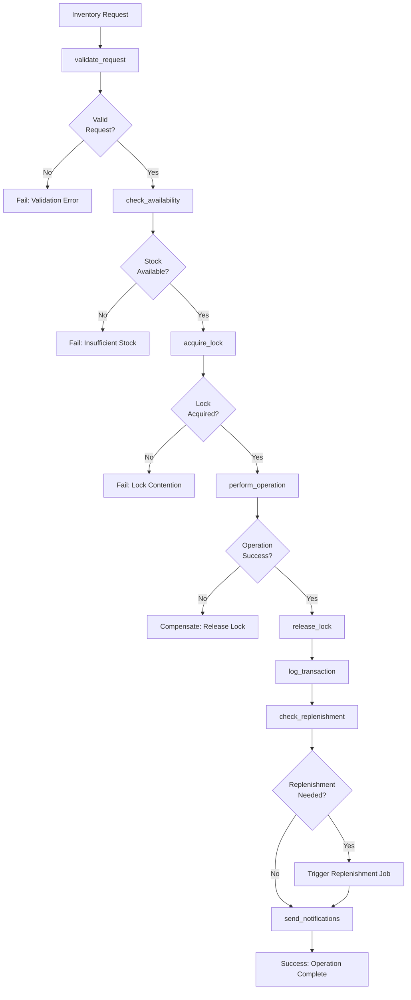

# Inventory Management Reactor Example

This example demonstrates inventory management with reservations, stock updates, and supplier integration.

## Overview

The InventoryManagementReactor handles complex inventory operations:

1. **Check Availability**: Verify stock levels
2. **Reserve Stock**: Temporarily hold inventory
3. **Update Quantities**: Modify stock levels
4. **Log Transactions**: Record inventory changes
5. **Trigger Replenishment**: Auto-order low stock items
6. **Send Notifications**: Alert relevant parties

### Inventory Management Workflow



## Implementation

```ruby
class InventoryManagementReactor < RubyReactor::Reactor
  async true

  retry_defaults max_attempts: 3, backoff: :exponential, base_delay: 1.second

  step :validate_request do
    validate_args do
      required(:product_id).filled(:string)
      required(:quantity).filled(:integer, gt?: 0)
      required(:operation).filled(:string, included_in?: ['reserve', 'release', 'consume'])
    end

    run do |product_id:, quantity:, operation:, **|
      product = Product.find_by(id: product_id)
      raise "Product not found" unless product

      Success({ product: product, operation: operation })
    end
  end

  step :check_availability do
    argument :request_data, result(:validate_request)

    run do |args, _context|
      product = args[:request_data][:product]
      quantity = args[:request_data][:quantity]
      operation = args[:request_data][:operation]

      case operation
      when 'consume'
        raise "Insufficient stock" if product.inventory_count < quantity
      when 'reserve'
        available = product.inventory_count - product.reserved_count
        raise "Insufficient available stock" if available < quantity
      end

      Success({ availability_checked: true })
    end
  end

  step :acquire_lock do
    argument :request_data, result(:validate_request)
    argument :availability_data, result(:check_availability)

    run do |args, _context|
      product = args[:request_data][:product]

      # Acquire distributed lock to prevent race conditions
      lock_key = "inventory_lock:#{product.id}"

      acquired = RedisLock.acquire(lock_key, ttl: 30.seconds)
      raise "Failed to acquire inventory lock" unless acquired

      Success({ lock_key: lock_key })
    end

    compensate do |args, _context|
      lock_key = args[:availability_data][:lock_key] || args[:lock_key]
      # Release lock on failure
      RedisLock.release(lock_key) if lock_key
    end
  end

  step :perform_operation do
    argument :request_data, result(:validate_request)
    argument :lock_data, result(:acquire_lock)

    run do |args, _context|
      product = args[:request_data][:product]
      quantity = args[:request_data][:quantity]
      operation = args[:request_data][:operation]

      case operation
      when 'reserve'
        product.increment!(:reserved_count, quantity)
        Success({ operation_completed: true, new_reserved: product.reserved_count })
      when 'release'
        product.decrement!(:reserved_count, quantity)
        Success({ operation_completed: true, new_reserved: product.reserved_count })
      when 'consume'
        product.decrement!(:inventory_count, quantity)
        Success({ operation_completed: true, new_inventory: product.inventory_count })
      end
    end

    compensate do |args, _context|
      product = args[:request_data][:product]
      quantity = args[:request_data][:quantity]
      operation = args[:request_data][:operation]

      # Reverse the operation
      case operation
      when 'reserve'
        product.decrement!(:reserved_count, quantity)
      when 'release'
        product.increment!(:reserved_count, quantity)
      when 'consume'
        product.increment!(:inventory_count, quantity)
      end
    end
  end

  step :release_lock do
    argument :lock_data, result(:acquire_lock)
    argument :operation_data, result(:perform_operation)

    run do |args, _context|
      lock_key = args[:lock_data][:lock_key]

      RedisLock.release(lock_key)
      Success({ lock_released: true })
    end
  end

  step :log_transaction do
    argument :request_data, result(:validate_request)
    argument :release_data, result(:release_lock)

    run do |args, _context|
      product = args[:request_data][:product]
      quantity = args[:request_data][:quantity]
      operation = args[:request_data][:operation]

      InventoryTransaction.create!(
        product: product,
        operation: operation,
        quantity: quantity,
        performed_at: Time.current
      )

      Success({ transaction_logged: true })
    end
  end

  step :check_replenishment do
    argument :request_data, result(:validate_request)
    argument :log_data, result(:log_transaction)

    run do |args, _context|
      product = args[:request_data][:product]

      if product.inventory_count <= product.reorder_point
        # Trigger replenishment process
        ReplenishmentJob.perform_later(product.id)
        Success({ replenishment_triggered: true })
      else
        Success({ replenishment_checked: true })
      end
    end
  end

  step :send_notifications do
    argument :request_data, result(:validate_request)
    argument :replenishment_data, result(:check_replenishment)

    idempotent true
    retry max_attempts: 3, backoff: :linear, base_delay: 5.seconds

    run do |args, _context|
      product = args[:request_data][:product]
      operation = args[:request_data][:operation]
      quantity = args[:request_data][:quantity]
      replenishment_triggered = args[:replenishment_data][:replenishment_triggered]

      notifications = []

      # Notify warehouse staff for significant changes
      if quantity > 10
        notifications << NotificationService.notify_warehouse(
          quantity: quantity
        )
      end

      # Notify managers for low stock
      if replenishment_triggered
        notifications << NotificationService.notify_managers(
          product: product,
          message: "Low stock alert: #{product.inventory_count} remaining"
        )
      end

      Success({ notifications_sent: notifications.all?(&:success?) })
    end
  end
end
```

## Advanced Inventory Scenarios

### Bulk Inventory Operations

```ruby
class BulkInventoryReactor < RubyReactor::Reactor
  async true

  step :validate_bulk_request do
    validate_args do
      required(:operations).filled(:array, max_size?: 100) do
        each do
          hash do
            required(:product_id).filled(:string)
            required(:quantity).filled(:integer, gt?: 0)
            required(:operation).filled(:string, included_in?: ['reserve', 'release', 'consume'])
          end
        end
      end
    end

    run do |operations:, **|
      validated_ops = operations.map do |op|
        product = Product.find(op[:product_id])
        raise "Product #{op[:product_id]} not found" unless product

        op.merge(product: product)
      end

      Success({ validated_operations: validated_ops })
    end
  end

  step :execute_operations do
    argument :bulk_data, result(:validate_bulk_request)

    run do |args, _context|
      validated_operations = args[:bulk_data][:validated_operations]

      results = []

      validated_operations.each do |op|
        begin
          # Execute each operation in sequence to maintain consistency
          result = InventoryManagementReactor.run(
            product_id: op[:product_id],
            quantity: op[:quantity],
            operation: op[:operation]
          )

          if result.success?
            results << { success: true, operation: op }
          else
            results << { success: false, operation: op, error: result.error.message }
          end
        rescue => e
          results << { success: false, operation: op, error: e.message }
        end
      end

      successful_count = results.count { |r| r[:success] }

      if successful_count == 0
        raise "All operations failed"
      elsif successful_count < results.size
        # Partial success - log warnings but don't fail
        Rails.logger.warn("Bulk inventory: #{successful_count}/#{results.size} operations succeeded")
      end

      Success({ bulk_results: results, partial_success: successful_count < results.size })
    end
  end
end
```

### Inventory Transfer Between Locations

```ruby
class InventoryTransferReactor < RubyReactor::Reactor
  async true

  step :validate_transfer do
    validate_args do
      required(:from_location_id).filled(:string)
      required(:to_location_id).filled(:string)
      required(:product_id).filled(:string)
      required(:quantity).filled(:integer, gt?: 0)
    end

    run do |from_location_id:, to_location_id:, product_id:, quantity:, **|
      from_location = Location.find(from_location_id)
      to_location = Location.find(to_location_id)
      product = Product.find(product_id)

      raise "Invalid locations" unless from_location && to_location
      raise "Same location" if from_location_id == to_location_id
      raise "Product not found" unless product

      # Check source location has enough stock
      source_inventory = LocationInventory.find_by(
        location: from_location,
        product: product
      )
      raise "Insufficient stock at source" unless source_inventory&.quantity&.>= quantity

      Success({
        from_location: from_location,
        to_location: to_location,
        product: product,
        quantity: quantity
      })
    end
  end

  step :reserve_source do
    argument :transfer_data, result(:validate_transfer)

    run do |args, _context|
      from_location = args[:transfer_data][:from_location]
      product = args[:transfer_data][:product]
      quantity = args[:transfer_data][:quantity]

      # Reserve inventory at source location
      reservation = InventoryService.reserve_at_location(
        location: from_location,
        product: product,
        quantity: quantity
      )

      raise "Source reservation failed" unless reservation

      Success({ source_reservation_id: reservation.id })
    end

    compensate do |args, _context|
      source_reservation_id = args[:transfer_data][:source_reservation_id] || args[:source_reservation_id]
      InventoryService.release_reservation(source_reservation_id)
    end
  end

  step :prepare_destination do
    argument :transfer_data, result(:validate_transfer)
    argument :reservation_data, result(:reserve_source)

    run do |args, _context|
      to_location = args[:transfer_data][:to_location]
      product = args[:transfer_data][:product]
      quantity = args[:transfer_data][:quantity]

      # Ensure destination location can accept the inventory
      destination_inventory = LocationInventory.find_or_create_by(
        location: to_location,
        product: product
      )

      Success({ destination_prepared: true })
    end
  end

  step :execute_transfer do
    argument :transfer_data, result(:validate_transfer)
    argument :reservation_data, result(:reserve_source)
    argument :destination_data, result(:prepare_destination)

    run do |args, _context|
      from_location = args[:transfer_data][:from_location]
      to_location = args[:transfer_data][:to_location]
      product = args[:transfer_data][:product]
      quantity = args[:transfer_data][:quantity]
      source_reservation_id = args[:reservation_data][:source_reservation_id]

      # Atomically transfer inventory
      InventoryService.transfer_inventory(
        from_location: from_location,
        to_location: to_location,
        product: product,
        quantity: quantity,
        reservation_id: source_reservation_id
      )

      Success({ transfer_completed: true })
    end

    compensate do |args, _context|
      from_location = args[:transfer_data][:from_location]
      to_location = args[:transfer_data][:to_location]
      product = args[:transfer_data][:product]
      quantity = args[:transfer_data][:quantity]

      # Reverse the transfer - this is complex and might require manual intervention
      Rails.logger.error("Transfer compensation needed for #{product.id} x #{quantity}")
      # Trigger manual review process
    end
  end

  step :log_transfer do
    argument :transfer_data, result(:validate_transfer)
    argument :transfer_result, result(:execute_transfer)

    run do |args, _context|
      from_location = args[:transfer_data][:from_location]
      to_location = args[:transfer_data][:to_location]
      product = args[:transfer_data][:product]
      quantity = args[:transfer_data][:quantity]

      InventoryTransfer.create!(
        from_location: from_location,
        to_location: to_location,
        product: product,
        quantity: quantity,
        transferred_at: Time.current
      )

      Success({ transfer_logged: true })
    end
  end
end
```

## Supplier Integration

### Automatic Replenishment

```ruby
class ReplenishmentReactor < RubyReactor::Reactor
  async true

  retry_defaults max_attempts: 3, backoff: :exponential, base_delay: 5.minutes

  step :check_supplier_availability do
    validate_args do
      required(:product_id).filled(:string)
    end

    run do |product_id:, **|
      product = Product.find(product_id)
      supplier = product.supplier

      raise "No supplier configured" unless supplier
      raise "Supplier inactive" unless supplier.active?

      Success({ product: product, supplier: supplier })
    end
  end

  step :calculate_order_quantity do
    argument :supplier_data, result(:check_supplier_availability)

    run do |args, _context|
      product = args[:supplier_data][:product]
      supplier = args[:supplier_data][:supplier]

      # Calculate optimal order quantity
      current_stock = product.inventory_count
      reorder_point = product.reorder_point
      max_stock = product.max_stock_level

      # Order enough to reach max stock
      order_quantity = [max_stock - current_stock, supplier.min_order_quantity].max

      # Check supplier constraints
      order_quantity = [order_quantity, supplier.max_order_quantity].min

      raise "Invalid order quantity" if order_quantity <= 0

      Success({ order_quantity: order_quantity })
    end
  end

  step :check_supplier_inventory do
    argument :supplier_data, result(:check_supplier_availability)
    argument :quantity_data, result(:calculate_order_quantity)

    run do |args, _context|
      supplier = args[:supplier_data][:supplier]
      product = args[:supplier_data][:product]
      order_quantity = args[:quantity_data][:order_quantity]

      # Query supplier API for availability
      supplier_response = SupplierAPI.check_availability(
        supplier_id: supplier.id,
        product_sku: product.sku,
        quantity: order_quantity
      )

      raise "Product not available from supplier" unless supplier_response.available?

      actual_available = supplier_response.available_quantity
      if actual_available < order_quantity
        # Adjust order quantity
        order_quantity = actual_available
      end

      Success({ adjusted_quantity: order_quantity, supplier_available: true })
    end
  end

  step :place_supplier_order do
    argument :supplier_data, result(:check_supplier_availability)
    argument :inventory_data, result(:check_supplier_inventory)

    run do |args, _context|
      supplier = args[:supplier_data][:supplier]
      product = args[:supplier_data][:product]
      adjusted_quantity = args[:inventory_data][:adjusted_quantity]

      order_response = SupplierAPI.place_order(
        supplier_id: supplier.id,
        items: [{
          sku: product.sku,
          quantity: adjusted_quantity,
          unit_price: product.supplier_price
        }]
      )

      raise "Supplier order failed" unless order_response.success?

      Success({ supplier_order_id: order_response.order_id, order_placed: true })
    end

    compensate do |args, _context|
      supplier_order_id = args[:inventory_data][:supplier_order_id] || args[:supplier_order_id]
      # Cancel the supplier order
      SupplierAPI.cancel_order(supplier_order_id) if supplier_order_id
    end
  end

  step :record_purchase_order do
    argument :supplier_data, result(:check_supplier_availability)
    argument :inventory_data, result(:check_supplier_inventory)
    argument :order_data, result(:place_supplier_order)

    run do |args, _context|
      product = args[:supplier_data][:product]
      supplier = args[:supplier_data][:supplier]
      adjusted_quantity = args[:inventory_data][:adjusted_quantity]
      supplier_order_id = args[:order_data][:supplier_order_id]

      purchase_order = PurchaseOrder.create!(
        supplier: supplier,
        supplier_order_id: supplier_order_id,
        status: :ordered,
        items_attributes: [{
          product: product,
          quantity: adjusted_quantity,
          unit_price: product.supplier_price,
          total_price: adjusted_quantity * product.supplier_price
        }]
      )

      Success({ purchase_order_id: purchase_order.id })
    end
  end

  step :schedule_delivery_tracking do
    argument :purchase_data, result(:record_purchase_order)

    run do |args, _context|
      supplier_order_id = args[:order_data][:supplier_order_id]

      # Schedule job to track delivery status
      DeliveryTrackingJob.set(wait: 1.hour).perform_later(supplier_order_id)

      Success({ tracking_scheduled: true })
    end
  end
end
```

## Testing Inventory Operations

```ruby
RSpec.describe InventoryManagementReactor do
  let(:product) { create(:product, inventory_count: 100, reserved_count: 0) }

  context "successful reservation" do
    it "reserves inventory correctly" do
      result = InventoryManagementReactor.run(
        product_id: product.id,
        quantity: 10,
        operation: 'reserve'
      )

      expect(result).to be_success
      product.reload
      expect(product.reserved_count).to eq(10)
      expect(product.available_count).to eq(90)
    end
  end

  context "insufficient stock" do
    it "fails when trying to consume more than available" do
      result = InventoryManagementReactor.run(
        product_id: product.id,
        quantity: 150,
        operation: 'consume'
      )

      expect(result).to be_failure
      expect(result.error.message).to include("Insufficient stock")
    end
  end

  context "concurrent operations" do
    it "handles race conditions with locking" do
      # Simulate concurrent operations
      threads = 5.times.map do
        Thread.new do
          InventoryManagementReactor.run(
            product_id: product.id,
            quantity: 1,
            operation: 'reserve'
          )
        end
      end

      threads.each(&:join)

      product.reload
      expect(product.reserved_count).to eq(5) # All operations succeeded
    end
  end

  context "compensation" do
    it "releases lock and reverses operation on failure" do
      allow_any_instance_of(InventoryManagementReactor).to receive(:perform_operation)
        .and_raise("Simulated failure")

      initial_reserved = product.reserved_count

      result = InventoryManagementReactor.run(
        product_id: product.id,
        quantity: 5,
        operation: 'reserve'
      )

      expect(result).to be_failure
      product.reload
      expect(product.reserved_count).to eq(initial_reserved) # No change
    end
  end
end
```

## Performance Optimization

### Database Optimization

```ruby
# Use database constraints for inventory integrity
class Product < ApplicationRecord
  # Ensure inventory never goes negative
  validates :inventory_count, numericality: { greater_than_or_equal_to: 0 }

  # Use optimistic locking
  # validates :lock_version
end
```

### Caching Strategy

```ruby
class InventoryCache
  def self.get_availability(product_id)
    Rails.cache.fetch("inventory:#{product_id}", expires_in: 5.minutes) do
      product = Product.find(product_id)
      {
        inventory_count: product.inventory_count,
        reserved_count: product.reserved_count,
        available: product.inventory_count - product.reserved_count
      }
    end
  end

  def self.invalidate(product_id)
    Rails.cache.delete("inventory:#{product_id}")
  end
end
```

### Batch Operations

```ruby
class BatchInventoryUpdateReactor < RubyReactor::Reactor
  step :batch_update do
    run do |updates:, **|
      # Use single transaction for batch updates
      Product.transaction do
        updates.each do |update|
          product = Product.find(update[:product_id])
          product.increment!(:inventory_count, update[:quantity])
        end
      end

      Success({ batch_completed: true })
    end
  end
end
```

## Monitoring and Alerting

```ruby
INVENTORY_METRICS = {
  stockout_rate: "Percentage of products out of stock",
  reservation_failure_rate: "Rate of failed reservations",
  average_operation_time: "Average time for inventory operations",
  lock_contention_rate: "Percentage of operations hitting lock contention",
  replenishment_delay: "Average time to replenish low stock items"
}

INVENTORY_ALERTS = {
  high_stockout_rate: "Stockout rate above 5%",
  high_lock_contention: "Lock contention above 10%",
  replenishment_failures: "Failed replenishment orders in last hour"
}
```