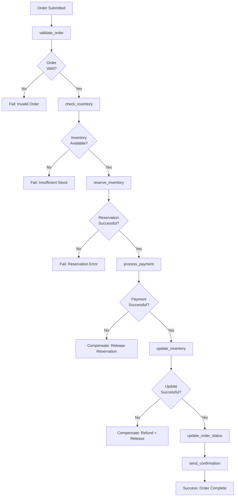

# Order Processing Reactor Example

This example demonstrates a complete order processing workflow with validation, payment processing, inventory management, and notifications.

## Overview

The OrderProcessingReactor handles the complete order fulfillment process:

1. **Validate Order**: Ensure order exists and is processable
2. **Check Inventory**: Verify all items are available
3. **Reserve Inventory**: Temporarily reserve items
4. **Process Payment**: Charge the customer's payment method
5. **Update Inventory**: Permanently decrement inventory
6. **Send Confirmation**: Email order confirmation

### Order Processing Workflow



## Implementation

```ruby
class OrderProcessingReactor < RubyReactor::Reactor
  async true  # Enable asynchronous execution

  # Reactor-level retry defaults
  retry_defaults max_attempts: 3, backoff: :exponential, base_delay: 2.seconds

  step :validate_order do
    validate_args do
      required(:order_id).filled(:string)
    end

    run do |order_id:|
      order = Order.find_by(id: order_id)
      raise "Order not found" unless order
      raise "Order already processed" if order.processed?
      raise "Order cancelled" if order.cancelled?

      Success({ order: order })
    end
  end

  step :check_inventory do
    depends_on :validate_order

    run do |order:, **|
      unavailable_items = []

      order.items.each do |item|
        product = Product.find(item.product_id)
        if product.inventory_count < item.quantity
          unavailable_items << {
            product_id: item.product_id,
            requested: item.quantity,
            available: product.inventory_count
          }
        end
      end

      raise "Insufficient inventory: #{unavailable_items}" unless unavailable_items.empty?

      Success({ inventory_checked: true })
    end
  end

  step :reserve_inventory do
    depends_on :check_inventory

    run do |order:, **|
      reservation_id = InventoryService.reserve_items(order.items)
      raise "Inventory reservation failed" unless reservation_id

      Success({ reservation_id: reservation_id })
    end

    compensate do |reservation_id:, **|
      # Release reservation on failure
      InventoryService.release_reservation(reservation_id) if reservation_id
    end
  end

  step :process_payment do
    depends_on :reserve_inventory

    # Payment processing needs careful retry handling
    retry max_attempts: 2, backoff: :fixed, base_delay: 30.seconds, idempotent: true

    run do |order:, **|
      payment_result = PaymentService.charge(
        amount: order.total,
        currency: order.currency,
        card_token: order.customer.card_token,
        description: "Order ##{order.id}"
      )

      raise "Payment failed: #{payment_result.error}" unless payment_result.success?

      Success({ payment_id: payment_result.id, payment_amount: order.total })
    end

    compensate do |payment_id:, **|
      # Refund payment on failure
      PaymentService.refund(payment_id) if payment_id
    end
  end

  step :update_inventory do
    depends_on :process_payment

    run do |order:, reservation_id:, **|
      # Convert reservation to permanent inventory reduction
      success = InventoryService.confirm_reservation(reservation_id)
      raise "Inventory update failed" unless success

      Success({ inventory_updated: true })
    end

    compensate do |order:, reservation_id:, **|
      # This shouldn't normally happen since payment succeeded
      # But if it does, we need to restore inventory
      InventoryService.restore_from_reservation(reservation_id) if reservation_id
    end
  end

  step :update_order_status do
    depends_on :update_inventory

    run do |order:, payment_id:, **|
      order.update!(
        status: :completed,
        payment_id: payment_id,
        processed_at: Time.current
      )

      Success({ order_completed: true })
    end
  end

  step :send_confirmation do
    depends_on :update_order_status

    # Email sending is idempotent and can be retried
    idempotent true
    retry max_attempts: 3, backoff: :linear, base_delay: 10.seconds

    run do |order:, payment_id:, **|
      email_result = EmailService.send_order_confirmation(
        to: order.customer.email,
        order: order,
        payment_id: payment_id
      )

      raise "Confirmation email failed" unless email_result.success?

      Success({ confirmation_sent: true })
    end
  end
end
```

## Usage

### Asynchronous Execution

```ruby
# Start order processing asynchronously
async_result = OrderProcessingReactor.run(order_id: 12345)

# Check status later
case async_result.status
when :success
  puts "Order processed successfully!"
  result = async_result.result
  puts "Payment ID: #{result.step_results[:process_payment][:payment_id]}"
when :failed
  puts "Order processing failed: #{async_result.error.message}"
  # Could trigger manual review process
end
```

### Synchronous Execution (for testing)

```ruby
# For testing or immediate processing
result = OrderProcessingReactor.run(order_id: 12345)

if result.success?
  puts "Order completed!"
  puts "Steps completed: #{result.completed_steps.to_a}"
else
  puts "Failed at step: #{result.error.step_name}"
  puts "Error: #{result.error.message}"
end
```

## Error Scenarios

### Insufficient Inventory

```
Step: check_inventory fails
→ Compensation: none (no state changes yet)
→ Result: failure with inventory details
```

### Payment Failure

```
Step: process_payment fails
→ Compensation: release_inventory (reservation_id)
→ Result: failure with payment error
```

### Email Failure

```
Step: send_confirmation fails (after successful payment/inventory update)
→ Compensation: refund_payment → restore_inventory
→ Result: failure (but order is actually complete - manual confirmation may be needed)
```

## Testing

```ruby
RSpec.describe OrderProcessingReactor do
  let(:order) { create(:order, :pending) }

  context "successful order processing" do
    it "completes all steps successfully" do
      # Mock all external services
      allow(Order).to receive(:find_by).and_return(order)
      allow(InventoryService).to receive(:reserve_items).and_return("res_123")
      allow(PaymentService).to receive(:charge).and_return(successful_payment)
      allow(InventoryService).to receive(:confirm_reservation).and_return(true)
      allow(EmailService).to receive(:send_order_confirmation).and_return(successful_email)

      result = OrderProcessingReactor.run(order_id: order.id)

      expect(result).to be_success
      expect(result.completed_steps).to include(:send_confirmation)
    end
  end

  context "payment failure" do
    it "compensates inventory reservation" do
      allow(Order).to receive(:find_by).and_return(order)
      allow(InventoryService).to receive(:reserve_items).and_return("res_123")
      allow(PaymentService).to receive(:charge).and_return(failed_payment)

      expect(InventoryService).to receive(:release_reservation).with("res_123")

      result = OrderProcessingReactor.run(order_id: order.id)

      expect(result).to be_failure
      expect(result.error.message).to include("Payment failed")
    end
  end
end
```

## Monitoring

Key metrics to track:

```ruby
# Success rates
order_processing_success_rate
payment_success_rate
inventory_reservation_success_rate

# Performance
average_order_processing_time
payment_processing_latency

# Error rates
inventory_insufficient_rate
payment_failure_rate
email_delivery_failure_rate
```

## Scaling Considerations

- **High Volume**: Use async execution with multiple Sidekiq workers
- **Payment Processing**: Implement idempotency keys for payment providers
- **Inventory**: Use optimistic locking or database transactions
- **Email**: Queue emails separately to avoid blocking order completion

## Extensions

### Partial Order Processing

```ruby
class PartialOrderProcessingReactor < OrderProcessingReactor
  # Override to allow partial fulfillment
  step :check_inventory do
    run do |order:, **|
      available_items, unavailable_items = partition_available_items(order.items)

      if available_items.any? && unavailable_items.any?
        # Create partial order for available items
        partial_order = create_partial_order(order, available_items)
        Success({ partial_order: partial_order, unavailable_items: unavailable_items })
      elsif available_items.empty?
        raise "No items available"
      else
        Success({ inventory_checked: true })
      end
    end
  end
end
```

### Order Cancellation

```ruby
class OrderCancellationReactor < RubyReactor::Reactor
  step :load_order do
    validate_args do
      required(:order_id).filled(:string)
    end

    run do |order_id:|
      order = Order.find_by(id: order_id)
      raise "Order not found" unless order
      Success({ order: order })
    end
  end

  step :cancel_order do
    run do |order:, **|
      # Only cancel if not already completed
      if order.completed?
        # Initiate refund and inventory restoration
        PaymentService.refund(order.payment_id)
        InventoryService.restore_order_items(order)
      end

      order.update!(status: :cancelled)
      Success({ cancelled: true })
    end
  end
end
```</content>
<parameter name="filePath">/Users/artur.panach/dev/republic/ruby_reactor/docs/examples/order_processing.md