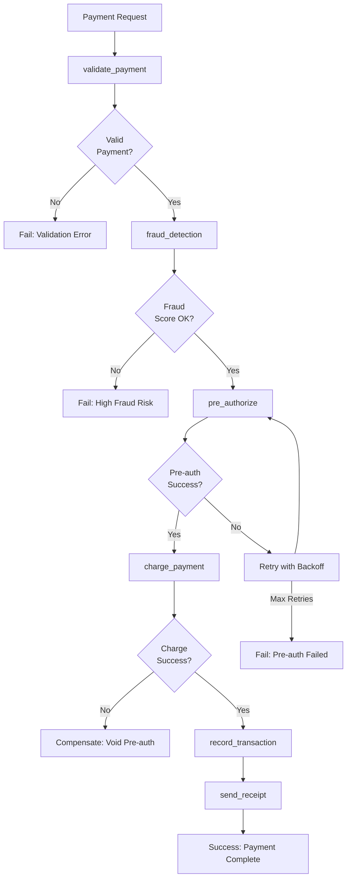

# Payment Processing Reactor Example

This example shows a payment processing workflow with fraud detection, multiple payment attempts, and comprehensive error handling.

## Overview

The PaymentProcessingReactor handles complex payment scenarios:

1. **Validate Payment**: Check payment details and amounts
2. **Fraud Check**: Run fraud detection algorithms
3. **Pre-authorization**: Pre-authorize the payment
4. **Final Charge**: Complete the payment
5. **Record Transaction**: Store payment details
6. **Send Receipt**: Email payment confirmation

### Payment Processing Workflow



## Implementation

```ruby
class PaymentProcessingReactor < RubyReactor::Reactor
  async true

  # Payment processing needs careful retry configuration
  retry_defaults max_attempts: 2, backoff: :fixed, base_delay: 30.seconds

  input :amount, validate: -> do
    required(:amount).filled(:decimal, gt?: 0)
  end

  input :currency, validate: -> do
    required(:currency).filled(:string, included_in?: ['USD', 'EUR', 'GBP'])
  end

  input :card_token, validate: -> do
    required(:card_token).filled(:string, format?: /^tok_/)
  end

  step :validate_payment do
    argument :amount, input(:amount)
    argument :currency, input(:currency)
    argument :card_token, input(:card_token)

    run do |args, _context|
      amount = args[:amount]
      currency = args[:currency]
      card_token = args[:card_token]

      Success({ validated_amount: amount, validated_currency: currency })
    end
  end

  step :fraud_detection do
    argument :validation_data, result(:validate_payment)
    argument :amount, input(:amount)
    argument :card_token, input(:card_token)

    run do |args, _context|
      amount = args[:amount]
      card_token = args[:card_token]

      fraud_score = FraudDetectionService.analyze(
        amount: amount,
        card_token: card_token,
        # Additional context...
      )

      if fraud_score > 0.8
        raise "High fraud risk detected (score: #{fraud_score})"
      end

      Success({ fraud_score: fraud_score, fraud_check_passed: true })
    end
  end

  step :pre_authorize do
    argument :fraud_data, result(:fraud_detection)
    argument :amount, input(:amount)
    argument :currency, input(:currency)
    argument :card_token, input(:card_token)

    retry max_attempts: 3, backoff: :exponential, base_delay: 5.seconds, idempotent: true

    run do |args, _context|
      amount = args[:amount]
      currency = args[:currency]
      card_token = args[:card_token]

      auth_result = PaymentGateway.pre_authorize(
        amount: amount,
        currency: currency,
        card_token: card_token
      )

      raise "Pre-authorization failed: #{auth_result.error}" unless auth_result.success?

      Success({ auth_id: auth_result.id, auth_amount: amount })
    end

    compensate do |args, _context|
      auth_id = args[:fraud_data][:auth_id] || args[:auth_id]
      # Void the pre-authorization
      PaymentGateway.void_authorization(auth_id) if auth_id
    end
  end

  step :charge_payment do
    argument :auth_data, result(:pre_authorize)

    # Final charge - critical operation
    retry max_attempts: 1, backoff: :fixed, base_delay: 60.seconds, idempotent: true

    run do |args, _context|
      auth_id = args[:auth_data][:auth_id]
      amount = args[:auth_data][:auth_amount]
      currency = args[:currency]

      charge_result = PaymentGateway.charge(
        auth_id: auth_id,
        amount: amount,
        currency: currency
      )

      raise "Charge failed: #{charge_result.error}" unless charge_result.success?

      Success({ charge_id: charge_result.id, charged_amount: amount })
    end

    compensate do |args, _context|
      charge_id = args[:auth_data][:charge_id] || args[:charge_id]
      # Refund the charge
      PaymentGateway.refund(charge_id) if charge_id
    end
  end

  step :record_transaction do
    argument :charge_data, result(:charge_payment)
    argument :fraud_data, result(:fraud_detection)
    argument :amount, input(:amount)
    argument :currency, input(:currency)
    argument :card_token, input(:card_token)

    run do |args, _context|
      charge_id = args[:charge_data][:charge_id]
      amount = args[:amount]
      currency = args[:currency]
      card_token = args[:card_token]
      fraud_score = args[:fraud_data][:fraud_score]

      transaction = PaymentTransaction.create!(
        charge_id: charge_id,
        amount: amount,
        currency: currency,
        card_token: card_token,
        fraud_score: fraud_score,
        status: :completed,
        processed_at: Time.current
      )

      { transaction_id: transaction.id }
    end

    compensate do |args, _context|
      transaction_id = args[:charge_data][:transaction_id] || args[:transaction_id]
      # Mark transaction as failed/refunded
      PaymentTransaction.find_by(id: transaction_id)&.update!(status: :refunded)
    end
  end

  step :send_receipt do
    argument :transaction_data, result(:record_transaction)
    argument :amount, input(:amount)
    argument :currency, input(:currency)

    idempotent true
    retry max_attempts: 3, backoff: :linear, base_delay: 10.seconds

    run do |args, _context|
      transaction_id = args[:transaction_data][:transaction_id]
      amount = args[:amount]
      currency = args[:currency]

      transaction = PaymentTransaction.find(transaction_id)
      customer = transaction.customer

      receipt_result = EmailService.send_payment_receipt(
        to: customer.email,
        transaction: transaction,
        amount: amount,
        currency: currency
      )

      raise "Receipt delivery failed" unless receipt_result.success?

      { receipt_sent: true }
    end
  end
end
```

## Advanced Payment Scenarios

### Multi-Attempt Payment Processing

```ruby
class MultiAttemptPaymentReactor < RubyReactor::Reactor
  async true

  retry_defaults max_attempts: 3, backoff: :exponential, base_delay: 10.seconds

  step :attempt_primary_card do
    argument :order, input(:order)

    run do |args, _context|
      order = args[:order]

      result = process_payment_with_card(order, order.primary_card)
      if result.success?
        { payment_result: result, card_used: :primary }
      else
        { payment_failed: true, primary_card_failed: true }
      end
    end
  end

  step :attempt_backup_card do
    argument :primary_attempt, result(:attempt_primary_card)
    argument :order, input(:order)

    run do |args, _context|
      order = args[:order]
      primary_card_failed = args[:primary_attempt][:primary_card_failed]

      return { skipped: true } unless primary_card_failed

      result = process_payment_with_card(order, order.backup_card)
      if result.success?
        { payment_result: result, card_used: :backup }
      else
        raise "All payment attempts failed"
      end
    end
  end

  step :process_successful_payment do
    argument :attempt_result, result(:attempt_backup_card)

    run do |args, _context|
      payment_result = args[:attempt_result][:payment_result]
      card_used = args[:attempt_result][:card_used]

      # Record successful payment
      PaymentRecord.create!(
        charge_id: payment_result.id,
        card_used: card_used,
        amount: payment_result.amount
      )

      { payment_recorded: true }
    end
  end

  private

  def process_payment_with_card(order, card)
    PaymentGateway.charge(
      amount: order.total,
      card_token: card.token,
      description: "Order ##{order.id}"
    )
  end
end

### Subscription Payment Processing

```ruby
class SubscriptionPaymentReactor < RubyReactor::Reactor
  async true

  retry_defaults max_attempts: 3, backoff: :exponential, base_delay: 1.hour

  input :subscription_id, validate: -> do
    required(:subscription_id).filled(:string)
  end

  step :validate_subscription do
    argument :subscription_id, input(:subscription_id)

    run do |args, _context|
      subscription_id = args[:subscription_id]

      subscription = Subscription.find(subscription_id)
      raise "Subscription not found" unless subscription
      raise "Subscription inactive" unless subscription.active?

      { subscription: subscription }
    end
  end

  step :calculate_proration do
    argument :validation_data, result(:validate_subscription)

    run do |args, _context|
      subscription = args[:validation_data][:subscription]

      # Calculate prorated amount for billing period
      proration = BillingService.calculate_proration(subscription)
      { proration_amount: proration.amount, billing_period: proration.period }
    end
  end

  step :charge_subscription do
    argument :validation_data, result(:validate_subscription)
    argument :proration_data, result(:calculate_proration)

    idempotent true  # Safe to retry subscription charges

    run do |args, _context|
      subscription = args[:validation_data][:subscription]
      proration_amount = args[:proration_data][:proration_amount]
      billing_period = args[:proration_data][:billing_period]

      charge_result = PaymentGateway.charge_subscription(
        customer_id: subscription.customer.stripe_id,
        amount: proration_amount,
        description: "Subscription #{subscription.id} - #{billing_period}"
      )

      raise "Subscription charge failed" unless charge_result.success?

      { charge_id: charge_result.id }
    end

    compensate do |args, _context|
      charge_id = args[:validation_data][:charge_id] || args[:charge_id]
      # Refund the subscription charge
      PaymentGateway.refund_subscription_charge(charge_id) if charge_id
    end
  end

  step :update_billing_record do
    argument :validation_data, result(:validate_subscription)
    argument :proration_data, result(:calculate_proration)
    argument :charge_data, result(:charge_subscription)

    run do |args, _context|
      subscription = args[:validation_data][:subscription]
      charge_id = args[:charge_data][:charge_id]
      billing_period = args[:proration_data][:billing_period]

      BillingRecord.create!(
        subscription: subscription,
        charge_id: charge_id,
        billing_period: billing_period,
        status: :paid
      )

      { billing_recorded: true }
    end
  end
```

### Subscription Payment Processing

```ruby
class SubscriptionPaymentReactor < RubyReactor::Reactor
  async true

  retry_defaults max_attempts: 3, backoff: :exponential, base_delay: 1.hour

  input :subscription_id, validate: -> do
    required(:subscription_id).filled(:string)
  end

  step :validate_subscription do
    validate_args do
      required(:subscription_id).filled(:string)
    end

    run do |subscription_id:|
      subscription = Subscription.find(subscription_id)
      raise "Subscription not found" unless subscription
      raise "Subscription inactive" unless subscription.active?

      { subscription: subscription }
    end
  end

  step :calculate_proration do
    depends_on :validate_subscription

    run do |subscription:, **|
      # Calculate prorated amount for billing period
      proration = BillingService.calculate_proration(subscription)
      { proration_amount: proration.amount, billing_period: proration.period }
    end
  end

  step :charge_subscription do
    depends_on :calculate_proration

    idempotent true  # Safe to retry subscription charges

    run do |subscription:, proration_amount:, billing_period:, **|
      charge_result = PaymentGateway.charge_subscription(
        customer_id: subscription.customer.stripe_id,
        amount: proration_amount,
        description: "Subscription #{subscription.id} - #{billing_period}"
      )

      raise "Subscription charge failed" unless charge_result.success?

      { charge_id: charge_result.id }
    end

    compensate do |charge_id:, **|
      # Refund the subscription charge
      PaymentGateway.refund_subscription_charge(charge_id) if charge_id
    end
  end

  step :update_billing_record do
    depends_on :charge_subscription

    run do |subscription:, charge_id:, billing_period:, **|
      BillingRecord.create!(
        subscription: subscription,
        charge_id: charge_id,
        billing_period: billing_period,
        status: :paid
      )

      { billing_recorded: true }
    end
  end
end
```

## Error Handling Patterns

### Payment Gateway Timeouts

```ruby
class TimeoutHandlingReactor < RubyReactor::Reactor
  step :handle_timeout do
    retry max_attempts: 5, backoff: :exponential, base_delay: 2.seconds

    run do
      begin
        Timeout.timeout(10.seconds) do
          PaymentGateway.charge(amount: 100, card_token: token)
        end
      rescue Timeout::Error
        raise PaymentTimeoutError.new("Gateway timeout")
      end
    end
  end
end

class PaymentTimeoutError < StandardError
  def retryable?
    true
  end
end
```

### Insufficient Funds Handling

```ruby
class InsufficientFundsReactor < RubyReactor::Reactor
  step :handle_insufficient_funds do
    run do
      result = PaymentGateway.charge(amount: 100, card_token: token)

      if result.error_code == 'insufficient_funds'
        # Trigger alternative payment flow
        notify_customer_insufficient_funds
        raise NonRetryablePaymentError.new("Insufficient funds")
      end

      result
    end
  end
end

class NonRetryablePaymentError < StandardError
  def retryable?
    false
  end
end
```

## Testing Payment Reactors

```ruby
RSpec.describe PaymentProcessingReactor do
  let(:valid_payment_params) do
    {
      amount: 100.00,
      currency: 'USD',
      card_token: 'tok_1234567890'
    }
  end

  context "successful payment" do
    it "completes all payment steps" do
      allow(FraudDetectionService).to receive(:analyze).and_return(0.3)
      allow(PaymentGateway).to receive(:pre_authorize).and_return(successful_auth)
      allow(PaymentGateway).to receive(:charge).and_return(successful_charge)
      allow(EmailService).to receive(:send_payment_receipt).and_return(successful_email)

      result = PaymentProcessingReactor.run(valid_payment_params)

      expect(result).to be_success
      expect(result.step_results[:charge_payment][:charge_id]).to be_present
    end
  end

  context "fraud detection" do
    it "blocks high-risk payments" do
      allow(FraudDetectionService).to receive(:analyze).and_return(0.9)

      result = PaymentProcessingReactor.run(valid_payment_params)

      expect(result).to be_failure
      expect(result.error.message).to include("High fraud risk")
    end
  end

  context "payment gateway failure" do
    it "retries pre-authorization" do
      allow(FraudDetectionService).to receive(:analyze).and_return(0.3)
      allow(PaymentGateway).to receive(:pre_authorize)
        .and_raise(PaymentGateway::TimeoutError)
        .and_raise(PaymentGateway::TimeoutError)
        .and_return(successful_auth)

      expect(PaymentGateway).to receive(:pre_authorize).exactly(3).times

      result = PaymentProcessingReactor.run(valid_payment_params)

      expect(result).to be_success
    end
  end

  context "compensation" do
    it "refunds on final charge failure" do
      allow(FraudDetectionService).to receive(:analyze).and_return(0.3)
      allow(PaymentGateway).to receive(:pre_authorize).and_return(successful_auth)
      allow(PaymentGateway).to receive(:charge).and_raise(PaymentGateway::DeclineError)

      expect(PaymentGateway).to receive(:void_authorization)

      result = PaymentProcessingReactor.run(valid_payment_params)

      expect(result).to be_failure
    end
  end
end
```

## Monitoring and Alerting

```ruby
# Key metrics for payment processing
PAYMENT_METRICS = {
  payment_success_rate: "Percentage of successful payments",
  fraud_detection_rate: "Percentage of payments flagged as fraud",
  average_payment_time: "Average time to process payment",
  retry_rate: "Percentage of payments requiring retries",
  chargeback_rate: "Rate of payment chargebacks"
}

# Alerts
PAYMENT_ALERTS = {
  high_failure_rate: "Payment success rate below 95%",
  high_fraud_rate: "Fraud detection rate above 10%",
  slow_processing: "Average payment time above 30 seconds"
}
```

## Security Considerations

1. **PCI Compliance**: Never log full card details
2. **Tokenization**: Use payment provider tokens, not raw card data
3. **Idempotency Keys**: Prevent duplicate charges
4. **Rate Limiting**: Implement per-customer rate limits
5. **Audit Logging**: Log all payment attempts (without sensitive data)

## Performance Optimization

### Connection Pooling

```ruby
# Configure payment gateway connection pooling
PaymentGateway.configure do |config|
  config.connection_pool_size = 10
  config.connection_timeout = 5.seconds
end
```

### Caching

```ruby
# Cache fraud detection models
Rails.cache.fetch("fraud_model_#{Date.today}", expires_in: 1.day) do
  FraudDetectionService.load_model
end
```

### Async Processing

```ruby
# Use async for non-critical steps
step :send_receipt do
  async true  # Don't block payment completion on email delivery

  run do
    # Email sending logic
  end
end
```</content>
<parameter name="filePath">/Users/artur.panach/dev/republic/ruby_reactor/docs/examples/payment_processing.md