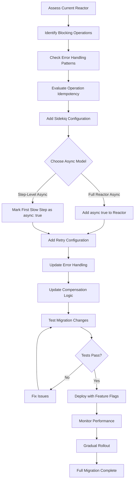

# Migration Guide: Sync to Async Reactors

This guide helps you migrate existing synchronous reactors to asynchronous execution with retry capabilities.

## Migration Overview

### Before (Synchronous)

```ruby
class OrderProcessingReactor < RubyReactor::Reactor
  step :validate_order do
    run { validate_order_logic }
  end

  step :process_payment do
    run { process_payment_logic }
  end
end

# Blocking execution
result = OrderProcessingReactor.run(order_id: 123)
```

### After (Asynchronous)

```ruby
class OrderProcessingReactor < RubyReactor::Reactor
  async true  # Enable async execution

  retry_defaults max_attempts: 3, backoff: :exponential, base_delay: 2.seconds

  step :validate_order do
    run { validate_order_logic }
  end

  step :process_payment do
    retry max_attempts: 2, idempotent: true  # Payment-specific retry
    run { process_payment_logic }
  end
end

# Non-blocking execution
async_result = OrderProcessingReactor.run(order_id: 123)
```

### Migration Workflow



## Step-by-Step Migration

### Step 1: Assess Current Implementation

1. **Identify blocking operations**: Find steps that benefit from async execution
2. **Check error handling**: Review current error handling patterns
3. **Evaluate idempotency**: Determine which operations are safe to retry
4. **Review dependencies**: Ensure all required gems are available

### Step 2: Add Sidekiq Configuration

```ruby
# config/sidekiq.rb
require 'ruby_reactor/worker'

RubyReactor.configure do |config|
  config.sidekiq_queue = :default
  config.sidekiq_retry_count = 3
  config.logger = Logger.new('log/ruby_reactor.log')
end
```

### Step 3: Enable Async Execution

#### Option A: Full Reactor Async

```ruby
class OrderProcessingReactor < RubyReactor::Reactor
  async true  # Add this line

  # ... existing steps unchanged
end
```

#### Option B: Step-Level Async

```ruby
class OrderProcessingReactor < RubyReactor::Reactor
  step :validate_order do
    # Keep synchronous for immediate validation
    run { validate_order_logic }
  end

  step :process_payment, async: true do  # Add async: true
    run { process_payment_logic }
  end

  # ... remaining steps run in worker
end
```

### Step 4: Add Retry Configuration

#### Basic Retry Setup

```ruby
class OrderProcessingReactor < RubyReactor::Reactor
  async true

  # Add reactor-level defaults
  retry_defaults max_attempts: 3, backoff: :exponential, base_delay: 2.seconds

  step :validate_order do
    # Inherits defaults
    run { validate_order_logic }
  end

  step :process_payment do
    # Override for critical operations
    retry max_attempts: 2, backoff: :fixed, base_delay: 10.seconds, idempotent: true
    run { process_payment_logic }
  end
end
```

#### Identify Idempotent Operations

```ruby
step :send_notification do
  idempotent true  # Safe to retry
  run { EmailService.send_notification(order) }
end

step :create_record do
  # NOT idempotent - don't mark as such
  run { Database.create_record(data) }
end
```

### Step 5: Update Error Handling

#### Before (Synchronous)

```ruby
begin
  result = OrderProcessingReactor.run(order_id: 123)
  if result.success?
    # Handle success
  else
    # Handle failure
  end
rescue => e
  # Handle exceptions
end
```

#### After (Asynchronous)

```ruby
async_result = OrderProcessingReactor.run(order_id: 123)

# Check status asynchronously
case async_result.status
when :pending, :running
  # Execution in progress
  schedule_status_check(async_result.job_id)
when :success
  result = async_result.result
  # Handle success
when :failed
  error = async_result.error
  # Handle failure
end
```

### Step 6: Update Compensation Logic

Async reactors run compensation in worker context:

```ruby
step :process_payment do
  run do
    payment = PaymentService.charge(amount, token)
    { payment_id: payment.id }
  end

  compensate do |payment_id:, **|
    # This now runs in Sidekiq worker
    PaymentService.refund(payment_id) if payment_id
  end
end
```

## Common Migration Patterns

### Pattern 1: Simple Async Conversion

**Before:**
```ruby
class SimpleReactor < RubyReactor::Reactor
  step :do_work do
    run { some_work }
  end
end
```

**After:**
```ruby
class SimpleReactor < RubyReactor::Reactor
  async true

  retry_defaults max_attempts: 3, backoff: :exponential, base_delay: 1.second

  step :do_work do
    run { some_work }
  end
end
```

### Pattern 2: Critical Path Optimization

**Before:**
```ruby
class PaymentReactor < RubyReactor::Reactor
  step :validate_card do
    run { validate_card_logic }
  end

  step :charge_card do
    run { charge_card_logic }
  end
end
```

**After:**
```ruby
class PaymentReactor < RubyReactor::Reactor
  step :validate_card do
    # Keep validation synchronous for immediate feedback
    run { validate_card_logic }
  end

  step :charge_card, async: true do
    # Move payment processing to background
    retry max_attempts: 2, backoff: :fixed, base_delay: 30.seconds, idempotent: true
    run { charge_card_logic }
  end
end
```

### Pattern 3: Complex Workflow with Dependencies

**Before:**
```ruby
class ComplexReactor < RubyReactor::Reactor
  step :step_a do
    run { work_a }
  end

  step :step_b do
    depends_on :step_a
    run { work_b }
  end

  step :step_c do
    depends_on :step_b
    run { work_c }
  end
end
```

**After:**
```ruby
class ComplexReactor < RubyReactor::Reactor
  async true

  retry_defaults max_attempts: 3, backoff: :exponential, base_delay: 2.seconds

  step :step_a do
    retry max_attempts: 5  # More retries for this step
    run { work_a }
  end

  step :step_b do
    argument :a_result, result(:step_a)
    idempotent true  # Safe to retry
    run do |args, _context|
      work_b(args[:a_result])
    end
  end

  step :step_c do
    argument :b_result, result(:step_b)
    run do |args, _context|
      work_c(args[:b_result])
    end
  end
end
```

## Testing Migration Changes

### Unit Tests

```ruby
RSpec.describe OrderProcessingReactor do
  context "async execution" do
    it "queues job for async execution" do
      expect {
        OrderProcessingReactor.run(order_id: 123)
      }.to change { RubyReactor::Worker.jobs.size }.by(1)
    end

    it "handles retry scenarios" do
      allow(PaymentService).to receive(:charge)
        .and_raise(NetworkError.new("Timeout"))
        .and_return(payment_result)

      result = OrderProcessingReactor.run(order_id: 123)

      # Test will need to drain the queue
      RubyReactor::Worker.drain

      expect(result).to be_success
    end
  end
end
```

### Integration Tests

```ruby
describe "Migration integration" do
  it "maintains same behavior with async execution" do
    # Test both sync and async versions produce same results
    sync_result = SyncOrderProcessingReactor.run(order_id: 123)
    async_result = AsyncOrderProcessingReactor.run(order_id: 123)

    RubyReactor::Worker.drain  # Process async result

    expect(async_result.result.step_results).to eq(sync_result.step_results)
  end
end
```

## Performance Considerations

### Before Migration

- **Blocking**: Workers wait during retry delays
- **Limited concurrency**: Fewer concurrent operations
- **Resource waste**: Threads blocked on sleep

### After Migration

- **Non-blocking**: Workers freed during retries
- **Higher concurrency**: More operations per worker
- **Better utilization**: Optimal resource usage

### Monitoring Changes

Track these new metrics:

```ruby
# Async-specific metrics
async_job_queue_depth
worker_utilization_rate
average_retry_delay
retry_success_rate
```

## Rollback Strategy

### Feature Flags

```ruby
class OrderProcessingReactor < RubyReactor::Reactor
  # Use environment variable for gradual rollout
  async ENV['ENABLE_ASYNC_REACTORS'] == 'true'

  # ... rest of implementation
end
```

### Gradual Migration

1. **Phase 1**: Enable async for low-risk reactors
2. **Phase 2**: Add retry configuration
3. **Phase 3**: Enable for high-throughput reactors
4. **Phase 4**: Full migration with monitoring

### Rollback Plan

```ruby
# Quick rollback by removing async flag
class OrderProcessingReactor < RubyReactor::Reactor
  # async true  # Comment out to disable
  # retry_defaults ...  # Remove retry config

  # Reactor becomes synchronous again
end
```

## Troubleshooting

### Common Issues

1. **Context too large**: Implement compression or external storage
2. **Serialization errors**: Handle complex objects properly
3. **Retry storms**: Tune retry parameters appropriately
4. **Worker timeouts**: Adjust Sidekiq timeout settings

### Debugging

```ruby
# Check Sidekiq logs for retry attempts
tail -f log/sidekiq.log
```

### Performance Tuning

```ruby
# Adjust retry configuration based on load testing
RubyReactor.configure do |config|
  config.sidekiq_retry_count = 5  # Increase if needed
  config.sidekiq_queue = :high_priority  # Use appropriate queue
  config.logger.level = Logger::INFO  # Adjust log level
end
```

3. **Worker timeouts**: Adjust Sidekiq timeout settings

- [ ] All existing functionality works
- [ ] No blocking during retry delays
- [ ] Improved throughput and resource utilization
- [ ] Full observability of async operations
- [ ] Comprehensive test coverage
- [ ] Monitoring and alerting in place

## Next Steps

1. Start with a low-risk reactor for initial migration
2. Implement monitoring and alerting
3. Gradually migrate remaining reactors
4. Optimize performance based on metrics
5. Document lessons learned</content>
<parameter name="filePath">/Users/artur.panach/dev/republic/ruby_reactor/docs/migration_guide.md