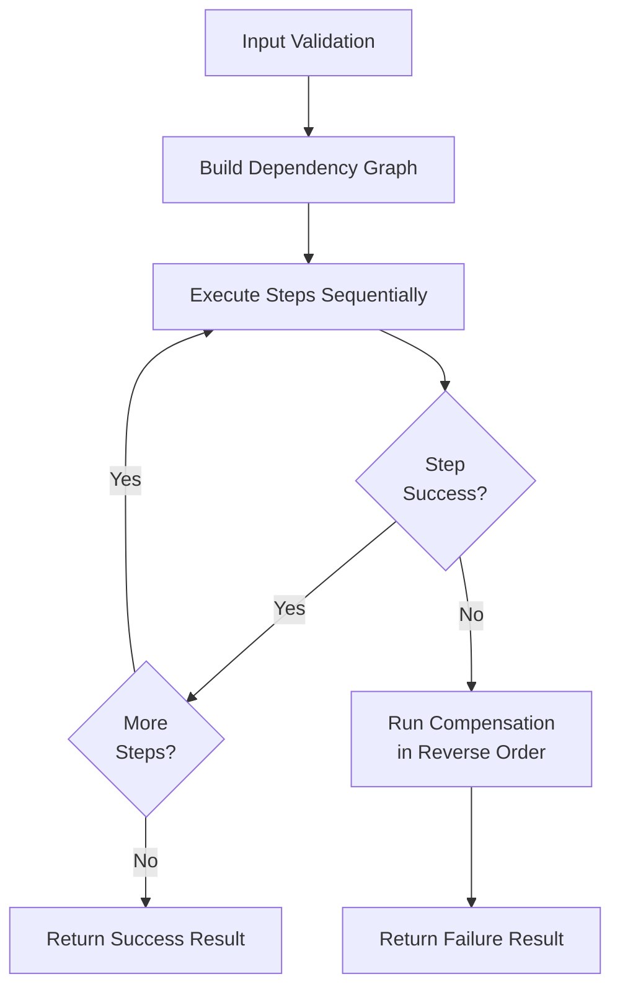
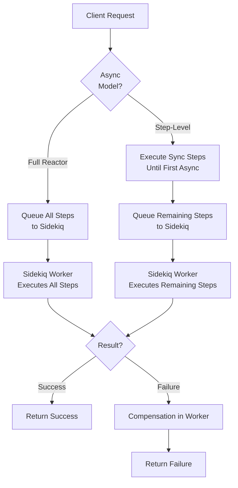

# RubyReactor Documentation

RubyReactor is a powerful Ruby framework for building reliable, sequential business processes with built-in error handling, compensation, and rollback capabilities.

## Table of Contents

- [Getting Started](getting_started.md)
- [Core Concepts](core_concepts.md)
- [DAG Execution and Saga Patterns](DAG.md)
- [Async Reactors](async_reactors.md)
- [Composition](composition.md)
- [Data Pipelines](data_pipelines.md)
- [Retry Configuration](retry_configuration.md)
- [Interrupts](interrupts.md)
- [Testing with RSpec](testing.md)
- [Examples](examples/)
  - [Order Processing](examples/order_processing.md)
  - [Payment Processing](examples/payment_processing.md)
  - [Inventory Management](examples/inventory_management.md)

## Quick Start

```ruby
require 'ruby_reactor'

class OrderProcessingReactor < RubyReactor::Reactor
  input :order_id

  step :validate_order do
    argument :order_id, input(:order_id)
    run { |args, _ctx| Success(Order.find(args[:order_id])) }
  end

  step :process_payment do
    argument :order, result(:validate_order)
    run { |args, _ctx| Success(PaymentService.charge(args[:order])) }
  end

  step :send_confirmation do
    argument :order, result(:validate_order)
    run { |args, _ctx| Success(EmailService.send(args[:order])) }
  end

  returns :process_payment
end

# Execute synchronously
result = OrderProcessingReactor.run(order_id: 123)
result.success? # => true
result.value    # => payment result
```

## Key Features

- **Sequential Execution**: Steps execute in dependency order
- **Error Handling**: Automatic compensation and rollback on failures
- **Async Support**: Full reactor async or step-level async execution
- **Non-Blocking Retries**: Job requeuing instead of blocking workers
- **Sidekiq Integration**: Seamless background processing
- **Retry Configuration**: Flexible retry policies per step

## Architecture

RubyReactor provides two execution models:

1. **Synchronous**: All steps execute in the current thread
2. **Asynchronous**: Steps execute in Sidekiq workers with non-blocking retries

### Execution Flow



### Async Execution Models



- **Full Reactor Async**: Entire reactor executes in background
- **Step-Level Async**: Handoff to background at first async step

## Error Handling

RubyReactor provides comprehensive error handling:

- **Step Failures**: Automatic retry with configurable backoff
- **Compensation**: Undo operations for failed steps
- **Rollback**: Complete transaction rollback on critical failures
- **Non-Blocking**: Workers freed during retry delays

## Performance

- **Zero Blocking**: No threads blocked during retry delays
- **Scalable**: Linear scaling with worker pool size
- **Efficient**: Optimized context serialization and deserialization

## Requirements

- Ruby 3.0+
- Redis (for async execution and state persistence)
- Sidekiq (for background processing)
- dry-validation (optional, for input/payload validation)

## Installation

Add to your Gemfile:

```ruby
gem 'ruby_reactor'
```

## Contributing

Bug reports and pull requests are welcome at <https://github.com/arturictus/ruby_reactor>. See the root [README](../README.md#contributing) for development setup.
