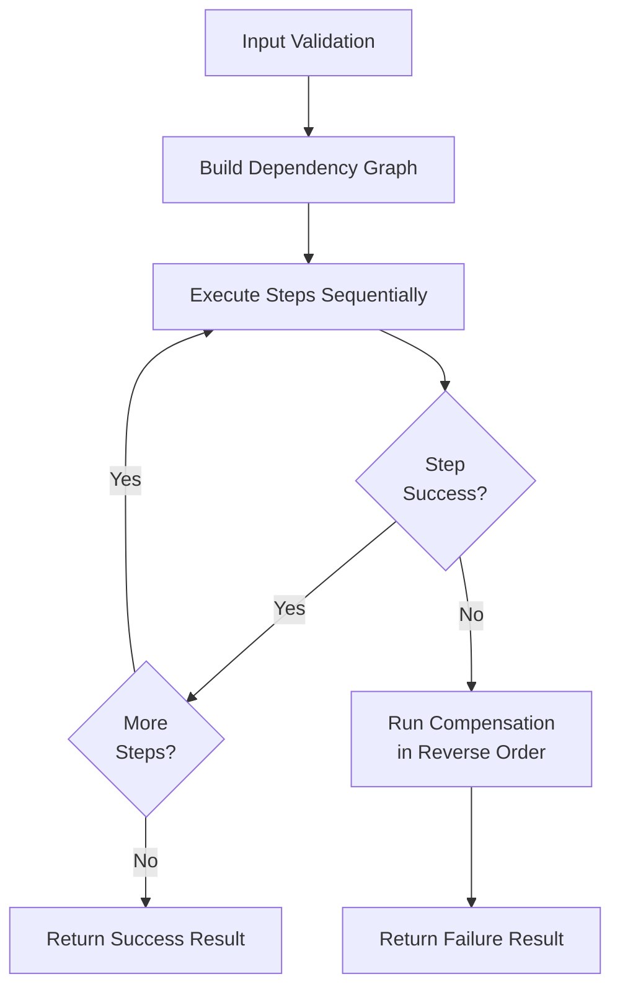
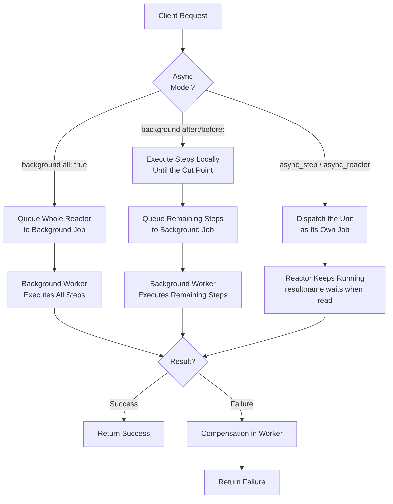

# RubyReactor Documentation

RubyReactor is a powerful Ruby framework for building reliable, sequential business processes with built-in error handling, compensation, and rollback capabilities.

## Defining Steps

RubyReactor supports two step styles:

- **Class steps** (preferred) — a class that `include RubyReactor::Step` with `self.run`, and optionally `self.compensate` and `self.undo`. Reference it in the reactor with `step :name, MyStepClass do ... end`.
- **Inline blocks** — `step :name do ... run { ... } end` inside the reactor class.

Use class steps for anything beyond a trivial one-liner. They improve **testability** (unit-test step logic in isolation), **composability** (reuse the same step across reactors), and **readability** (reactor files stay focused on orchestration as workflows grow).

Most examples in this documentation mix class steps with inline blocks — class steps where the logic matters, inline blocks where a step is trivial. See [Core Concepts — Step Classes](core_concepts.md#step-classes-preferred) for the full guide.

## Table of Contents

- [Getting Started](getting_started.md)
- [Core Concepts](core_concepts.md)
- [DAG Execution and Saga Patterns](DAG.md)
- [Async Reactors](async_reactors.md)
- [Composition](composition.md)
- [Data Pipelines](data_pipelines.md)
- [Retry Configuration](retry_configuration.md)
- [Locks, Semaphores, Rate Limits, Periods & Ordered Locks](locks_and_semaphores.md)
- [Interrupts](interrupts.md)
- [Middlewares & OpenTelemetry](middlewares.md)
- [Testing with RSpec](testing.md)
- [Examples](examples/)
  - [Order Processing](examples/order_processing.md)
  - [Payment Processing](examples/payment_processing.md)
  - [Inventory Management](examples/inventory_management.md)

## Quick Start

```ruby
require 'ruby_reactor'

class ValidateOrderStep
  include RubyReactor::Step

  def self.run(arguments, _context)
    Success(Order.find(arguments[:order_id]))
  end
end

class ProcessPaymentStep
  include RubyReactor::Step

  def self.run(arguments, _context)
    Success(PaymentService.charge(arguments[:order]))
  end
end

class OrderProcessingReactor < RubyReactor::Reactor
  input :order_id

  step :validate_order, ValidateOrderStep do
    argument :order_id, input(:order_id)
  end

  step :process_payment, ProcessPaymentStep do
    argument :order, result(:validate_order)
  end

  step :send_confirmation do
    argument :order, result(:validate_order)
    run { |args, _ctx| Success(EmailService.send(args[:order])) }
  end

  returns :process_payment
end

# Execute synchronously
result = OrderProcessingReactor.run(order_id: 123)
result.success? # => true
result.value    # => payment result
```

## Key Features

- **Sequential Execution**: Steps execute in dependency order
- **Error Handling**: Automatic compensation and rollback on failures
- **Async Support**: `background` hand-off (whole reactor or from a declared cut point), `async_step` (one step as its own job), `async_reactor` (an independent nested reactor)
- **Non-Blocking Retries & Waits**: Job requeuing instead of blocking workers — a worker reading a pending async result parks (locks kept held) rather than pinning its thread
- **Pluggable Backend**: Sidekiq or ActiveJob (any ActiveJob-compatible queue) for background processing
- **Retry Configuration**: Flexible retry policies per step

## Architecture

RubyReactor provides two execution models:

1. **Synchronous**: All steps execute in the current thread
2. **Asynchronous**: Steps execute in background jobs (Sidekiq or ActiveJob) with non-blocking retries

### Execution Flow



### Async Execution Models



- **`background all: true`**: Entire reactor executes in background
- **`background after:` / `before:`**: One declared cut point — everything past it runs in a single background job
- **`async_step` / `async_reactor`**: One step's work, or a whole nested reactor, dispatched as its own independent job; results are read with `result(:name)` (bounded wait — a worker-side reader parks instead of blocking; see [Async Reactors](async_reactors.md#waiting-on-dispatched-work))

## Error Handling

RubyReactor provides comprehensive error handling:

- **Step Failures**: Automatic retry with configurable backoff
- **Compensation**: Undo operations for failed steps
- **Rollback**: Complete transaction rollback on critical failures
- **Non-Blocking**: Workers freed during retry delays

## Performance

- **Zero Blocking**: No threads blocked during retry delays
- **Scalable**: Linear scaling with worker pool size
- **Efficient**: Optimized context serialization and deserialization

## Requirements

- Ruby 3.0+
- Redis (for async execution and state persistence)
- Sidekiq or ActiveJob (for background processing)
- dry-validation (optional, for input/payload validation)

## Installation

Add to your Gemfile:

```ruby
gem 'ruby_reactor'
```

## Contributing

Bug reports and pull requests are welcome at <https://github.com/arturictus/ruby_reactor>. See the root [README](../README.md#contributing) for development setup.
