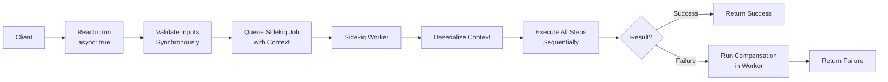
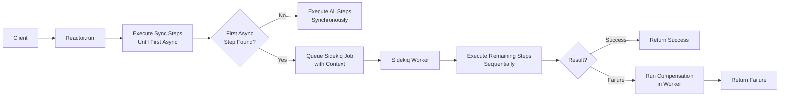
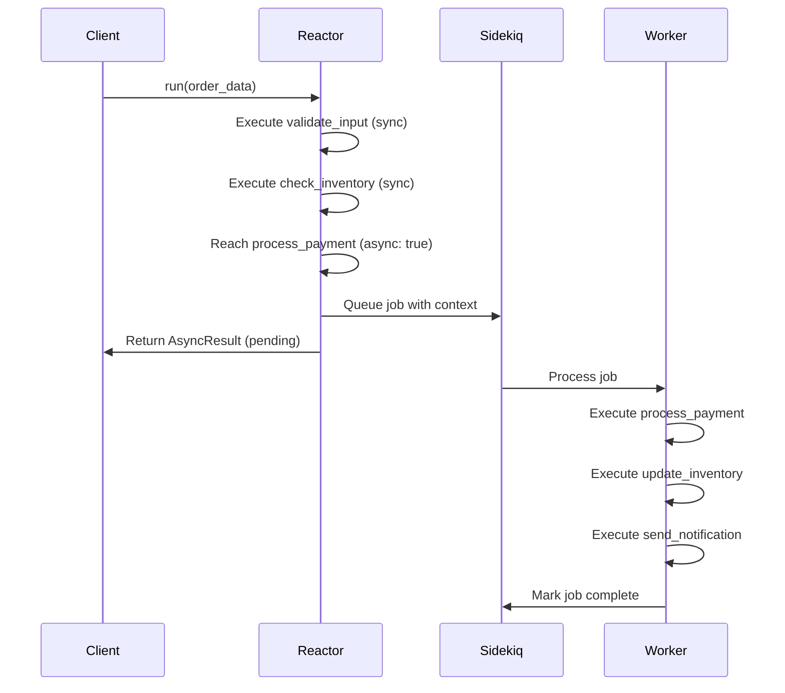
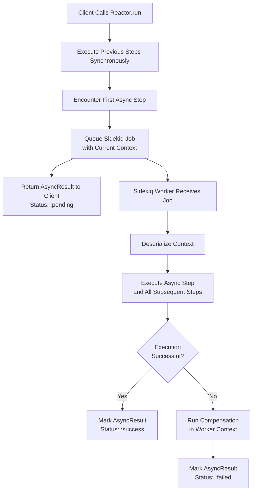

# Async Reactors

RubyReactor supports two asynchronous execution models: **Full Reactor Async** and **Step-Level Async**. Both models run on a pluggable background job backend — **Sidekiq** by default, or **ActiveJob** (any ActiveJob-compatible queue: Resque, Solid Queue, GoodJob, etc.) — with non-blocking retry mechanisms. The mechanics below are described in Sidekiq terms since it's the default, but everything (queueing, snoozing, retries, durability) works identically on ActiveJob; see [Backend Configuration](#backend-configuration) to switch.

## Overview

Async execution provides several benefits:

- **Non-blocking**: Workers are freed during retry delays
- **Scalable**: Better resource utilization with large worker pools
- **Reliable**: Automatic retry with configurable backoff strategies
- **Observable**: Full visibility into execution state and retry attempts

## Full Reactor Async

When a reactor is marked as `async true`, the entire execution happens in a Sidekiq worker, including input validation.

### Configuration

```ruby
class ValidateOrderStep
  include RubyReactor::Step

  def self.run(_arguments, _context)
    validate_order_logic
  end
end

class OrderProcessingReactor < RubyReactor::Reactor
  async true  # Enable full reactor async

  step :validate_order, ValidateOrderStep

  step :process_payment do
    run { process_payment_logic }
  end

  step :send_confirmation do
    run { send_confirmation_logic }
  end
end
```

### Execution Flow

```ruby
# Synchronous call returns immediately
async_result = OrderProcessingReactor.run(order_id: 123)

async_result.execution_id       # UUID for reloading state
async_result.intermediate_results # Whatever was computed before handoff

# Inspect status later by reloading from storage
reactor = OrderProcessingReactor.find(async_result.execution_id)
case reactor.context.status.to_s
when "running"   then puts "Execution is in progress"
when "completed" then puts "Done: #{reactor.result.value}"
when "failed"    then puts "Failed: #{reactor.result.error}"
when "paused"    then puts "Waiting on interrupt"
end
```

> **Note:** `AsyncResult` itself does not poll. It only carries the job handle and any results computed before handoff (`job_id`, `execution_id`, `intermediate_results`). To check progress, reload via `Reactor.find(execution_id)` and inspect `context.status`, or use the web dashboard.

### Architecture



```
Client → Reactor.run() → Queue Job → Sidekiq Worker → Execute All Steps
```

## Step-Level Async

Individual steps can be marked as `async: true`. Execution runs synchronously until the first async step, then hands off to a Sidekiq worker for all remaining execution.

### Configuration

```ruby
class ValidateOrderStep
  include RubyReactor::Step

  def self.run(arguments, _context)
    validate_order_logic(arguments)
  end
end

class OrderProcessingReactor < RubyReactor::Reactor
  step :validate_order, ValidateOrderStep do
    argument :order_id, input(:order_id)
  end

  step :process_payment do
    async true # First async step — triggers handoff to worker
    run { |args, _ctx| process_payment_logic(args) }
  end

  step :update_inventory do
    # Runs in worker after handoff
    run { |args, _ctx| update_inventory_logic(args) }
  end

  step :send_confirmation do
    # Runs in same worker
    run { |args, _ctx| send_confirmation_logic(args) }
  end
end
```

> **DSL note:** `async` is declared inside the step block (`async true`), not as a keyword on `step :name, async: true`. The `step` method only accepts a step name and an optional implementation class as positional arguments.

### Execution Flow

```ruby
# Runs validate_order synchronously, then hands off
async_result = OrderProcessingReactor.run(order_id: 123)

# All remaining steps execute in a single worker
# Compensation and rollback work within the worker context
```

### Architecture



```
Client → Reactor.run() → Sync Steps → Queue Job → Worker → Remaining Steps
```

## Async Steps

Individual steps can be configured with `async true`, which changes the execution behavior at the point where the first async step is encountered.

### Key Behavior

When an async step is encountered during synchronous execution:

1. **All previous steps have already executed synchronously** in the main thread
2. **The Sidekiq job is queued** at the moment the async step would be executed
3. **The async step itself and all subsequent steps execute** in the Sidekiq worker
4. **The main thread returns immediately** with an async result handle

### Important Distinction

- **Before async step**: All execution is synchronous
- **At async step**: Job is queued instead of executing the step
- **After async step**: All remaining execution happens in the worker

### Example

```ruby
class OrderProcessingReactor < RubyReactor::Reactor
  step :validate_input do
    # Executes synchronously in main thread
    run { validate_order_input }
  end

  step :check_inventory do
    # Executes synchronously in main thread
    run { check_inventory_levels }
  end

  step :process_payment do
    async true
    # Job is queued here - this step executes in worker
    run { process_payment_logic }
  end

  step :update_inventory do
    # Executes in worker
    run { update_inventory_records }
  end

  step :send_notification do
    # Executes in worker
    run { send_order_confirmation }
  end
end
```

### Execution Flow with Mermaid





### Critical Points

- **Synchronous Prefix Guarantee**: Steps before the first async step always complete synchronously
- **Single Handoff Point**: Only one job is queued per reactor execution
- **Worker Execution**: The async step and all following steps run in the same worker
- **Context Preservation**: Execution state is serialized and passed to the worker
- **Compensation Scope**: All compensation for failed async execution happens in the worker

## Retry Configuration

Both async models support sophisticated retry mechanisms with non-blocking job requeuing.

### Step-Level Retry

```ruby
class PaymentProcessingReactor < RubyReactor::Reactor
  async true

  step :validate_payment do
    retries max_attempts: 3, backoff: :exponential, base_delay: 1.second
    run { |args, _ctx| validate_payment_logic(args) }
  end

  step :charge_card do
    async true
    retries max_attempts: 5, backoff: :linear, base_delay: 5.seconds
    run { |args, _ctx| charge_card_logic(args) }
  end

  step :update_records do
    # No retry - critical step
    run { |args, _ctx| update_records_logic(args) }
  end
end
```

### Reactor-Level Defaults

```ruby
class PaymentProcessingReactor < RubyReactor::Reactor
  async true

  # Set defaults for all steps
  retry_defaults max_attempts: 3, backoff: :exponential, base_delay: 2.seconds

  step :validate_payment do
    # Inherits reactor defaults (3 attempts, exponential backoff)
    run { validate_payment_logic }
  end

  step :charge_card do
    # Override defaults for this step
    retries max_attempts: 5, backoff: :linear, base_delay: 10.seconds
    run { charge_card_logic }
  end
end
```

## Retry Strategies

### Backoff Algorithms

- **`:exponential`**: Delay doubles with each attempt (1s, 2s, 4s, 8s...)
- **`:linear`**: Delay increases linearly (5s, 10s, 15s, 20s...)
- **`:fixed`**: Same delay for each attempt (5s, 5s, 5s, 5s...)

## Error Handling and Compensation

Async reactors support full compensation and rollback in the worker context:

```ruby
class OrderProcessingReactor < RubyReactor::Reactor
  async true

  step :process_payment do
    argument :order, result(:validate_order)
    run { |args, _ctx| process_payment_logic(args[:order]) }

    undo do |result, _args, _ctx|
      # Runs in worker when a LATER step fails
      PaymentService.refund(result[:payment_id])
      Success()
    end

    compensate do |error, args, _ctx|
      # Runs in worker if THIS step fails
      AuditService.log_payment_failure(args[:order].id, error.message)
      Success()
    end
  end

  step :update_inventory do
    argument :order, result(:validate_order)
    run { |args, _ctx| update_inventory_logic(args[:order]) }

    compensate do |_error, args, _ctx|
      # Runs in worker on failure
      InventoryService.restore(args[:order])
      Success()
    end
  end
end
```

## Monitoring and Observability

### Job Visibility

On the Sidekiq adapter, retries are visible in the Sidekiq web UI with:
- Step name and attempt number
- Retry delay and timing
- Success/failure status
- Execution context

On the ActiveJob adapter, visibility depends on your underlying queue adapter (e.g. Solid Queue's dashboard, Sidekiq's own UI if that's the adapter underneath ActiveJob, etc.) — RubyReactor's own execution trace (`reactor.execution_trace`, see [Getting Started](getting_started.md#inspecting-the-context)) is backend-agnostic either way.

## Configuration

### Backend Configuration

```ruby
# config/initializers/ruby_reactor.rb (Rails) or load before booting your worker
RubyReactor.configure do |config|
  config.storage.adapter = :redis
  config.storage.redis_url = ENV.fetch("REDIS_URL", "redis://localhost:6379/0")

  config.queue_name = :default
  config.job_retry_count = 3
  config.logger = Logger.new('log/ruby_reactor.log')

  # Default is the Sidekiq adapter. Swap to ActiveJob:
  # config.async_router = RubyReactor::Adapters::ActiveJob::Router
end
```

Worker classes (`Adapters::Sidekiq::Worker` and `Adapters::ActiveJob::Worker`) are loaded automatically via Zeitwerk when `ruby_reactor` is required — no extra `require` is needed. On the ActiveJob adapter, jobs run through whatever `config.active_job.queue_adapter` your Rails app already uses (Sidekiq, Resque, Solid Queue, GoodJob, `:test`, ...).

## Performance Considerations

### Worker Pool Sizing

- **Full Reactor Async**: Size pool based on total reactor throughput
- **Step-Level Async**: Size pool based on async step frequency

### Context Size Limits

- Redis has job size limits (~512MB)
- TODO: Large contexts are automatically compressed
- Consider external storage for very large execution states

### Monitoring Metrics

Track these key metrics:
- Retry attempt counts per step
- Average retry delays
- Success rates after retries
- Worker utilization during peak loads
