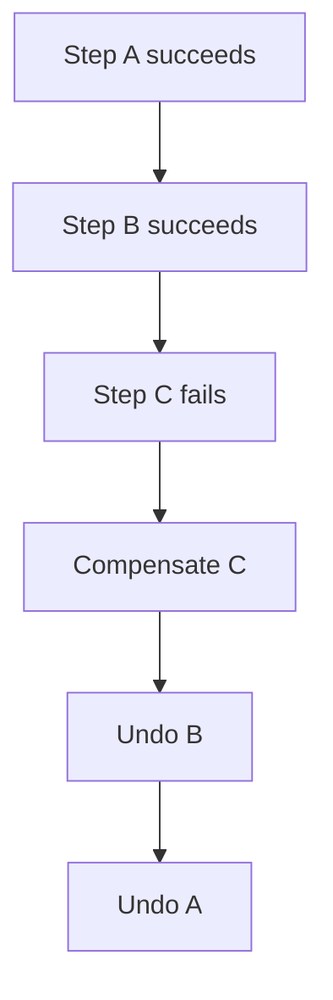
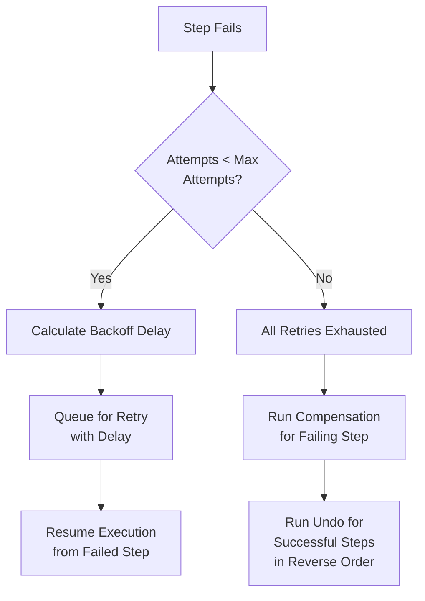
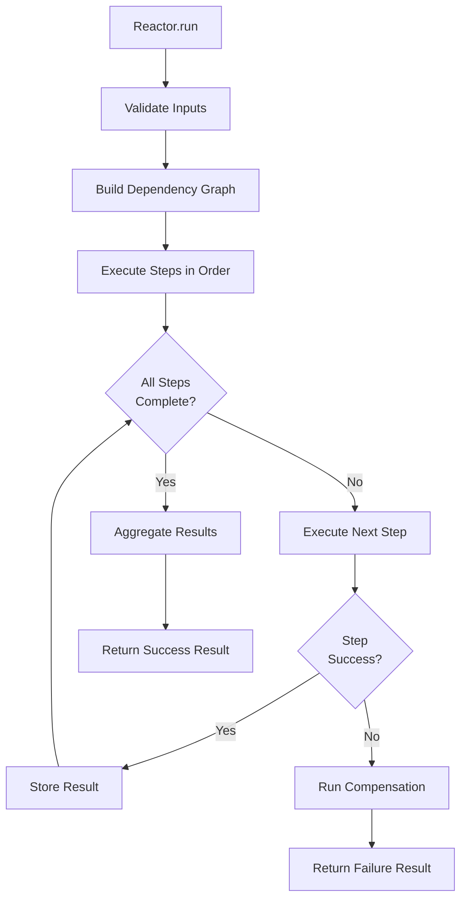
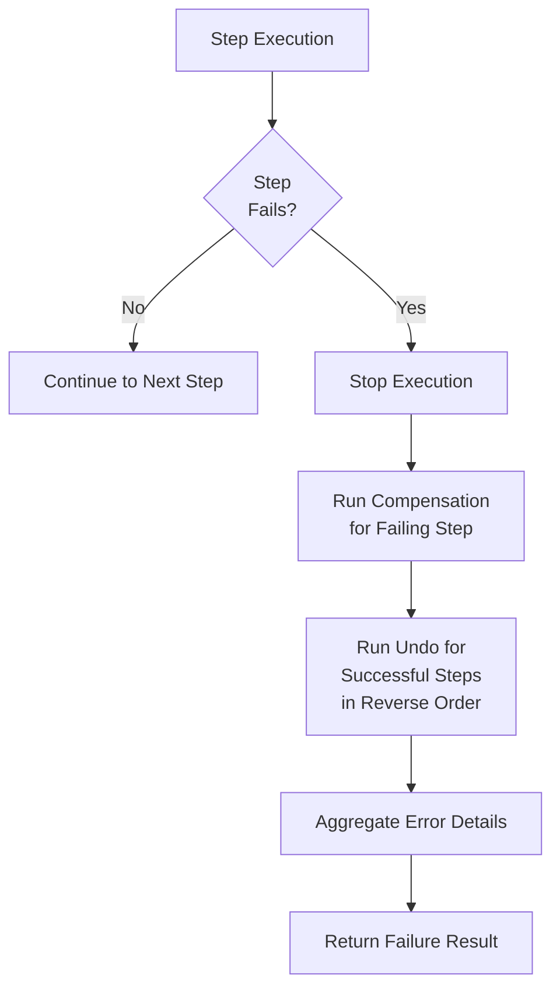

# Core Concepts

Understanding RubyReactor's core concepts is essential for building reliable sequential business processes.

## Reactor

A Reactor is the main execution unit that orchestrates steps in a specific order.

```ruby
class OrderProcessingReactor < RubyReactor::Reactor
  # Reactor definition
end
```

**Key Characteristics:**
- **Sequential Execution**: Steps run one after another in dependency order
- **Error Handling**: Automatic rollback on failures
- **Compensation**: Undo operations for failed steps
- **Result Aggregation**: Collects results from all steps

## Steps

Steps are the individual units of work within a reactor. Each step has a name and implementation.

RubyReactor supports two definition styles:

| Style | When to use |
|-------|-------------|
| **Class steps** (preferred) | Production logic, compensation/undo, shared steps, anything you will test |
| **Inline blocks** | Prototypes, trivial steps, concise documentation examples |

> Documentation examples mix class steps with inline blocks — class steps where the logic matters, inline blocks where a step is trivial. Prefer class steps in your application code, especially as reactors grow.

### Step Classes (preferred)

Define steps as separate classes that include `RubyReactor::Step`. This is the recommended approach for real business logic: it keeps reactors readable, makes steps easy to unit test, and lets you reuse the same step across multiple reactors.

```ruby
class ReserveInventoryStep
  include RubyReactor::Step

  def self.run(arguments, context)
    order = arguments[:order]
    # Business logic for inventory reservation
    reservation_id = InventoryService.reserve(order[:items])
    Success({
      reservation_id: reservation_id,
      reserved_items: order[:items].size
    })
  end

  def self.compensate(error, arguments, context)
    # Cleanup logic for failed reservations
    puts "Cleaning up inventory reservation due to: #{error.message}"
    # Release any partial reservations
    Success("Inventory reservation cleaned up")
  end

  def self.undo(result, arguments, context)
    # Rollback logic for successful reservations during reactor failure
    reservation_id = result[:reservation_id]
    InventoryService.release(reservation_id)
    Success("Inventory reservation released")
  end
end
```

To use a step class in a reactor, reference it by class:

```ruby
class OrderProcessingReactor < RubyReactor::Reactor
  step :reserve_inventory, ReserveInventoryStep do
    argument :order, result(:validate_order)
  end
end
```

**Benefits of class steps:**

- **Testability** — call `MyStep.run(args, context)` (and `compensate`/`undo`) directly in unit specs without running the whole reactor
- **Composability** — share a step class across reactors and build larger workflows from small, focused units
- **Readability** — reactor definitions stay orchestration-only; business logic lives in named classes instead of growing inline blocks
- **Maintainability** — compensation and undo logic sit beside `run` in one place

**Step class methods:**
- **`run(arguments, context)`**: The main business logic. Returns `Success(result)`, `Failure(error)`, or `Skipped(reason:)` (see [Skipping a reactor cleanly](#skipping-a-reactor-cleanly))
- **`compensate(error, arguments, context)`**: Cleanup for the current failing step. Called when the step fails
- **`undo(result, arguments, context)`**: Rollback for previously successful steps. Called during reactor failure rollback

### Inline step definition

For quick prototypes or trivial steps, define logic inline inside the reactor. `run` blocks always receive two positional arguments: the resolved arguments hash and the execution context. Declare inputs with `argument :name, source`:

```ruby
step :validate_order do
  argument :order_id, input(:order_id)

  run do |args, _context|
    order = Order.find(args[:order_id])
    return Failure("Order not found") unless order
    Success({ order: order })
  end
end
```

Inline blocks support `compensate` and `undo` the same way class steps do — useful for small examples, but harder to test and reuse as logic grows.

**Step components (both styles):**

- **Name**: Unique identifier (symbol)
- **Implementation**: `run` block or `self.run` class method
- **Dependencies**: Other steps that must complete first (`argument`, `wait_for`)
- **Compensation / undo**: Rollback logic for failures

## Context

Context holds the execution state throughout the reactor lifecycle.

```ruby
context = RubyReactor::Context.new(order_id: 123, customer_id: 456)
```

**Context Contents:**
- **Inputs**: Original parameters passed to `Reactor.run()`
- **Intermediate Results**: Outputs from completed steps
- **Completed Steps**: Set of successfully finished step names
- **Step Results**: Final outputs from each step
- **Execution Metadata**: Job IDs, timestamps, reactor class info

## Dependencies

Steps can depend on other steps, creating a directed acyclic graph (DAG) of execution.

```ruby
class ValidateOrderStep
  include RubyReactor::Step

  def self.run(_arguments, _context)
    validate_order_logic
  end
end

class ProcessPaymentStep
  include RubyReactor::Step

  def self.run(arguments, _context)
    process_payment_for_order(arguments[:order])
  end
end

class SendConfirmationStep
  include RubyReactor::Step

  def self.run(arguments, _context)
    payment_result = arguments[:payment_result]
    send_confirmation_email(payment_result[:order], payment_result[:payment_id])
  end
end

class OrderProcessingReactor < RubyReactor::Reactor
  step :validate_order, ValidateOrderStep

  step :process_payment, ProcessPaymentStep do
    argument :order, result(:validate_order)
  end

  step :send_confirmation, SendConfirmationStep do
    argument :payment_result, result(:process_payment)
  end
end
```

**Dependency Resolution:**
- Topological sorting ensures correct execution order
- Future feature: Parallel execution of independent steps (when available)
- Validation prevents circular dependencies

## Results

`Reactor.run` returns one of five result types:

- **`RubyReactor::Success`** — `success?` is `true`. `value` holds the output of the step named in `returns`, or the full `intermediate_results` hash if no `returns` is declared.
- **`RubyReactor::Failure`** — `failure?` is `true`. Readers include `error`, `step_name`, `reactor_name`, `step_arguments`, `inputs`, `exception_class`, `file_path`, `line_number`, `backtrace`, `validation_errors`, and `retryable?`.
- **`RubyReactor::Skipped`** — a "clean halt". A `Success` subclass, so `success?` is `true` **and** `skipped?` is `true`; `reason` and `step_name` say where/why. Returned when a step returns `Skipped(reason: "...")` or a `with_period` bucket is already claimed. Remaining steps don't run and completed steps are **not** compensated. See [Skipping a reactor cleanly](#skipping-a-reactor-cleanly).
- **`RubyReactor::AsyncResult`** — returned by an async reactor or when a step hands off to a worker. Readers: `job_id`, `execution_id`, `intermediate_results`.
- **`RubyReactor::InterruptResult`** — returned when an `interrupt` step pauses execution. Readers: `execution_id`, `correlation_id`, `status` (`:paused`), `timeout_at`, `intermediate_results`.

Step-by-step state lives on the context, not the result object. Reload via `Reactor.find(execution_id)` to inspect:

```ruby
reactor = OrderProcessingReactor.find(execution_id)
reactor.context.intermediate_results # => { validate_order: {...}, ... }
reactor.context.status               # => "completed" | "failed" | "paused" | "running"
reactor.execution_trace              # ordered list of run/undo/compensate entries
reactor.result                       # reconstructed Success/Failure/InterruptResult
```

## Error Handling

RubyReactor provides sophisticated error handling with automatic compensation.

### Step Failures

When a step fails, execution stops and compensation begins:

```ruby
class ProcessPaymentStep
  include RubyReactor::Step

  def self.run(arguments, _context)
    PaymentService.charge(arguments[:amount], arguments[:token])
  end

  def self.compensate(error, arguments, _context)
    # Best-effort cleanup specific to this step's failure
    AuditService.log_payment_failure(arguments[:token], error.message)
  end
end

class PaymentReactor < RubyReactor::Reactor
  step :process_payment, ProcessPaymentStep do
    argument :amount, input(:amount)
    argument :token, input(:card_token)
  end
end
```

### Compensation Order

Compensation runs in reverse order of successful steps:



### Error Types

- **StepExecutionError**: Business logic failures
- **DependencyError**: Missing required dependencies
- **ValidationError**: Input validation failures
- **CompensationError**: Compensation logic failures

## Retries

RubyReactor supports automatic retry mechanisms for failed steps with configurable backoff strategies.

### When Retries Occur

When a step fails during execution, RubyReactor can automatically retry the step before triggering compensation and rollback. Retries occur when:

1. A step raises an exception during its `run` block
2. The step has retry configuration (either reactor-level defaults or step-specific settings)
3. The maximum retry attempts haven't been exceeded

### Retry Execution Flow



### Retry Configuration

Retries can be configured at the reactor level (as defaults) or per step:

```ruby
class OrderProcessingReactor < RubyReactor::Reactor
  step :validate_order do
    run do
      # validate input
    end

    undo do
      # Nothing to do here just as example
    end
  end

  step :check_inventory do
    # Uses reactor defaults (5 attempts, fixed backoff)
    run do 
      InventoryService.check_availability(product_id, quantity) 
    end

    undo do
      # Nothing to do here just as example
    end
  end

  step :reserve_inventory do
    retries max_attempts: 5, backoff: :fixed, base_delay: 2 # 2 seconds
    
    run do 
      InventoryService.reserve(product_id, quantity)
    end

    compensate do |error, arguments, context|
      # Cleanup partial reservations
      puts "Cleaning up inventory reservation due to: #{error.message}"
    end
  end
end
```

### Retry Parameters

- **`max_attempts`**: Maximum number of execution attempts (including initial attempt)
- **`backoff`**: Strategy for calculating delays between retries
  - `:exponential` (default): Delay doubles with each attempt
  - `:linear`: Delay increases linearly  
  - `:fixed`: Same delay for each attempt
- **`base_delay`**: Base delay for calculations (in seconds or ActiveSupport duration)

### Example Execution with Retries

Consider a reactor where `reserve_inventory` fails has a set `retries` with max_attemps of 5 max attempts with fixed backoff:

```
1. run step=validate_order          # Success
2. run step=check_inventory         # Success  
3. run step=reserve_inventory       # Attempt 1 - Fails
4. run step=reserve_inventory       # Attempt 2 - Fails (retry with 2s delay)
5. run step=reserve_inventory       # Attempt 3 - Fails (retry with 2s delay)
6. run step=reserve_inventory       # Attempt 4 - Fails (retry with 2s delay)
7. run step=reserve_inventory       # Attempt 5 - Fails (retry with 2s delay)
8. compensate step=reserve_inventory # All retries exhausted
9. undo step=check_inventory        # Rollback successful steps
10. undo step=validate_order        # in reverse order
```

### Retry vs Compensation vs Undo

- **Retries**: Re-attempt the failing step with backoff delays
- **Compensation**: Cleanup logic for the failing step after all retries are exhausted
- **Undo**: Rollback logic for previously successful steps during reactor failure

Retries happen first, followed by compensation and undo only if all retry attempts fail.

### Asynchronous Retries

For asynchronous reactors, retries are queued as background jobs with calculated delays, preventing worker thread blocking:

```ruby
class AsyncPaymentReactor < RubyReactor::Reactor
  async true

  step :charge_card do
    retries max_attempts: 3, backoff: :exponential, base_delay: 5.seconds
    run do
      # This might fail due to network issues
      PaymentService.charge(card_token, amount)
    end
  end
end
```

Failed steps are automatically requeued with exponential backoff delays, allowing workers to process other jobs while waiting.

## Execution Models

### Synchronous Execution

```ruby
result = Reactor.run(inputs)
# Blocks until completion
# Returns Result object immediately
```

**Characteristics:**
- Blocking execution in current thread
- Immediate results
- Simple error handling
- Limited scalability

### Asynchronous Execution

```ruby
async_result = Reactor.run(inputs)
# Returns immediately
async_result.execution_id # UUID to look up state later

# Reload to inspect status / final result
reactor = Reactor.find(async_result.execution_id)
case reactor.context.status.to_s
when "completed" then reactor.result.value
when "failed"    then reactor.result.error
when "paused"    then reactor.result.correlation_id
when "running"   then :still_running
end
```

**Characteristics:**

- Non-blocking execution
- Background processing with Sidekiq
- Retry capabilities
- Better scalability

## Step Arguments

`run` blocks always receive two positional arguments: the resolved arguments hash and the context. Declare each argument explicitly with `argument :name, source` — there is no implicit keyword injection.

Sources you can use:

- `input(:name)` — value from the reactor's inputs (the hash passed to `Reactor.run`).
- `input(:name, :path)` — nested path access into a hash input.
- `result(:step_name)` — full output of a previous step.
- `result(:step_name, :path)` — nested path into a previous step's output.
- `value(literal)` — a constant value.

```ruby
step :validate_order do
  argument :order_id, input(:order_id)
  argument :customer_id, input(:customer_id)

  run do |args, _context|
    order = Order.find_by(id: args[:order_id], customer_id: args[:customer_id])
    Success({ order: order })
  end
end

step :process_payment do
  argument :order, result(:validate_order, :order)

  run do |args, _context|
    payment = PaymentService.charge(args[:order].total, args[:order].card_token)
    Success({ payment_id: payment.id })
  end
end
```

If a step declares no `argument`s, the reactor's raw inputs hash is passed as `args`.

## Undo

Undo provides transactional rollback for previously successful steps when a later step fails.

### When Undo Runs

Unlike compensation which only runs for the failing step, undo is triggered during the **backwalk** phase when rolling back the entire reactor execution. When a step fails:

1. **Compensation** runs for the failing step itself
2. **Undo** runs for all previously successful steps in reverse order

### Basic Undo

```ruby
class ReserveInventoryStep
  include RubyReactor::Step

  def self.run(arguments, _context)
    reservation_id = InventoryService.reserve(arguments[:items])
    Success(reservation_id: reservation_id)
  end

  def self.undo(result, _arguments, _context)
    InventoryService.release(result[:reservation_id])
    Success("Inventory reservation released")
  end
end

class OrderReactor < RubyReactor::Reactor
  step :reserve_inventory, ReserveInventoryStep do
    argument :items, input(:items)
  end
end
```

### Undo Context

Undo blocks receive three parameters:
- **Result**: The successful result from the step's `run` block
- **Arguments**: The resolved arguments passed to the step
- **Context**: The full execution context with all intermediate results

```ruby
step :complex_operation do
  argument :input, input(:payload)

  run do |args, _ctx|
    # Complex operation that modifies external state
    record = create_record(args[:input])
    notification = send_notification(record)
    Success({ record_id: record.id, notification_id: notification.id })
  end

  undo do |result, arguments, context|
    # Clean up in reverse order of creation
    notification_id = result[:notification_id]
    record_id = result[:record_id]

    delete_notification(notification_id) if notification_id
    delete_record(record_id) if record_id

    Success("Complex operation fully undone")
  end
end
```

### Undo vs Compensation

- **Compensation**: Handles cleanup for the currently failing step
- **Undo**: Handles rollback of all previously successful steps during reactor failure

Both mechanisms work together to ensure transactional semantics across complex business processes.

## Compensation

Compensation provides cleanup logic for steps that fail during execution. Unlike undo which handles rollback of successful steps, compensation is specific to the failing step itself.

### When Compensation Runs

Compensation runs immediately when a step fails, before the broader rollback process begins. It allows the failing step to clean up any partial state changes it may have made.

### Basic Compensation

```ruby
class ReserveInventoryStep
  include RubyReactor::Step

  def self.run(arguments, _context)
    reservation_id = InventoryService.reserve(arguments[:items])
    Success(reservation_id: reservation_id)
  end

  def self.compensate(error, _arguments, _context)
    puts "Cleaning up after reservation failure: #{error.message}"
    Success()
  end
end

class OrderReactor < RubyReactor::Reactor
  step :reserve_inventory, ReserveInventoryStep do
    argument :items, input(:items)
  end
end
```

### Compensation Context

Compensation blocks receive three parameters:
- **Error**: The exception that caused the step to fail
- **Arguments**: The resolved arguments that were passed to the step
- **Context**: The full execution context

```ruby
step :process_payment do
  argument :order, result(:validate_order)
  argument :payment_method, input(:payment_method)

  run do |args, _ctx|
    # Payment processing logic that might fail
    PaymentService.charge(args[:order].total, args[:payment_method])
  end

  compensate do |error, arguments, context|
    # Handle payment processing failure
    order = arguments[:order]
    payment_method = arguments[:payment_method]

    # Log the failure for audit purposes
    AuditService.log_payment_failure(order.id, error.message)

    # Send notification about payment failure
    NotificationService.send_payment_failed_email(order.customer_email, order.id)
  end
end
```

## Skipping a reactor cleanly

Alongside `Success` and `Failure`, a step can return **`Skipped`** — a "clean halt". The reactor stops immediately: remaining steps don't run, and **already-completed steps are NOT compensated or undone**. Use it when a step discovers the rest of the workflow is unnecessary and the partial progress so far is correct to keep (e.g. "user already opted out", "nothing to do this round").

`Skipped` is exposed exactly like `Success` and `Failure` — as a bare helper inside both class steps and inline `run` blocks:

```ruby
# Class step
class SyncProfileStep
  include RubyReactor::Step

  def self.run(arguments, _context)
    return Skipped(reason: "user_opted_out") if arguments[:user].opted_out?

    Success(synced: ProfileService.sync(arguments[:user]))
  end
end

# Inline block — identical helper
step :sync_profile do
  argument :user, input(:user)
  run do |args, _ctx|
    next Skipped(reason: "user_opted_out") if args[:user].opted_out?

    Success(synced: ProfileService.sync(args[:user]))
  end
end
```

`Skipped` is a `Success` subclass, so existing `if result.success?` branches still take the right path; check `result.skipped?` to distinguish it:

```ruby
result = SyncReactor.run(user: user)
result.success?   # => true
result.skipped?   # => true on a clean halt, false otherwise
result.reason     # => "user_opted_out"
result.step_name  # => :sync_profile (the halting step)
```

The reactor's context status becomes `:skipped` (distinct from `:completed`/`:failed`), and a `{ type: :skipped, step:, reason: }` entry is appended to the execution trace.

**`Skipped` vs `Failure`:** use `Skipped` when the partial progress is correct and should be kept; use `Failure` when prior steps need to be rolled back. A `with_period` dedup gate also produces a `Skipped` result before any step runs. See [Locks & Semaphores — The `Skipped` result](locks_and_semaphores.md#the-skipped-result) for the full reference and the decision matrix.

## Validation

Input validation ensures data integrity before execution.

### Built-in Validation

```ruby
class OrderReactor < RubyReactor::Reactor
  input :order_id do
    required(:order_id).filled(:integer, gt?: 0)
  end
end
```

### Custom Validators

```ruby
class OrderReactor < RubyReactor::Reactor
  input :order do
    required(:order).hash do
      required(:id).filled(:integer, gt?: 0)
      required(:total).filled(:decimal, gt?: 0)
      required(:items).filled(:array, min_size?: 1)
    end
  end
end
```

## Dependency Graph

RubyReactor builds a dependency graph to determine execution order.

### Graph Construction

```ruby
# Explicit dependencies
step :a do; end
step :b do; argument :a_result, result(:a); end
step :c do; argument :a_result, result(:a); end
step :d do; argument :b_result, result(:b); argument :c_result, result(:c); end

# Execution order: a → [b,c] → d
```

### Cycle Detection

```ruby
# This would raise DependencyError
step :a do; argument :b_result, result(:b); end
step :b do; argument :a_result, result(:a); end  # Circular dependency!
```

## Execution Flow

### Normal Execution



1. **Input Validation**: Validate reactor inputs
2. **Graph Building**: Construct dependency graph
3. **Step Execution**: Execute steps in dependency order
4. **Result Aggregation**: Collect all step outputs
5. **Return Result**: Return comprehensive result object

### Error Execution



1. **Step Failure**: A step raises an exception
2. **Stop Execution**: Halt remaining steps
3. **Compensation**: Run compensation block for the failing step
4. **Undo**: Run undo blocks for all previously successful steps in reverse order
5. **Rollback**: Return failure result with error details

## Threading Model

### Synchronous
- Single-threaded execution
- Blocking operations halt the entire process
- Simple debugging and monitoring

### Asynchronous
- Multi-threaded execution via Sidekiq
- Non-blocking retry mechanisms
- Complex monitoring and debugging

## Best Practices

### Step Design

1. **Single Responsibility**: Each step should do one thing well
2. **Idempotency**: Design steps to be safely retryable when possible
3. **Error Handling**: Use appropriate exception types
4. **Resource Management**: Clean up resources in compensation blocks

### Dependency Management

1. **Minimize Dependencies**: Keep the dependency graph simple
2. **Clear Naming**: Use descriptive step names
3. **Logical Grouping**: Group related steps together

### Error Handling

1. **Specific Exceptions**: Use custom exception classes
2. **Compensation Logic**: Always provide compensation for failing steps
3. **Undo Logic**: Always provide undo for steps that modify external state
4. **Logging**: Log important events and errors
5. **Monitoring**: Track success/failure rates

### Performance

1. **Efficient Steps**: Keep individual steps fast
2. **Async for Slow Ops**: Use async for I/O bound operations
3. **Resource Limits**: Set appropriate timeouts and limits
4. **Caching**: Cache expensive operations when safe