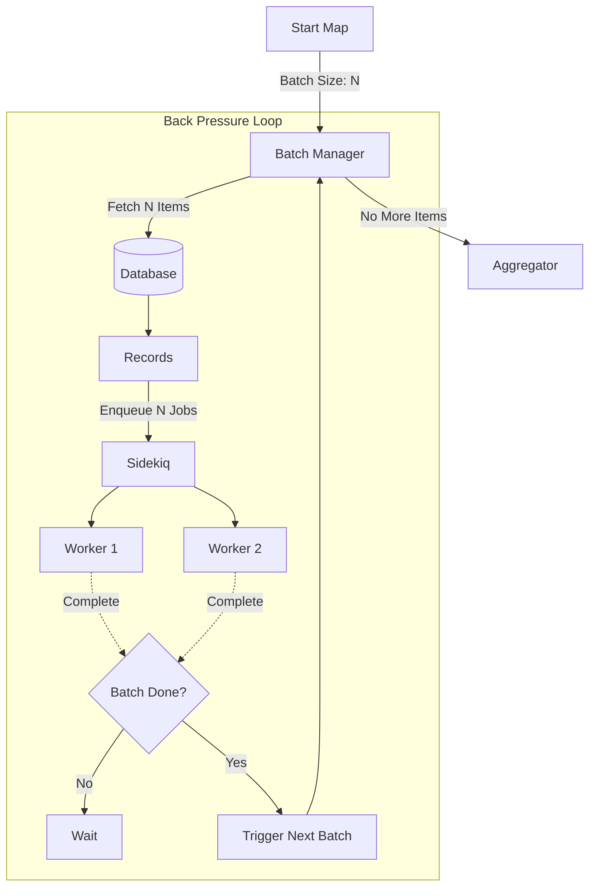

# Data Pipelines

RubyReactor provides powerful data pipeline capabilities through the `map` feature, allowing you to process collections of data efficiently. This system supports both synchronous and asynchronous execution, batch processing, and robust error handling.

## Overview

The data pipeline system is built around the `map` step, which iterates over an input collection and processes each element through a defined sub-reactor or inline steps.

Key features:
- **Parallel Processing**: Execute steps asynchronously via Sidekiq
- **Batch Control**: Manage system load with configurable batch sizes
- **Error Handling**: Choose between failing fast or collecting partial results
- **Retries**: Configure granular retry policies for individual steps
- **Aggregation**: Collect and transform results after processing

## Basic Usage

The simplest form of a data pipeline is an inline `map` step that processes elements synchronously.

```ruby
class UserTransformationReactor < RubyReactor::Reactor
  input :users

  map :transformed_users do
    source input(:users)
    argument :user, element(:transformed_users)

    # Define steps to run for each element
    step :normalize do
      argument :user, input(:user)
      run do |args, _|
        user = args[:user]
        Success({
          name: user[:name].strip,
          email: user[:email].downcase
        })
      end
    end

    # The result of this step becomes the result for the element
    returns :normalize
  end
end
```

## Dynamic Sources & ActiveRecord

The `map` step supports a dynamic `source` block, which is particularly useful when working with ActiveRecord or when the collection depends on input arguments. Instead of passing a static collection, you can define a block that returns an Enumerable or an `ActiveRecord::Relation`.

```ruby
map :process_products do
  argument :filter, input(:filter)

  # Dynamic source block
  source do |args|
    # This block executes at runtime
    threshold = args[:filter][:stock]
    Product.where("stock >= ?", threshold)
  end

  argument :product, element(:process_products)
  async true, batch_size: 100

  step :process do
    # ...
  end
  
  returns :process
end
```

When an `ActiveRecord::Relation` is returned, RubyReactor efficiently batches the query using database-level `OFFSET` and `LIMIT` based on the configured `batch_size`, preventing memory bloat by not loading all records at once.

## Batch Processing Mechanism

When processing large datasets asynchronously, you can control the parallelism using `batch_size`. This limits how many Sidekiq jobs are enqueued simultaneously, preventing system overload.

```ruby
map :bulk_import do
  source input(:records)
  argument :record, element(:bulk_import)
  
  # Process only 50 records at a time
  async true, batch_size: 50

  step :import_record do
    # ...
  end
end
```

### Back Pressure & Resource Management

When `async true` is used with a `batch_size`, RubyReactor implements an intelligent **back pressure** mechanism. Instead of flooding Redis and Sidekiq with millions of jobs immediately (which is the standard behavior for many background job systems), the system processes data in controlled chunks.

This approach provides critical benefits for stability and scalability:

1.  **Memory Efficiency**: By using `ActiveRecord` batching (`LIMIT` / `OFFSET`), only the current batch of records is loaded into memory. This allows processing datasets larger than available RAM.
2.  **Redis Protection**: Prevents "Queue Explosion". Only a small number of job arguments are stored in Redis at any time, preventing OOM errors in your Redis instance.
3.  **Database Stability**: Database load is distributed over time rather than spiking all at once.

**Visualizing the Flow:**



This ensures that the system works at the speed of your workers, not the speed of the enqueueing process, maintaining a constant and manageable resource footprint regardless of dataset size.

## Error Handling

You can control how the pipeline reacts to failures using the `fail_fast` option.

### Fail Fast (Default)

By default (`fail_fast true`), the entire map operation fails immediately if any single element fails.

```ruby
map :strict_processing do
  source input(:items)
  # ...
  fail_fast true # Default
end
```

### Collecting Results (Successes & Failures)

If you want to process all elements regardless of failures, set `fail_fast false`. The map step returns a `ResultEnumerator` that allows you to easily separate successful executions from failures.

```ruby
map :resilient_processing do
  source input(:items)
  argument :item, element(:resilient_processing)
  
  # Continue processing even if some items fail
  fail_fast false

  step :risky_operation do
    # ...
  end

  returns :risky_operation
end

step :analyze_results do
  argument :results, result(:resilient_processing)
  
  run do |args|
    col = args[:results]
    
    # Iterate over successful results
    col.successes.each do |result|
      # result.value contains the return value of the map element
      puts "Success: #{result.value}"
    end

    # Iterate over failures
    col.failures.each do |result|
      puts "Error: #{result.error}"
    end

    Success({
      success_count: col.successes.count,
      failure_count: col.failures.count
    })
  end
end
```

## Retry Configuration

You can configure retries for individual steps within a map. This is particularly useful for transient failures (e.g., network timeouts) in async pipelines.

```ruby
map :reliable_processing do
  source input(:urls)
  argument :url, element(:reliable_processing)
  async true

  step :fetch_data do
    argument :url, input(:url)

    # Retry up to 3 times with exponential backoff
    retries max_attempts: 3, backoff: :exponential, base_delay: 1.second

    run do |args, _|
      # If this raises or returns Failure, it will be retried
      HttpClient.get(args[:url])
    end
  end

  returns :fetch_data
end
```

### Retry Behavior

- **Async Mode**: Retries are handled by requeuing the Sidekiq job with a delay. This is non-blocking and efficient.
- **Sync Mode**: Retries happen immediately within the execution thread (blocking).


