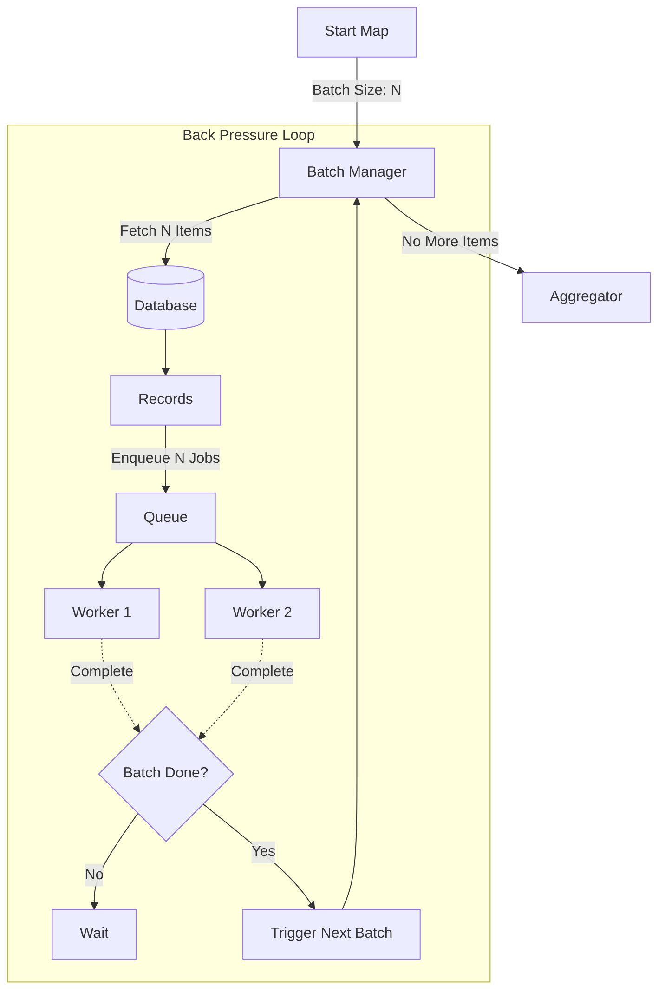

# Data Pipelines

RubyReactor provides powerful data pipeline capabilities through the `map` feature, allowing you to process collections of data efficiently. This system supports both synchronous and background execution, batch processing, and robust error handling.

## Overview

The data pipeline system is built around the `map` step, which iterates over an input collection and processes each element through a defined sub-reactor or inline steps.

Key features:
- **Parallel Processing**: Run elements as background jobs via Sidekiq or ActiveJob
- **Batch Control**: Manage system load with configurable batch sizes
- **Error Handling**: Choose between failing fast or collecting partial results
- **Retries**: Configure granular retry policies for individual steps
- **Aggregation**: Collect and transform results after processing

## Basic Usage

The simplest form of a data pipeline is an inline `map` step that processes elements synchronously.

```ruby
class UserTransformationReactor < RubyReactor::Reactor
  input :users

  map :transformed_users do
    source input(:users)
    argument :user, element(:transformed_users)

    # Define steps to run for each element
    step :normalize do
      argument :user, input(:user)
      run do |inputs, _|
        user = inputs.user
        Success({
          name: user[:name].strip,
          email: user[:email].downcase
        })
      end
    end

    # The result of this step becomes the result for the element
    returns :normalize
  end
end
```

## Dynamic Sources & ActiveRecord

The `map` step supports a dynamic `source` block, which is particularly useful when working with ActiveRecord or when the collection depends on input arguments. Instead of passing a static collection, you can define a block that returns an Enumerable or an `ActiveRecord::Relation`.

```ruby
map :process_products do
  argument :filter, input(:filter)

  # Dynamic source block
  source do |args|
    # This block executes at runtime
    threshold = args[:filter][:stock]
    Product.where("stock >= ?", threshold)
  end

  argument :product, element(:process_products)
  fan_out batch_size: 100

  step :process do
    # ...
  end
  
  returns :process
end
```

When an `ActiveRecord::Relation` is returned, RubyReactor efficiently batches the query using database-level `OFFSET` and `LIMIT` based on the configured `batch_size`, preventing memory bloat by not loading all records at once.

## Batch Processing Mechanism

> `fan_out` runs every element as its own **background job** (Sidekiq or ActiveJob). A fan-out map is a hand-off point: the reactor stops at the map, and once every element's outcome is collected it resumes in a worker with the steps after the map. It fans out the same way when the reactor is already running in a worker (`background all: true`, or after a `background` hand-off); only a map nested inside another map's element runs inline.
>
> `fan_out` replaces the removed map-level `async true`, which now raises at class-definition time.

When processing large datasets in background jobs, you can control the parallelism using `batch_size`. This limits how many background jobs are enqueued simultaneously, preventing system overload.

```ruby
map :bulk_import do
  source input(:records)
  argument :record, element(:bulk_import)
  
  # Process only 50 records at a time
  fan_out batch_size: 50

  step :import_record do
    # ...
  end
end
```

### `fan_out` Without `batch_size`

`batch_size` is optional. When you enable `fan_out` without it, RubyReactor
defaults the batch size to the full source size and fans out **one background
worker per element** immediately. Every element runs through the same
per-element path — so elements whose sub-reactor contains `background` hand-offs
or background retries are handled correctly — and a collector aggregates the outcomes into a
`ResultEnumerator`.

```ruby
map :process_items do
  source input(:items)
  argument :item, element(:process_items)

  # No batch_size: every element gets its own worker, enqueued at once
  fan_out

  step :process do
    # ...
  end
end
```

This is convenient for small or fixed-size collections, but it provides **no
back pressure** — all element jobs are enqueued simultaneously. For large or
database-backed sources, set a `batch_size` to enable the back-pressure
mechanism described below.

### Back Pressure & Resource Management

When `fan_out` is used with a `batch_size`, RubyReactor implements an intelligent **back pressure** mechanism. Instead of flooding Redis and the queue backend with millions of jobs immediately (which is the standard behavior for many background job systems), the system processes data in controlled chunks.

This approach provides critical benefits for stability and scalability:

1.  **Memory Efficiency**: By using `ActiveRecord` batching (`LIMIT` / `OFFSET`), only the current batch of records is loaded into memory. This allows processing datasets larger than available RAM.
2.  **Redis Protection**: Prevents "Queue Explosion". Only a small number of job arguments are stored in Redis at any time, preventing OOM errors in your Redis instance.
3.  **Database Stability**: Database load is distributed over time rather than spiking all at once.

**Visualizing the Flow:**


```mermaid
graph TD
    Start[Start Map] -->|Batch Size: N| BatchManager
    
    subgraph "Back Pressure Loop"
        BatchManager[Batch Manager] -->|Fetch N Items| DB[(Database)]
        DB --> Records
        Records -->|Enqueue N Jobs| Queue
        
        Queue --> W1[Worker 1]
        Queue --> W2[Worker 2]
        
        W1 -.->|Complete| Check{Batch Done?}
        W2 -.->|Complete| Check
        
        Check -->|No| Wait[Wait]
        Check -->|Yes| Next[Trigger Next Batch]
        Next --> BatchManager
    end
    
    BatchManager -->|No More Items| Finish[Aggregator]
```

This ensures that the system works at the speed of your workers, not the speed of the enqueueing process, maintaining a constant and manageable resource footprint regardless of dataset size.

## Error Handling

You can control how the pipeline reacts to failures using the `fail_fast` option.

### Fail Fast (Default)

By default (`fail_fast true`), the map fails as soon as any single element fails: no new element starts after the failure.

```ruby
map :strict_processing do
  source input(:items)
  # ...
  fail_fast true # Default
end
```

In fan-out mode, elements already running when the failure happens finish first. The map reports its failure only once every element has settled, so its failure latency grows to the slowest element in flight. Elements that had not started are marked skipped and never run.

### Rollback

A map rolls back like a composed reactor. The elements that **completed** are rolled back by replaying each element's own step `undo`s, newest step first, **highest element index first**. There is no map-level rollback DSL: the `undo` blocks you already write on the element reactor's steps are the element's rollback. This happens:

- **When the map fails** (an element fails with `fail_fast`, or the `collect` block raises): every element that completed is rolled back, then the steps before the map are undone. The failing element already rolled itself back (its failing step compensated, its earlier steps undone).
- **When a later step fails, or the run is undone manually** (`Reactor.undo(id)`): every completed element is rolled back at the map's position in the parent's reverse-completion order.

The same holds in inline and fan-out mode, whatever order the element jobs ran in.

```ruby
map :charge_orders, ChargeOrderReactor do   # ChargeOrderReactor's :charge step declares `undo` (a refund)
  source input(:orders)
  argument :order, element(:charge_orders)
  fan_out
end

step :notify do
  wait_for :charge_orders
  # If this fails, every order :charge_orders charged is refunded, then earlier steps are undone.
end
```

Things to know:

- **Make element `undo`s idempotent.** They can run after the map succeeded, on a later failure or on a manual undo, and a failure elsewhere must not leave a half-refund.
- **Rollback failures are reported per element.** An element whose undo fails does not stop the others. Its entry in `Failure#rollback_failures` carries `map_step:` and `element_index:`.
- **`context_ttl` is the rollback horizon.** Each element's rollback reads its stored context, found through the map's element index. Both are kept for `context_ttl` from the element's run, while the parent's own TTL restarts on every save. If either expired before the rollback, each element that ran is reported with `reason: :context_unavailable` and its `element_index`, never skipped silently. (A fan-out map that failed skipped some elements, so there an expired row is reported with `element_index: nil`.)
- **A duplicate still running is left alone.** If an element's job is still live when the rollback reaches it (a duplicate delivery), it is reported with `reason: :element_in_flight`.
- **Rollback is serial**, in the process that detected the failure, so it takes time proportional to the number of completed elements.

### Collecting Results (Successes & Failures)

If you want to process all elements regardless of failures, set `fail_fast false`. The map step returns a `ResultEnumerator` that allows you to easily separate successful executions from failures. Each failed element rolls itself back; if a later step fails, the successful elements are rolled back as described in [Rollback](#rollback), and the failed ones are not rolled back twice.

```ruby
map :resilient_processing do
  source input(:items)
  argument :item, element(:resilient_processing)
  
  # Continue processing even if some items fail
  fail_fast false

  step :risky_operation do
    # ...
  end

  returns :risky_operation
end

step :analyze_results do
  argument :results, result(:resilient_processing)
  
  run do |inputs|
    col = inputs.results
    
    # Iterate over successful results
    col.successes.each do |value|
      # 'value' is the direct return value of the map element
      puts "Success: #{value}"
    end

    # Iterate over failures
    col.failures.each do |error|
      # 'error' is the failure object/message itself
      puts "Error: #{error}"
    end

    # Note: Iterating the collection directly yields wrapped objects
    col.each do |result|
      if result.is_a?(RubyReactor::Success)
        puts "Wrapped Value: #{result.value}"
      else
        puts "Wrapped Error: #{result.error}"
      end
    end

    Success({
      success_count: col.successes.count,
      failure_count: col.failures.count
    })
  end
end
```

## Retry Configuration

You can configure retries for individual steps within a map. This is particularly useful for transient failures (e.g., network timeouts) in background pipelines.

```ruby
map :reliable_processing do
  source input(:urls)
  argument :url, element(:reliable_processing)
  fan_out

  step :fetch_data do
    argument :url, input(:url)

    # Retry up to 3 times with exponential backoff
    retries max_attempts: 3, backoff: :exponential, base_delay: 1.second

    run do |inputs, _|
      # If this raises or returns Failure, it will be retried
      HttpClient.get(inputs.url)
    end
  end

  returns :fetch_data
end
```

### Retry Behavior

- **Fan-out Mode** (`fan_out`): Retries are handled by requeuing the background job with a delay. This is non-blocking and efficient.
- **Sync Mode**: Retries happen immediately within the execution thread (blocking).


