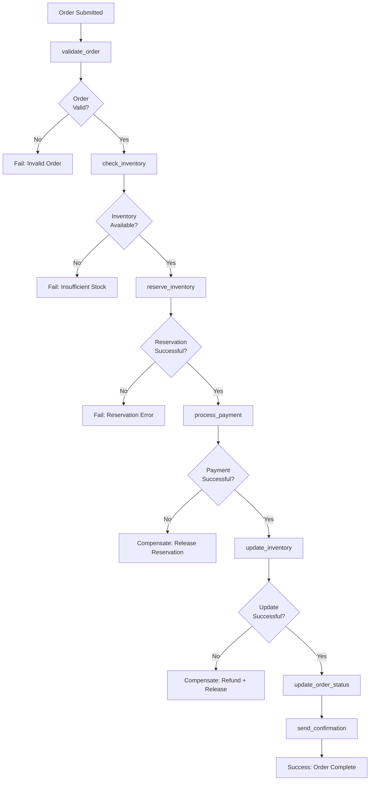

# Order Processing Reactor Example

> This example mixes class steps with inline blocks — class steps for core business logic, inline blocks for simpler steps.

This example demonstrates a complete order processing workflow with validation, payment processing, inventory management, and notifications.

## Overview

The OrderProcessingReactor handles the complete order fulfillment process:

1. **Validate Order**: Ensure order exists and is processable
2. **Check Inventory**: Verify all items are available
3. **Reserve Inventory**: Temporarily reserve items
4. **Process Payment**: Charge the customer's payment method
5. **Update Inventory**: Permanently decrement inventory
6. **Send Confirmation**: Email order confirmation

### Order Processing Workflow



## Implementation

```ruby
class ValidateOrderStep
  include RubyReactor::Step

  def self.run(arguments, _context)
    order = Order.find_by(id: arguments[:order_id])
    return Failure("Order not found") unless order
    return Failure("Order already processed") if order.processed?
    return Failure("Order cancelled") if order.cancelled?

    Success(order: order)
  end
end

class ReserveInventoryStep
  include RubyReactor::Step

  def self.run(arguments, _context)
    reservation_id = InventoryService.reserve_items(arguments[:order].items)
    return Failure("Inventory reservation failed") unless reservation_id

    Success(reservation_id: reservation_id)
  end

  def self.undo(result, _arguments, _context)
    InventoryService.release_reservation(result[:reservation_id]) if result[:reservation_id]
    Success()
  end
end

class ProcessPaymentStep
  include RubyReactor::Step

  def self.run(arguments, _context)
    order = arguments[:order]
    payment_result = PaymentService.charge(
      amount: order.total,
      currency: order.currency,
      card_token: order.customer.card_token,
      description: "Order ##{order.id}"
    )

    return Failure("Payment failed: #{payment_result.error}") unless payment_result.success?

    Success(payment_id: payment_result.id, payment_amount: order.total)
  end

  def self.undo(result, _arguments, _context)
    PaymentService.refund(result[:payment_id]) if result[:payment_id]
    Success()
  end
end

class OrderProcessingReactor < RubyReactor::Reactor
  background all: true  # Enable asynchronous execution

  # Reactor-level retry defaults
  retry_defaults max_attempts: 3, backoff: :exponential, base_delay: 2.seconds

  input :order_id do
    required(:order_id).filled(:string)
  end

  step :validate_order, ValidateOrderStep do
    argument :order_id, input(:order_id)
  end

  step :check_inventory do
    argument :order, result(:validate_order, :order)

    run do |args, _ctx|
      unavailable_items = []

      args[:order].items.each do |item|
        product = Product.find(item.product_id)
        if product.inventory_count < item.quantity
          unavailable_items << {
            product_id: item.product_id,
            requested: item.quantity,
            available: product.inventory_count
          }
        end
      end

      return Failure("Insufficient inventory: #{unavailable_items}") unless unavailable_items.empty?

      Success(inventory_checked: true)
    end
  end

  step :reserve_inventory, ReserveInventoryStep do
    argument :order, result(:validate_order, :order)
  end

  step :process_payment, ProcessPaymentStep do
    argument :order, result(:validate_order, :order)

    # Payment processing needs careful retry handling
    retries max_attempts: 2, backoff: :fixed, base_delay: 30.seconds
  end

  step :update_inventory do
    argument :order, result(:validate_order, :order)
    argument :reservation_id, result(:reserve_inventory, :reservation_id)

    run do |args, _ctx|
      success = InventoryService.confirm_reservation(args[:reservation_id])
      return Failure("Inventory update failed") unless success

      Success({ inventory_updated: true })
    end

    undo do |_result, args, _ctx|
      InventoryService.restore_from_reservation(args[:reservation_id]) if args[:reservation_id]
      Success()
    end
  end

  step :update_order_status do
    argument :order, result(:validate_order, :order)
    argument :payment_id, result(:process_payment, :payment_id)

    run do |args, _ctx|
      args[:order].update!(
        status: :completed,
        payment_id: args[:payment_id],
        processed_at: Time.current
      )

      Success({ order_completed: true })
    end
  end

  step :send_confirmation do
    argument :order, result(:validate_order, :order)
    argument :payment_id, result(:process_payment, :payment_id)

    retries max_attempts: 3, backoff: :linear, base_delay: 10.seconds

    run do |args, _ctx|
      email_result = EmailService.send_order_confirmation(
        to: args[:order].customer.email,
        order: args[:order],
        payment_id: args[:payment_id]
      )

      return Failure("Confirmation email failed") unless email_result.success?

      Success({ confirmation_sent: true })
    end
  end

  returns :send_confirmation
end
```

## Usage

### Asynchronous Execution

```ruby
# Start order processing asynchronously
async_result = OrderProcessingReactor.run(order_id: 12345)
async_result.execution_id # UUID for state lookup

# Reload state later (e.g. from a polling endpoint)
reactor = OrderProcessingReactor.find(async_result.execution_id)
case reactor.context.status.to_s
when "completed"
  puts "Order processed successfully!"
  payment_id = reactor.context.intermediate_results[:process_payment][:payment_id]
  puts "Payment ID: #{payment_id}"
when "failed"
  failure = reactor.result # RubyReactor::Failure
  puts "Order processing failed at #{failure.step_name}: #{failure.error}"
  # Could trigger manual review process
when "running"
  puts "Still processing..."
end
```

### Synchronous Execution (for testing)

```ruby
# For testing or immediate processing
reactor = OrderProcessingReactor.new
result = reactor.run(order_id: 12345)

if result.success?
  puts "Order completed!"
  puts "Steps completed: #{reactor.context.intermediate_results.keys}"
else
  puts "Failed at step: #{result.step_name}"
  puts "Error: #{result.error}"
end
```

## Error Scenarios

### Insufficient Inventory

```
Step: check_inventory fails
→ Compensation: none (no state changes yet)
→ Result: failure with inventory details
```

### Payment Failure

```
Step: process_payment fails
→ Compensation: release_inventory (reservation_id)
→ Result: failure with payment error
```

### Email Failure

```
Step: send_confirmation fails (after successful payment/inventory update)
→ Compensation: refund_payment → restore_inventory
→ Result: failure (but order is actually complete - manual confirmation may be needed)
```

## Testing

```ruby
RSpec.describe OrderProcessingReactor do
  let(:order) { create(:order, :pending) }

  context "successful order processing" do
    it "completes all steps successfully" do
      # Mock all external services
      allow(Order).to receive(:find_by).and_return(order)
      allow(InventoryService).to receive(:reserve_items).and_return("res_123")
      allow(PaymentService).to receive(:charge).and_return(successful_payment)
      allow(InventoryService).to receive(:confirm_reservation).and_return(true)
      allow(EmailService).to receive(:send_order_confirmation).and_return(successful_email)

      subject = test_reactor(OrderProcessingReactor, order_id: order.id)

      expect(subject).to be_success
      expect(subject).to have_run_step(:send_confirmation)
    end
  end

  context "payment failure" do
    it "compensates inventory reservation" do
      allow(Order).to receive(:find_by).and_return(order)
      allow(InventoryService).to receive(:reserve_items).and_return("res_123")
      allow(PaymentService).to receive(:charge).and_return(failed_payment)

      expect(InventoryService).to receive(:release_reservation).with("res_123")

      subject = test_reactor(OrderProcessingReactor, order_id: order.id)

      expect(subject).to be_failure
      expect(subject.error).to include("Payment failed")
    end
  end
end
```

## Monitoring

Key metrics to track:

```ruby
# Success rates
order_processing_success_rate
payment_success_rate
inventory_reservation_success_rate

# Performance
average_order_processing_time
payment_processing_latency

# Error rates
inventory_insufficient_rate
payment_failure_rate
email_delivery_failure_rate
```

## Scaling Considerations

- **High Volume**: Use async execution with multiple Sidekiq or ActiveJob workers
- **Payment Processing**: Implement idempotency keys for payment providers
- **Inventory**: Use optimistic locking or database transactions
- **Email**: Queue emails separately to avoid blocking order completion

## Extensions

### Partial Order Processing

```ruby
class PartialOrderProcessingReactor < OrderProcessingReactor
  # Override to allow partial fulfillment
  step :check_inventory do
    argument :order, result(:validate_order, :order)

    run do |args, _ctx|
      available_items, unavailable_items = partition_available_items(args[:order].items)

      if available_items.any? && unavailable_items.any?
        partial_order = create_partial_order(args[:order], available_items)
        Success({ partial_order: partial_order, unavailable_items: unavailable_items })
      elsif available_items.empty?
        Failure("No items available")
      else
        Success({ inventory_checked: true })
      end
    end
  end
end
```

### Order Cancellation

```ruby
class OrderCancellationReactor < RubyReactor::Reactor
  input :order_id do
    required(:order_id).filled(:string)
  end

  step :load_order do
    argument :order_id, input(:order_id)

    run do |args, _ctx|
      order = Order.find_by(id: args[:order_id])
      return Failure("Order not found") unless order
      Success({ order: order })
    end
  end

  step :cancel_order do
    argument :order, result(:load_order, :order)

    run do |args, _ctx|
      order = args[:order]
      # Only cancel if not already completed
      if order.completed?
        PaymentService.refund(order.payment_id)
        InventoryService.restore_order_items(order)
      end

      order.update!(status: :cancelled)
      Success({ cancelled: true })
    end
  end
end
```