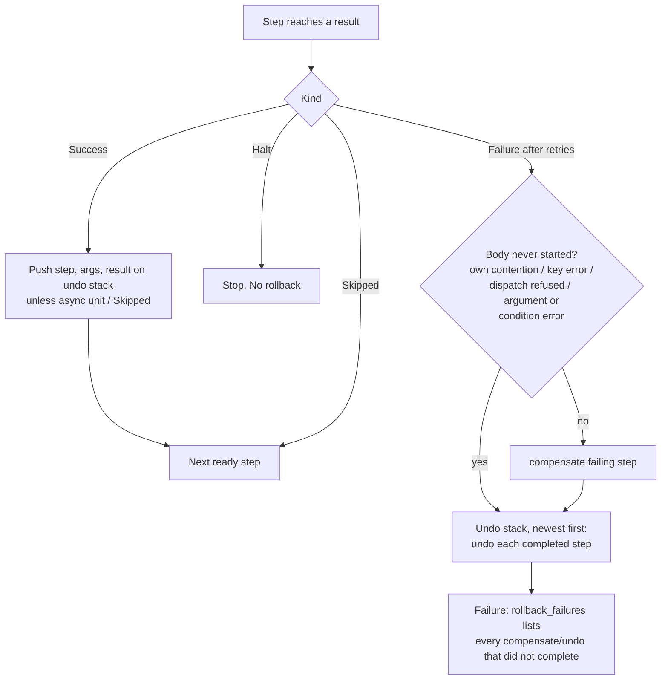

# Execution Order & Rollback

What runs, in what order, and what is **left in place** when something fails, for every
construct RubyReactor offers. Baseline commit `faf90e8d` (ruby_reactor 0.8.3 + #61, #63).

**Updated for 008 (Reliable Rollback Across Constructs).** Rows and rules marked *changed in 008*
describe the behavior after [specs/008-rollback-reliability](../../008-rollback-reliability/spec.md);
the text they replace is kept in git history. The transcript was re-run: 63 scenarios, 63 match.
Line references `[R: …]` in unchanged rows still point at the baseline.

Labels: `[R: file:line]` = read in source · `[O: S-…]` = observed, see
[`../evidence/output.txt`](../evidence/output.txt) · `[T: spec:line]` = existing spec.
*Compensate* = the failing step's own cleanup; *undo* = rollback of a completed step;
*rollback* = both. *Unit* = an `async_step` or `async_reactor` dispatch.

Contents: [1. Rollback algorithm](#1-rollback-algorithm) ·
[2. Construct lifecycles](#2-construct-lifecycles) · [3. Order matrix](#3-order-matrix) ·
[4. Cross-cutting: locks](#4-cross-cutting-locks) · [5. Cross-cutting: retries](#5-cross-cutting-retries)

---

## 1. Rollback algorithm

One mechanism does all rollback: the **undo stack** of the reactor execution that owns the step
(`Context#undo_stack`, serialized with the context `[R: lib/ruby_reactor/context.rb:173]`).

Rules, each confirmed on plain steps:

| # | Rule | Evidence |
|---|---|---|
| R1 | Steps run in dependency order. Among ready steps, definition order. Each `Success` pushes `{step, arguments, result}` on the undo stack. | `[R: lib/ruby_reactor/executor/result_handler.rb:137]` `[O: S-plain-09]` |
| R2 | On failure the failing step's **compensate runs first**, then **every completed step's undo, newest first** (reverse completion order, also across DAG branches). No later step runs. | `[R: lib/ruby_reactor/executor/compensation_manager.rb:35]` `[R: …/compensation_manager.rb:69]` `[O: S-plain-01, S-plain-02, S-plain-09]` |
| R3 | A step whose own coordination was never acquired (contention, key error, refused dispatch) is **not** compensated. Earlier steps are still undone. | `[R: …/compensation_manager.rb:11, :44]` `[O: S-lock-03, S-edge-01]` |
| R4 | A compensate or undo that returns `Failure` or raises does **not** stop the rollback. It is listed on `Failure#rollback_failures`. A compensate failure also turns the final error into `CompensationError` ("Execution error: …", no `step_name`). | `[R: …/compensation_manager.rb:57, :202]` `[O: S-plain-03, S-plain-04, S-compose-07]` |
| R5 | `Halt` stops without rollback. `Skipped` steps are never pushed, so they are never undone. | `[R: …/result_handler.rb:97, :114]` `[O: S-plain-05, S-plain-06]` |
| R6 | Async units (`async_step`, `async_reactor`) are **never pushed**: the parent never undoes them. *Changed in 008:* the step says so itself (`StepConfig#rollback_tracked?` is false for async units); the coordinator has no async special case. | `[R: lib/ruby_reactor/dsl/step_builder.rb rollback_tracked?]` `[O: S-async-03, S-async-06]` |
| R7 | *Changed in 008.* Every `StandardError` after completed work rolls back. An argument source/transform/result path that raises (`ArgumentResolutionError`) or a raising `where`/`guard` (`ConditionError`) is a never-started failure: the step is not compensated, completed steps are undone. Any other `StandardError` outside a step body rolls back too, attributed to the executing step. A non-`StandardError` exception runs no rollback: a caller-process run is stored `aborted` for a manual `Reactor.undo(id)`; a worker run stays `running` and is redelivered. | `[R: lib/ruby_reactor/executor/result_handler.rb build_execution_failure]` `[R: lib/ruby_reactor/executor.rb mark_aborted]` `[O: S-plain-07, S-edge-03, S-edge-04]` |
| R8 | Rollback runs in whichever process detects the failure: the caller (inline), the reactor worker, the map collector, or (for units) nobody. | §2 |

### Failure kinds → path

| Failure kind | Where it happens | Failing step compensated? | Completed steps undone? | Evidence |
|---|---|---|---|---|
| Body returns `Failure` / raises `StandardError` | body | yes | yes | `[O: S-plain-01, S-plain-02]` |
| Retries exhausted | body, last attempt | yes, **once** | yes | `[O: S-retry-01, S-retry-04, S-bg-03]` |
| `validate_output` fails | after body | yes (side effect exists) | yes | `[R: …/result_handler.rb:277]` `[O: S-plain-08]` |
| Step input/argument validation fails | before body | no | yes | `[O: S-edge-05]` |
| `where`/`guard` block raises (*changed in 008*) | before body | no (never started, `ConditionError`) | yes | `[O: S-edge-04]` |
| Argument source/transform/result path raises `StandardError` (*changed in 008*) | before body | no (never started, `ArgumentResolutionError`) | yes; failure names the step | `[O: S-plain-07]` |
| Any other `StandardError` outside a step body (*changed in 008*) | executor | — | yes; failure names the executing step | `spec/ruby_reactor/rollback/failure_rollback_spec.rb` |
| Non-`StandardError` exception in body (*changed in 008*) | body | no | no rollback code runs; the exception propagates unchanged; a caller-process run is stored **`aborted`**, and `Reactor.undo(id)` rolls it back | `[O: S-edge-03]` `spec/ruby_reactor/rollback/aborted_execution_spec.rb` |
| Own lock/semaphore contended (inline) | before body | no | yes | `[O: S-lock-03]` |
| Own contention past `lock_snooze_max_attempts` (worker) | before body | no | yes | `[O: S-edge-01]` |
| Reader's `result(:unit)` wait times out | argument resolution | no (never started; *changed in 008:* wrapped as the reader's `ArgumentResolutionError`, so the failure names the reader) | yes | `[O: S-async-08]` |
| Compensate fails | rollback | — | yes, continues; *changed in 008:* the `CompensationError` failure names the step | `[O: S-plain-03]` |
| Undo fails / raises | rollback | — | yes, continues | `[O: S-plain-04]` |
| Undo cannot re-take its step lock within `rollback_wait` | rollback | — | that undo **skipped**, reported | `[O: S-lock-05]` |
| Reactor input validation | before any step | — | nothing ran | `[O: S-edge-06]` |
| `Halt` returned | body | no | **no** (by design) | `[O: S-plain-05]` |
| Interrupt payload invalid past `max_attempts` | `continue` | — | yes | `[O: S-intr-02]` |
| Worker crash (process dies) | anywhere | no | no; the job is redelivered and resumes from the last checkpoint | `[O: S-edge-02]` |

---

## 2. Construct lifecycles

### 2.1 Step (inline)

1. Resolve arguments (`result(...)`, `input(...)`, transforms). This is **outside** the step's
   rescue `[R: lib/ruby_reactor/executor/step_executor.rb:83]`.
2. Retry loop `[R: lib/ruby_reactor/executor/retry_manager.rb:11]`. Each attempt runs
   `where/guard → argument validation → step coordination (lock, semaphore, rate limit…) → body`.
3. Result handling: Success pushes onto the undo stack. Failure (after the last attempt) runs rollback (§1).
4. **Rollback hooks**: `compensate` (this step failing), `undo` (a later step failing).
5. **Locks**: a step-level lock is held only around the body. Rollback re-takes it (§4).

### 2.2 `compose`

1. `ComposeStep#run` builds (or, on resume, **reuses**) the child context and runs the child
   reactor inline, in the same process, with its own undo stack
   `[R: lib/ruby_reactor/step/compose_step.rb:10, :97]`. *Changed in 008:* a stored child whose
   status is `failed` is a previous **retry attempt** that already rolled itself back, so the
   compose starts a **fresh** child and records a `compose_attempt_discarded` trace entry (with
   that attempt's `rollback_failures`). A running/paused/parked child is still resumed.
2. Child fails → the child rolls itself back (child compensate, child undos) **before** returning
   `Failure` to the parent. The parent then compensates the compose step and undoes its own
   completed steps.
3. Child succeeds → the compose step is pushed on the parent's undo stack. Its `undo` (= its
   `compensate`, the same method) replays the **child's** undo stack newest-first
   `[R: …/compose_step.rb:31, :47]`.
4. **Rollback hooks**: none declarable. `ComposeBuilder` has no `compensate`/`undo`
   `[R: lib/ruby_reactor/dsl/compose_builder.rb:60]`. `retries` is available
   `[R: …/compose_builder.rb:7]` and, *since 008*, re-runs the whole child `[O: S-compose-05]`.
5. **Locks**: the child re-enters the parent's reactor lock (same root owner, counted) and hands it
   back without releasing the parent's hold `[O: S-lock-06]`.

**Resume entry points (008 R-05 audit).** Every path that resumes a stored context, and whether
it can resume one after that context rolled back:

| Entry point | Can resume after a rollback? |
| --- | --- |
| `Worker` (root / `async_reactor` child) | no: `failed`/`cancelled` runs have nothing left to run, and an `aborted` run is skipped |
| `Map::Collector` → parent `resume_execution` | no: it resumes the parent before any rollback, and skips a finished parent |
| `Map::ElementExecutor` requeue (retry / park) | no: it requeues before the element rolls back |
| `Reactor#continue` (interrupt) | no: after an undo the context is `cancelled` |
| `ComposeStep#run` on a retry | was **yes** at the baseline; fixed in 008 (a failed child is replaced by a fresh one) |

### 2.3 `map`, inline (default)

1. `MapStep#run_inline` runs one child reactor execution **per element, sequentially**, each with
   its own context and undo stack `[R: lib/ruby_reactor/step/map_step.rb:100]`.
2. An element fails → that element's executor rolls **that element** back (its compensate + its
   undos). With `fail_fast` (default) the map stops at once and returns the element's `Failure`
   `[R: …/map_step.rb:112]`. Otherwise the `Failure` is collected and the map continues.
3. The parent then treats the map step as failed and compensates it. *Changed in 008:*
   `MapStep#compensate` replays the undo stack of every element whose stored context is
   `completed`, **highest index first**, found through the map's element-context index; failed
   elements already rolled themselves back. Then the parent undoes its earlier steps
   `[O: S-map-01]`. A raising `collect` counts as a map failure.
4. Map succeeds → the map step is pushed on the parent undo stack. *Changed in 008:* its `undo`
   is the same element replay, so a later failure or a manual undo rolls back every completed
   element `[O: S-map-03]`. Element rollback failures carry `map_step`/`element_index`; an
   expired element context is reported `context_unavailable`.
5. **Rollback hooks**: none declarable. `MapBuilder` builds `compensate_block: nil, undo_block: nil`
   and has no `retries` `[R: lib/ruby_reactor/dsl/map_builder.rb:130-131]`.

### 2.4 `map` with `fan_out`

1. The parent persists its context, sets a counter, dispatches one `MapElementWorker` job per
   element (in `batch_size` batches), enqueues an eager collector, and **stops**
   (`DispatchResult`) `[R: lib/ruby_reactor/step/map_step.rb:172-195]`.
2. Each element job runs its element reactor (`Map::ElementExecutor`). A failed element is rolled
   back inside its own job. With `fail_fast` it records the failure and triggers the collector
   `[R: lib/ruby_reactor/map/element_executor.rb:176-195]`.
3. An element job that **starts after** a fail-fast failure is recorded skips itself
   `[R: …/element_executor.rb:61, :145]`. *Changed in 008:* it stores a `_skipped` result slot,
   and the dispatcher settles every index it never dispatched the same way. The collector applies
   the failure only once **every index has settled**, so elements in flight finish first. Which
   elements run still depends on scheduling; what is left in place does not: nothing
   `[O: S-map-04, S-map-04b]`.
4. The collector resumes the parent in a worker. On failure it compensates the map step (the
   element replay above) and runs the parent's rollback there. On success, *since 008*, it
   pushes the map step on the parent's undo stack with an empty record, so a later failure
   undoes every element `[O: S-map-06]`.
5. Element retries re-enqueue the element job, so other elements run in between
   `[O: S-map-09]`. Inline map retries sleep in place `[O: S-map-10]`.

### 2.5 `async_step`

1. Dispatch: durable record + enqueue, then the step is marked complete **for scheduling only**
   (no result) and the parent keeps going `[R: lib/ruby_reactor/executor/async_step_dispatch.rb:25-47]`.
   Nothing is pushed on the parent's undo stack.
2. `StepWorker` runs the body in its own job, retries in a **loop inside that job**, and writes a
   terminal record. *Changed in 008:* after the **final** attempt fails (body started), it calls
   the step's `compensate` **once**, in that job, and records `compensation` on the unit's record
   before completing it. An inline `undo` on `async_step` is rejected at class definition (a step
   class's `undo` is warned about) `[O: S-async-01, S-async-07]`.
3. A reader (`result(:u)`) blocks until the record is terminal and receives the value, or the
   `Failure` **object** as an argument `[R: lib/ruby_reactor/template/result.rb:68-88]`. The parent
   is affected only if the reader itself returns `Failure`. Then the **reader** is compensated and
   the parent's completed steps are undone. The unit is not compensated a second time
   `[O: S-async-02]`.
4. A parent that fails and rolls back does not stop or undo the unit. In fake-queue ordering the
   unit body runs **after** the parent's rollback `[O: S-async-03]`.

### 2.6 `async_reactor`

1. Dispatch validates the child inputs, persists the child as its own execution (linked only by
   `parent_context_id`), and enqueues it. The step returns `Success(nil)` and is not pushed
   `[R: lib/ruby_reactor/step/async_reactor_step.rb:5-8, :146]`.
2. The child is an ordinary reactor. On its own failure it rolls back its own steps in its worker
   `[O: S-async-04]`.
3. A reader gets the child's real `Success`/`Failure` `[R: lib/ruby_reactor/template/result.rb:170]`.
   Opting in (reader fails) rolls back the parent **after** the child has already rolled itself
   back `[O: S-async-05]`.
4. A parent failure never undoes a completed child. A child still queued runs after the parent's
   rollback `[O: S-async-06]`.

### 2.7 `background` reactor (`all:` / `before:` / `after:`)

1. The caller runs steps up to the hand-off point, checkpoints the context (**including the undo
   stack**), and enqueues the worker `[R: lib/ruby_reactor/executor/step_executor.rb:364]`.
2. The worker resumes (`Executor#resume_execution`) with the persisted undo stack. So a worker-side
   failure also undoes steps that ran **in the caller** `[O: S-bg-02]`.
3. Retries inside the worker re-enqueue the job with backoff. Compensation happens once, in the
   delivery that exhausts the attempts `[R: lib/ruby_reactor/executor/retry_manager.rb:143]`
   `[O: S-bg-03]`.
4. Order is identical to inline for the same shape `[O: S-bg-01, S-compose-06]`.

### 2.8 Interrupt (pause / continue / cancel / undo)

1. Reaching an `interrupt` step returns `InterruptResult`. The context is saved `paused`, and a
   reactor-level lock is **released** (a pause is not a park) `[R: lib/ruby_reactor/executor.rb:161]`
   `[O: S-intr-01]`.
2. `continue` re-acquires the reactor lock and resumes. A later failure undoes the steps completed
   **before** the pause (persisted undo stack). The interrupt step itself is never on the stack
   `[O: S-intr-01]`.
3. Invalid payload past `max_attempts` → `undo` + `failed` `[R: lib/ruby_reactor/reactor.rb:411]`
   `[O: S-intr-02]`.
4. `Reactor.cancel` never rolls back `[R: …/reactor.rb:194]` `[O: S-intr-03]`. `Reactor.undo(id)`
   undoes the stack and cancels, **without taking the reactor-level lock**
   `[R: …/reactor.rb:63, :188]` `[O: S-intr-04]`.

---

## 3. Order matrix

Rows are probes, and every row is `MATCH` in the transcript. Events are exactly what the probe
recorded. `⇒` is the final outcome of the top-level execution. In *Left in place*, `—` means
nothing is left in place. Rows without a scenario id are combinations that are not reachable or
not probed, with the reason given.

### 3.1 Plain steps

| Scenario | Shape | Failure at | Mode | Ordered events | Left in place | Evidence |
|---|---|---|---|---|---|---|
| S-plain-01 | a → b → c | b returns Failure | inline | run:a run:b compensate:b undo:a ⇒ failure(b) | — | [O: S-plain-01] |
| S-plain-02 | a → b → c | b raises | inline | run:a run:b compensate:b undo:a ⇒ failure(b) | — | [O: S-plain-02] |
| S-plain-03 | a → b | b fails, its compensate fails | inline | run:a run:b compensate:b undo:a ⇒ failure(b) (CompensationError) *(changed in 008)* | — (reported: b/compensate) | [O: S-plain-03] |
| S-plain-04 | a → b → c | c fails, b's undo raises | inline | run:a run:b run:c compensate:c undo:b undo:a ⇒ failure(c) | b's effect, if its undo failed (reported) | [O: S-plain-04] |
| S-plain-05 | a → b → c | b returns Halt | inline | run:a run:b ⇒ halt | a, b (by design) | [O: S-plain-05] |
| S-plain-06 | a → b(Skipped) → c | c fails | inline | run:a run:b run:c compensate:c undo:a ⇒ failure(c) | — | [O: S-plain-06] |
| S-plain-07 | a → b | b's argument transform raises | inline | run:a undo:a ⇒ failure(b) *(changed in 008)* | — | [O: S-plain-07] |
| S-plain-08 | a → b | b's output fails `validate_output` | inline | run:a run:b compensate:b undo:a ⇒ failure(b) | — | [O: S-plain-08] |
| S-plain-09 | a, b → c → d | d fails | inline | run:a run:b run:c run:d compensate:d undo:c undo:b undo:a ⇒ failure(d) | — | [O: S-plain-09] |

### 3.2 `compose`

| Scenario | Shape | Failure at | Mode | Ordered events | Left in place | Evidence |
|---|---|---|---|---|---|---|
| S-compose-01 | a → compose(c1 → c2) → b | c2 (in child) | inline | run:a run:child.c1 run:child.c2 compensate:child.c2 undo:child.c1 undo:a ⇒ failure(child) | — | [O: S-compose-01] |
| S-compose-02 | a → compose(c1 → c2) → b | b (after child) | inline | run:a run:child.c1 run:child.c2 run:b compensate:b undo:child.c2 undo:child.c1 undo:a ⇒ failure(b) | — | [O: S-compose-02] |
| S-compose-03 | compose x(x1 → x2) → compose y(y1 → y2) | y2 | inline | run:x.x1 run:x.x2 run:y.y1 run:y.y2 compensate:y.y2 undo:y.y1 undo:x.x2 undo:x.x1 ⇒ failure(y) | — | [O: S-compose-03] |
| S-compose-04 | a → compose outer(o1 → compose inner(i1 → i2)) | i2 (depth 2) | inline | run:a run:outer.o1 run:inner.i1 run:inner.i2 compensate:inner.i2 undo:inner.i1 undo:outer.o1 undo:a ⇒ failure(outer) | — | [O: S-compose-04] |
| S-compose-05 | compose(c1 → c2) with `retries max_attempts: 2` | c2 fails once | inline | run:child.c1 run:child.c2 compensate:child.c2 undo:child.c1 retry:child#1 run:child.c1 run:child.c2 ⇒ success *(changed in 008)* | — (a fresh child per attempt) | [O: S-compose-05] |
| S-compose-05b | as 05, then → b | b after the retried compose | inline | … retry:child#1 run:child.c1 run:child.c2 run:b compensate:b undo:child.c2 undo:child.c1 ⇒ failure(b) *(changed in 008)* | — | [O: S-compose-05b] |
| S-compose-06 | `background all:` a → compose(c1 → c2) → b | b | worker | same as S-compose-02 | — | [O: S-compose-06] |
| S-compose-07 | a → compose(c1(undo raises) → c2) | c2 | inline | run:a run:child.c1 run:child.c2 compensate:child.c2 undo:child.c1 undo:a ⇒ failure(child) | c1's effect (reported: c1/undo, flattened into parent) | [O: S-compose-07] |
| S-compose-08 | a → compose(c1 → c2) → b | c2 returns **Halt** | inline | run:a run:child.c1 run:child.c2 **run:b** ⇒ success | — (the child's halt does not stop the parent) | [O: S-compose-08] |
| — | compose with `fan_out` map inside | — | worker | **not probed: known bug.** The root never resumes after the map (`specs/future_improvements.md:225`) | — | [R: lib/ruby_reactor/map/helpers.rb:128-138] |
| — | compose-level `compensate`/`undo` hook | — | — | **not reachable**: the DSL offers none | — | [R: lib/ruby_reactor/dsl/compose_builder.rb:60] |

### 3.3 `map`

Element reactor: `e1 → e2`, both with compensate/undo. Element `i == 2` fails at `e2`. Items `[0,1,2,3]`.

| Scenario | Shape | Failure at | Mode | Ordered events | Left in place | Evidence |
|---|---|---|---|---|---|---|
| S-map-01 | a → map → b | element 2 | inline, fail_fast | run:a, e1/e2 [0], e1/e2 [1], run:e1[2] run:e2[2] compensate:e2[2] undo:e1[2], undo:e2[1] undo:e1[1] undo:e2[0] undo:e1[0], undo:a ⇒ failure(m) *(changed in 008)* | — (element 3 never runs) | [O: S-map-01] |
| S-map-02 | a → map → b | element 2 | inline, `fail_fast false` | run:a, [0], [1], [2] + compensate:e2[2] undo:e1[2], [3], run:b ⇒ **success** | elements 0, 1, 3 (by design, the map succeeds) | [O: S-map-02] |
| S-map-03 | a → map → b | b (after map) | inline | run:a, [0..3], run:b compensate:b, undo [3], [2], [1], [0], undo:a ⇒ failure(b) *(changed in 008)* | — | [O: S-map-03] |
| S-map-04 | a → map → b | element 2 | fan_out, fail_fast (jobs in order 0..3) | same as S-map-01 *(changed in 008)* | — (element 3 skipped) | [O: S-map-04] |
| S-map-04b | a → map → b | element 2 | fan_out, fail_fast, jobs performed 3,2,1,0 | run:a, [3], run:e1[2] run:e2[2] compensate:e2[2] undo:e1[2], undo:e2[3] undo:e1[3], undo:a ⇒ failure(m) *(changed in 008)* | — (0, 1 skipped) | [O: S-map-04b] |
| S-map-05 | a → map → b | element 2 | fan_out, `fail_fast false` | same as S-map-02 | elements 0, 1, 3 | [O: S-map-05] |
| S-map-06 | a → map → b | b (after map) | fan_out | same as S-map-03 *(changed in 008)* | — | [O: S-map-06] |
| S-map-07 | a → compose(c0 → map) | element 2 | inline | run:a run:child.c0, [0], [1], [2]+rollback, undo [1], [0], undo:child.c0 undo:a ⇒ failure(child) *(changed in 008)* | — | [O: S-map-07] |
| S-map-08 | map(element: e1 → compose(k1) → e2) | element 2's e2 | inline | …, run:e1[2] run:k.k1 run:e2[2] compensate:e2[2] undo:k.k1 undo:e1[2], then elements 1, 0 each undo:e2 undo:k.k1 undo:e1 ⇒ failure(m) *(changed in 008)* | — | [O: S-map-08] |
| S-map-09 | a → map → b | every e2 fails once, `retries 2` | fan_out | run:a run:e1[0] run:e2[0] retry:e2#1 run:e1[1] run:e2[1] retry:e2#1 run:e2[0] run:e2[1] run:b ⇒ success | — | [O: S-map-09] |
| S-map-10 | a → map → b | same | inline | run:a run:e1[0] run:e2[0] retry:e2#1 run:e2[0] run:e1[1] run:e2[1] retry:e2#1 run:e2[1] run:b ⇒ success | — | [O: S-map-10] |
| S-map-11 | a → map → b | element 1 returns **Halt** | inline | run:a, [0], run:e1[1] run:e2[1] ⇒ **halt** | a, elements 0, 1 (by design) | [O: S-map-11] |
| — | map-level `retries` / `compensate` / `undo` | — | — | **not reachable**: `MapBuilder` has none (the element steps' `undo`s are the map's rollback, 008) | — | [R: lib/ruby_reactor/dsl/map_builder.rb:130-131] |
| S-map-12 | a → map(element: e1 → async_step u, e2) → b | element 1's e2 | fan_out, fail_fast | run:a, [0] e1 e2, run:e1[1] run:e2[1] compensate:e2[1] undo:e1[1], undo:e2[0] undo:e1[0], undo:a, **run:u[0] run:u[1]** ⇒ failure(m) *(changed in 008)* | **both units, incl. failed element 1's** (async units are independent, INV-25; F-09) | [O: S-map-12] [R: lib/ruby_reactor/executor/async_step_dispatch.rb:20-24] vs [R: lib/ruby_reactor/map/element_executor.rb:51-55] |

### 3.4 `async_step` / `async_reactor`

| Scenario | Shape | Failure at | Mode | Ordered events | Left in place | Evidence |
|---|---|---|---|---|---|---|
| S-async-01 | a → async_step u; b | u, no reader | inline + StepWorker | run:a run:b run:u compensate:u ⇒ success *(changed in 008)* | a, b (by design: no reader) | [O: S-async-01] |
| S-async-02 | a → async_step u → r reads u | u, r fails on it | inline + Sidekiq inline! | run:a run:u compensate:u run:r compensate:r undo:a ⇒ failure(r) *(changed in 008)* | — | [O: S-async-02] |
| S-async-03 | a → async_step u; b | b, u succeeds | inline + StepWorker | run:a run:b compensate:b undo:a **run:u** ⇒ failure(b) | **u (runs after the rollback)** | [O: S-async-03] |
| S-async-04 | a → async_reactor child(c1 → c2); b | c2 in child, no reader | inline + Worker | run:a run:b run:child.c1 run:child.c2 compensate:child.c2 undo:child.c1 ⇒ success | a, b | [O: S-async-04] |
| S-async-05 | a → async_reactor child → r reads child | c2 in child, r fails | inline + Sidekiq inline! | run:a [child rolls back itself] run:r compensate:r undo:a ⇒ failure(r) | — | [O: S-async-05] |
| S-async-06 | a → async_reactor child; b | b, child succeeds | inline + Worker | run:a run:b compensate:b undo:a **run:child.c1 run:child.c2** ⇒ failure(b) | **child's c1, c2** | [O: S-async-06] |
| S-async-07 | a → async_step u(`retries 3`); b | u always fails | inline + StepWorker | run:a run:b run:u run:u run:u compensate:u ⇒ success *(changed in 008)* | a, b (no reader); no retry events | [O: S-async-07] |
| S-async-08 | a → async_step u → r reads u | reader wait times out | inline (fake queue) | run:a undo:a **run:u** compensate:u ⇒ failure(r) *(changed in 008)* | **u, if it succeeds (runs after the rollback, F-09)** | [O: S-async-08] |

### 3.5 `background`

| Scenario | Shape | Failure at | Mode | Ordered events | Left in place | Evidence |
|---|---|---|---|---|---|---|
| S-bg-01 | `all:` a → b → c | c | worker | run:a run:b run:c compensate:c undo:b undo:a ⇒ failure(c) | — | [O: S-bg-01] |
| S-bg-02 | a \| `after: :a` \| b → c | c | caller + worker | run:a (caller) run:b run:c compensate:c undo:b undo:a (worker) ⇒ failure(c) | — | [O: S-bg-02] |
| S-bg-03 | `all:` a → b(`retries 3`) | b always | worker | run:a run:b retry:b#1 run:b retry:b#2 run:b compensate:b undo:a ⇒ failure(b) | — | [O: S-bg-03] |
| S-bg-04 | `all:` a → b(`retries 2`) → c | b once | worker | run:a run:b retry:b#1 run:b run:c ⇒ success | — | [O: S-bg-04] |

### 3.6 Coordination, retries, interrupts, edge cases

| Scenario | Shape | Failure at | Mode | Ordered events | Left in place | Evidence |
|---|---|---|---|---|---|---|
| S-lock-01 | reactor `with_lock rk`: a → b | b | inline | lock_acquired:rk run:a run:b compensate:b undo:a lock_released:lock:rk ⇒ failure(b) | — | [O: S-lock-01] |
| S-lock-02 | a → b(step lock sk) → c | c | inline | run:a lock_acquired:sk run:b lock_released:sk run:c compensate:c lock_acquired:sk undo:b lock_released:sk undo:a ⇒ failure(c) | — | [O: S-lock-02] |
| S-lock-03 | a → b(step lock sk, held elsewhere) | b contended | inline | run:a undo:a ⇒ failure(b) | — (b never ran, not compensated) | [O: S-lock-03] |
| S-lock-04 | a → b(step semaphore 1) → c | c | inline | as S-lock-02 with semaphore events | — | [O: S-lock-04] |
| S-lock-05 | a → b(step lock, `rollback_wait 0.3`) → c (grabs sk) | c | inline | run:a lock_acquired:sk run:b lock_released:sk run:c compensate:c undo:a ⇒ failure(c) | **b** (undo skipped, reported `coordination_unavailable`) | [O: S-lock-05] |
| S-lock-06 | reactor lock rk: a → compose(child lock rk) → b | b | inline | lock_acquired:rk run:a lock_acquired:rk run:child.c1 lock_released:lock:rk run:b(rk count=1) compensate:b undo:child.c1 undo:a lock_released:lock:rk ⇒ failure(b) | — | [O: S-lock-06] |
| S-retry-01 | a → b(`retries 3`) | b always | inline | run:a run:b retry:b#1 run:b retry:b#2 run:b compensate:b undo:a ⇒ failure(b) | — | [O: S-retry-01] |
| S-retry-02 | a → b(`fail!(retry: false)`) | b | inline | run:a run:b compensate:b undo:a ⇒ failure(b) | — | [O: S-retry-02] |
| S-retry-03 | a → b(`retries 2`) → c | b once | inline | run:a run:b retry:b#1 run:b run:c ⇒ success | — | [O: S-retry-03] |
| S-retry-04 | a → b raises (`retries 2`) | b always | inline | run:a run:b retry:b#1 run:b compensate:b undo:a ⇒ failure(b) | — | [O: S-retry-04] |
| S-intr-01 | reactor lock: a → interrupt → c | c after continue | inline | lock_acquired:rk run:a lock_released:lock:rk ⏸ lock_acquired:rk run:c compensate:c undo:a lock_released:lock:rk ⇒ failure(c) | — | [O: S-intr-01] |
| S-intr-02 | a → interrupt(`max_attempts 1`) | invalid payload | inline | run:a undo:a ⇒ failure(approval) | — | [O: S-intr-02] |
| S-intr-03 | a → interrupt | `Reactor.cancel` | inline | run:a ⇒ cancelled | **a** (by design) | [O: S-intr-03] |
| S-intr-04 | completed a → b, reactor lock | `Reactor.undo(id)` while rk held by another owner | inline | … undo:b undo:a ⇒ cancelled | — (undo ran **outside** the reactor lock) | [O: S-intr-04] |
| S-edge-01 | `all:` a → b(step lock held elsewhere) | contention ceiling | worker | run:a undo:a ⇒ failure(b) | — | [O: S-edge-01] |
| S-edge-02 | `all:` a → b → c | worker crash in b | worker, redelivered | run:a run:b ✖ run:b run:c ⇒ success | b's first partial run (at-least-once) | [O: S-edge-02] |
| S-edge-03 | a → b | b raises `Exception` | inline | run:a run:b ⇒ exception raised to caller; stored status `aborted` *(changed in 008)* | **a**, until a manual `Reactor.undo(id)` | [O: S-edge-03] |
| S-edge-04 | a → b | b's `where` raises | inline | run:a undo:a ⇒ failure(b) *(changed in 008)* | — (b never ran, not compensated) | [O: S-edge-04] |
| S-edge-05 | a → b | b input type invalid | inline | run:a undo:a ⇒ failure(b) | — | [O: S-edge-05] |
| S-edge-06 | reactor input invalid | before start | inline | ⇒ failure | — | [O: S-edge-06] |

---

## 4. Cross-cutting: locks

| Primitive | Held from → to | During rollback | Evidence |
|---|---|---|---|
| Reactor `with_lock` / `with_semaphore` | admission → executor `ensure` (after the last undo) | **held** through rollback | `[R: lib/ruby_reactor/executor.rb:161]` `[O: S-lock-01]` |
| … across a park (worker contention / pending async read) | kept (detached, re-adopted on redelivery) | — | `[R: lib/ruby_reactor/executor.rb:639-668]` |
| … across an interrupt pause | **released**, re-acquired on `continue` | — | `[O: S-intr-01]` |
| … for `Reactor.undo(id)` | **not taken** | undo runs without it | `[R: lib/ruby_reactor/reactor.rb:188]` `[O: S-intr-04]` |
| … composed child with the same key | re-entrant (same root owner, counter) | parent hold intact | `[O: S-lock-06]` |
| … `async_reactor` child with the same key | **refused at dispatch** (deadlock guard): that step fails, normal rollback | — | `[R: lib/ruby_reactor/step/async_reactor_step.rb:104]` |
| Step `with_lock` / `with_semaphore` | body only | **re-taken** around that step's compensate/undo, waiting `rollback_wait` (default lock `ttl` / 60 s) | `[R: lib/ruby_reactor/executor/step_coordination.rb:207-251]` `[O: S-lock-02, S-lock-04]` |
| … when it cannot be re-taken | — | that rollback **skipped** and reported, the rest continues | `[O: S-lock-05]` `[T: spec/ruby_reactor/step_coordination/rollback_under_contention_spec.rb:32]` |
| Step rate limit / period / ordered lock | body only | **not** re-taken (quota never blocks cleanup) | `[R: …/step_coordination.rb:196-206]` `[T: spec/ruby_reactor/step_coordination/rollback_spec.rb:101]` |
| Contention on a step's own lock | — | step never started → not compensated. Inline: fails at once. Worker: parks, then fails at the ceiling | `[O: S-lock-03, S-edge-01]` |

Between a step's forward release and its rollback re-acquire there is a window in which
another execution can take the key and change the protected resource. The re-acquire serializes
the undo with that execution. It does not guarantee the resource is still as the step left it.

## 5. Cross-cutting: retries

| Where the step runs | How a retry happens | Compensation | Evidence |
|---|---|---|---|
| Inline reactor | `sleep(backoff)` in the caller's thread | once, after the last attempt | `[R: lib/ruby_reactor/executor/retry_manager.rb:171-175]` `[O: S-retry-01]` |
| `background` worker | job re-enqueued with backoff (`RetryQueuedResult`) | once, in the delivery that exhausts | `[O: S-bg-03]` |
| Map element, inline | `sleep` in place, element after element | per element, once | `[O: S-map-10]` |
| Map element, fan_out | element job re-enqueued, other elements interleave | per element, once | `[O: S-map-09]` |
| `async_step` | loop **inside** the StepWorker job, no retry middleware event | **never** (unit rollback hooks do not run) | `[R: lib/ruby_reactor/step_worker.rb:275-289]` `[O: S-async-07]` |
| `compose` (`retries` on the compose) | the **child is resumed**, not restarted: steps undone during the failed attempt count as completed | child rolled back on each failed attempt, then only the retried step re-runs | `[R: lib/ruby_reactor/step/compose_step.rb:97]` `[O: S-compose-05, S-compose-05b]` |
| `fail!(…, retry: false)` | not retried | once | `[O: S-retry-02]` |
| Successful retry | — | none (no compensate for the failed attempts) | `[O: S-retry-03, S-bg-04]` |
