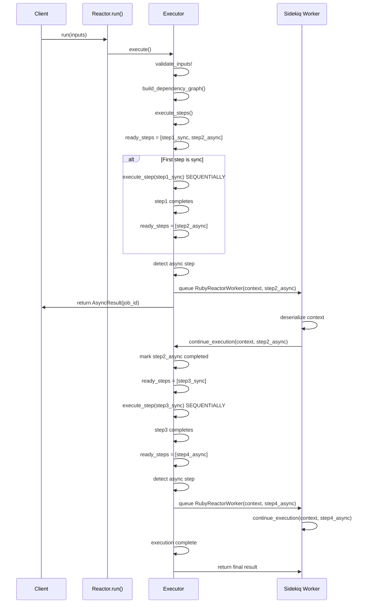
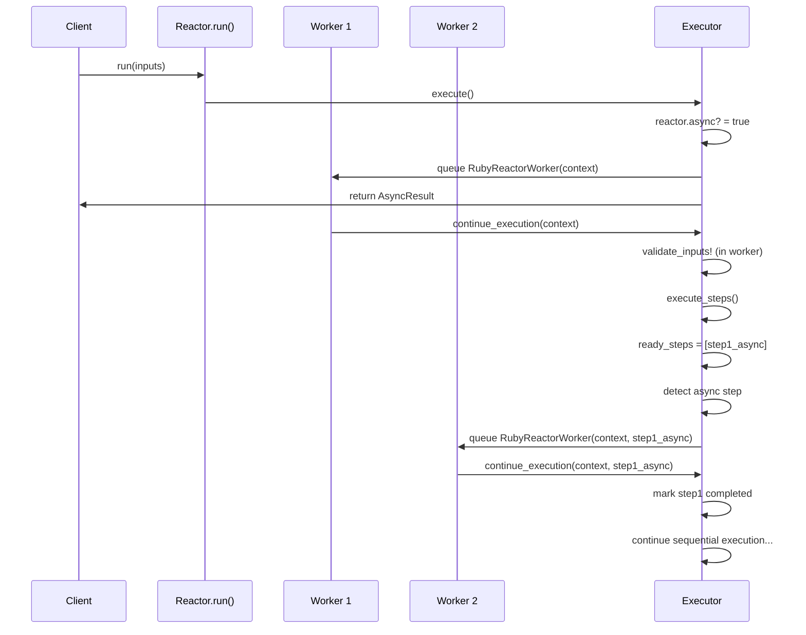
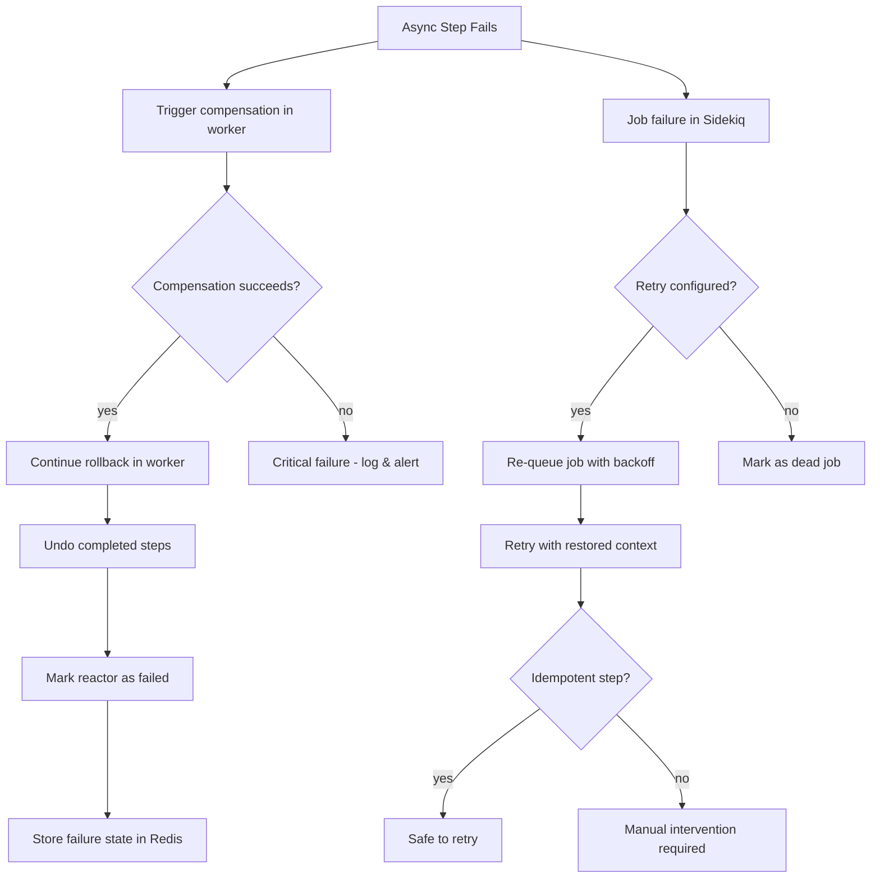
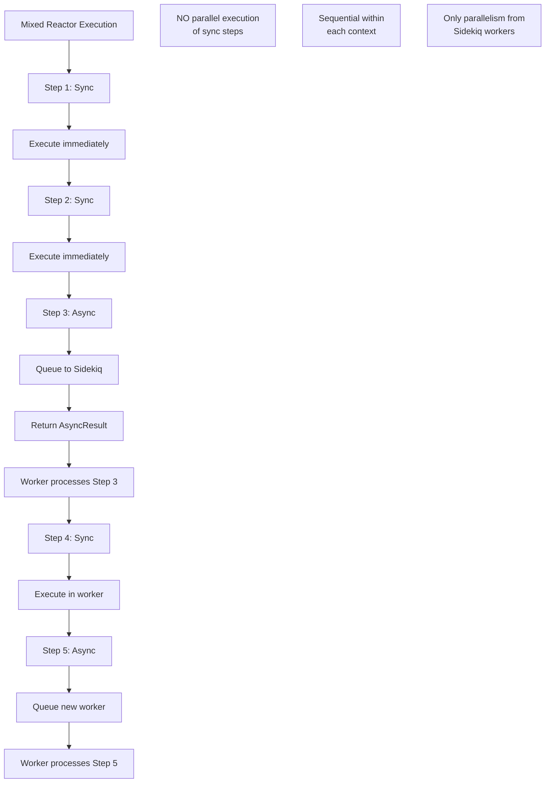
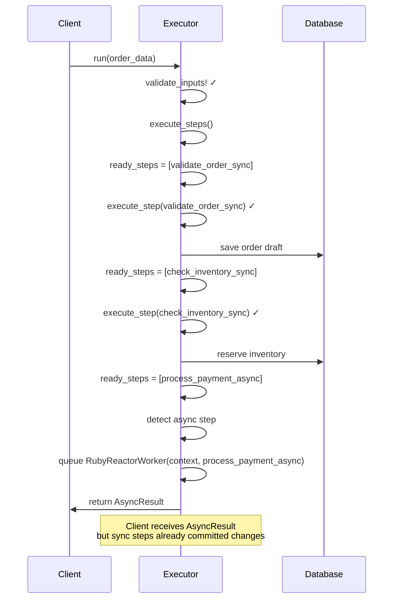
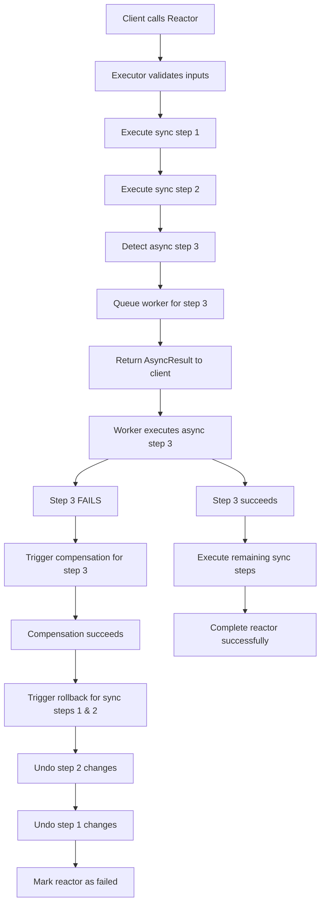
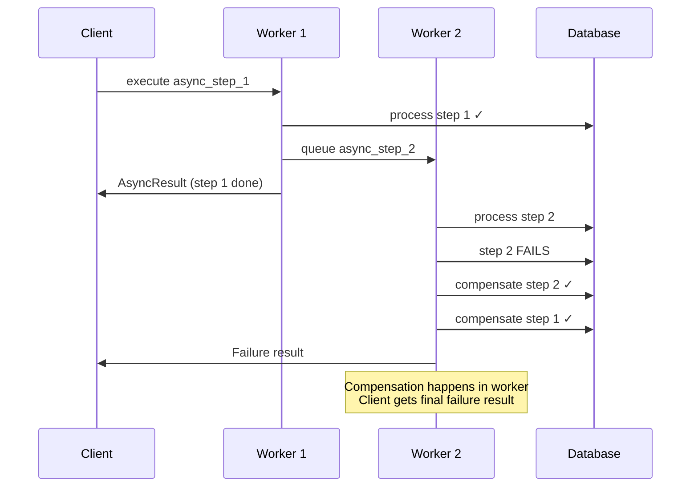
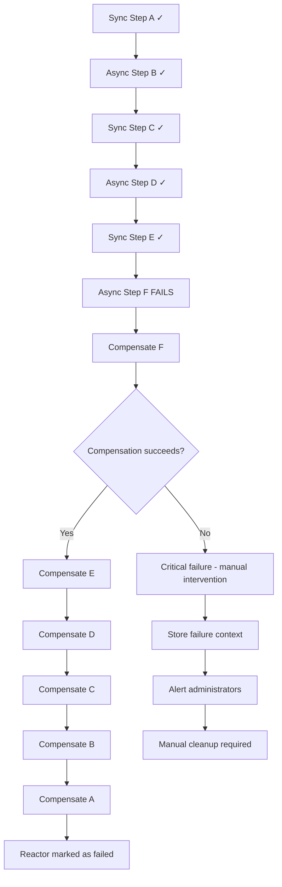
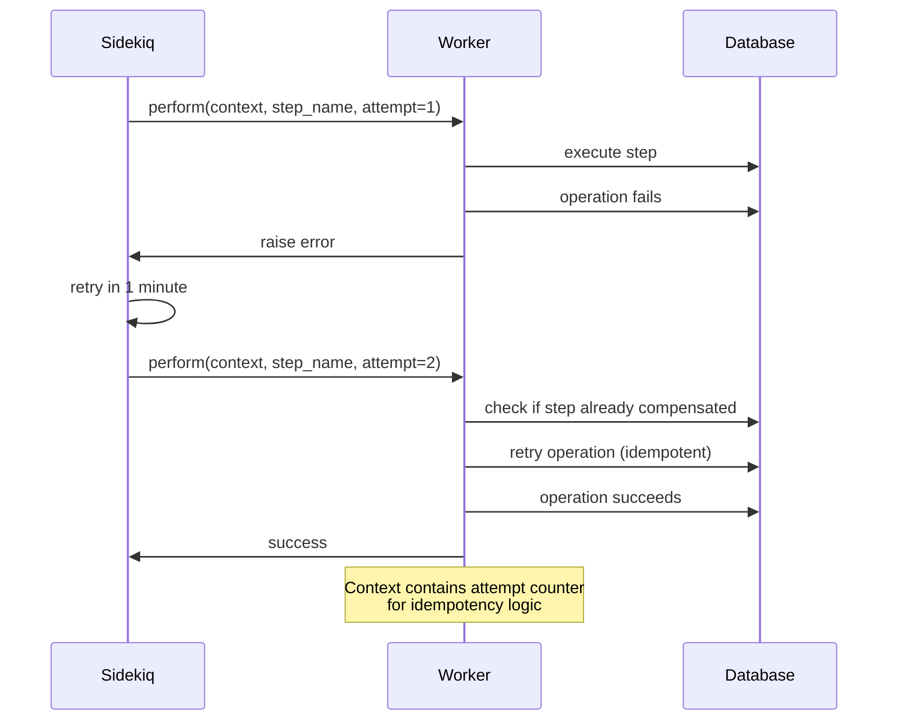
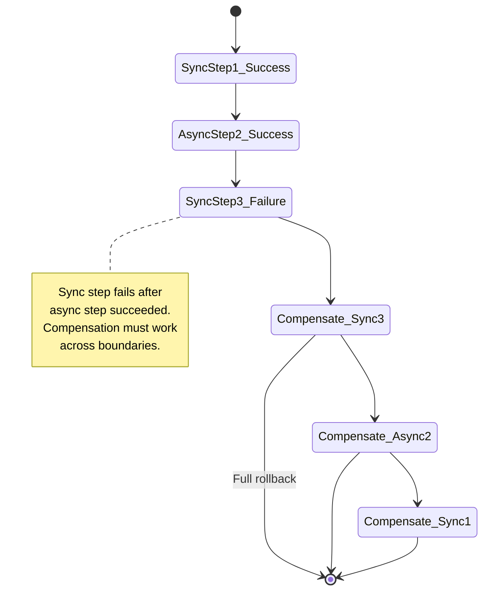

# Sidekiq Integration Implementation Plan

## Executive Summary

This document provides a detailed implementation plan for Sidekiq integration in RubyReactor. The integration introduces async step execution while maintaining sequential processing and reliability guarantees.

**Key Principles:**
- **Sequential Execution**: No parallel execution of sync steps - everything remains sequential
- **Async Handoff**: First async step triggers complete switch to background processing
- **Worker Chaining**: Multiple async steps create chained Sidekiq workers
- **Reliability First**: Compensation and rollback work across async boundaries

**Clarification on Execution Model:**
- **NO parallel execution** of sync steps - this was the source of ambiguity in the original document
- **ONLY parallelism** comes from Sidekiq workers processing different parts of the same reactor execution
- **Sequential processing** is maintained within each execution context (sync or async worker)

## Architecture Overview

### Execution Models

#### Synchronous Reactor (Current)
```mermaid
graph TD
    A[Reactor.run()] --> B[Executor.initialize]
    B --> C[validate_inputs!]
    C --> D[build_dependency_graph]
    D --> E[execute_steps loop]
    E --> F{ready_steps?}
    F -->|yes| G[execute_step sequentially]
    G --> H[resolve_arguments]
    H --> I[run_step_implementation]
    I --> J{result?}
    J -->|Success| K[set_result & complete_step]
    J -->|Failure| L[compensate & rollback]
    K --> F
    F -->|no| M[return final result]
```

#### Asynchronous Reactor (New)
```mermaid
graph TD
    A[Reactor.run()] --> B{reactor.async?}
    B -->|no| C[validate_inputs! synchronously]
    B -->|yes| D[queue RubyReactorWorker with validation]

    C --> E[execute_steps loop]
    D --> F[RubyReactorWorker]
    F --> G[validate_inputs! in worker]

    E --> H{step.async?}
    G --> H

    H -->|no| I[execute_step synchronously]
    H -->|yes| J[serialize context]
    J --> K[queue RubyReactorWorker]
    K --> L[return AsyncResult]

    I --> M[handle result]
    M --> N{next steps ready?}
    N -->|async steps| O[queue additional workers]
    N -->|sync steps| P[execute in current context]
    N -->|done| Q[return final result]

    O --> R[RubyReactorWorker continues]
    R --> N
```

## Implementation Phases

### Phase 1: Core Infrastructure

#### 1.1 Add Dependencies
Update `ruby_reactor.gemspec`:
```ruby
spec.add_dependency "sidekiq", "~> 7.0"
spec.add_dependency "redis", "~> 5.0"
```

#### 1.2 Extend DSL for Async Support

**Reactor DSL Extension:**
```ruby
module RubyReactor
  module Dsl
    module Reactor
      module ClassMethods
        def async(async_flag = true)
          @async = async_flag
        end

        def async?
          @async ||= false
        end
      end
    end
  end
end
```

**Step DSL Extension:**
```ruby
class StepBuilder
  def initialize(name, impl = nil, async: false)
    @async = async
    # ... existing code
  end

  def async(async_flag = true)
    @async = async_flag
  end
end

class StepConfig
  attr_reader :async

  def initialize(config)
    @async = config[:async] || false
    # ... existing code
  end

  def async?
    @async
  end
end
```

#### 1.3 Context Serialization
```ruby
class Context
  def serialize
    {
      inputs: @inputs,
      intermediate_results: @intermediate_results,
      reactor_class: @reactor_class.name,
      completed_steps: @completed_steps.to_a,
      step_results: @step_results
    }.to_json
  end

  def self.deserialize(json_data)
    data = JSON.parse(json_data)
    context = new(data['inputs'])
    context.instance_variable_set(:@intermediate_results, data['intermediate_results'])
    context.instance_variable_set(:@reactor_class, Object.const_get(data['reactor_class']))
    context.instance_variable_set(:@completed_steps, Set.new(data['completed_steps']))
    context.instance_variable_set(:@step_results, data['step_results'])
    context
  end
end
```

#### 1.4 Create Sidekiq Worker
```ruby
class RubyReactorWorker
  include Sidekiq::Worker

  def perform(serialized_context, current_step_name = nil)
    context = Context.deserialize(serialized_context)
    executor = Executor.new(context.reactor_class, context.inputs)
    executor.continue_execution(context, current_step_name)
  end
end
```

### Phase 2: Executor Modifications

#### 2.1 Async Detection and Handoff
```ruby
class Executor
  def execute
    validate_inputs!
    build_dependency_graph
    validate_graph!

    if reactor_class.async?
      # Async reactor: validate in worker
      queue_async_execution(nil)
      return RubyReactor::AsyncResult.new(job_id: job_id)
    else
      # Sync reactor: validate here, execute synchronously
      execute_steps
    end
  end

  def execute_steps
    until dependency_graph.all_completed?
      ready_steps = dependency_graph.ready_steps

      if ready_steps.empty?
        raise Error::DependencyError.new(
          "No ready steps available but execution not complete",
          context: context
        )
      end

      # Check for async step - switch to background processing
      async_step = ready_steps.find(&:async?)
      if async_step
        queue_async_execution(async_step)
        return RubyReactor::AsyncResult.new(job_id: job_id)
      end

      # Execute sync steps sequentially (NO PARALLELISM)
      ready_steps.each do |step_config|
        execute_step(step_config)
      end
    end

    # Return final result
    final_result
  end

  def continue_execution(restored_context, completed_step_name = nil)
    @context = restored_context
    @dependency_graph = build_dependency_graph_from_context

    # Mark completed step as done (if continuing from async step)
    dependency_graph.complete_step(completed_step_name) if completed_step_name

    execute_steps
  end
end
```

#### 2.2 Worker Queuing Logic
```ruby
class Executor
  private

  def queue_async_execution(async_step)
    serialized_context = context.serialize
    job_id = if async_step
      # Queue specific async step
      RubyReactorWorker.perform_async(serialized_context, async_step.name)
    else
      # Queue reactor validation and execution
      RubyReactorWorker.perform_async(serialized_context)
    end

    # Store job_id for tracking
    context.set_job_id(job_id)
    job_id
  end
end
```

### Phase 3: Complex Execution Flows

#### 3.1 Mixed Sync/Async Reactor Flow


#### 3.2 Async Reactor Flow (validation in worker)


#### 3.3 Failure and Compensation Flow


#### 3.4 Sequential Processing Guarantee


### Phase 4: Error Handling & Reliability

#### 4.1 Job Failure Handling
```ruby
class RubyReactorWorker
  include Sidekiq::Worker

  sidekiq_options retry: 3, dead: true

  sidekiq_retries_exhausted do |msg, ex|
    # Handle exhausted retries
    context_data = msg['args'].first
    context = Context.deserialize(context_data)

    # Mark reactor as failed
    mark_reactor_failed(context, ex)
  end

  def perform(serialized_context, current_step_name = nil)
    # Implementation with error handling
  rescue StandardError => e
    handle_worker_error(e, serialized_context, current_step_name)
    raise
  end
end
```

#### 4.2 Context Persistence for Recovery
```ruby
class Context
  def save_to_redis(job_id)
    Redis.current.setex(
      "ruby_reactor:context:#{job_id}",
      24.hours.to_i,
      serialize
    )
  end

  def self.load_from_redis(job_id)
    json_data = Redis.current.get("ruby_reactor:context:#{job_id}")
    deserialize(json_data) if json_data
  end
end
```

### Phase 5: Testing Strategy

#### 5.1 Unit Tests
- Test DSL extensions (`async true`, `step :name, async: true`)
- Test context serialization/deserialization
- Test executor async detection logic

#### 5.2 Integration Tests
- Test mixed sync/async reactor execution
- Test worker chaining scenarios
- Test failure and compensation across async boundaries

#### 5.3 Async Test Helpers
```ruby
module AsyncTestHelper
  def wait_for_async_completion(job_id, timeout: 30)
    # Poll for completion or implement webhook/callback system
  end

  def assert_async_result(job_id, expected_result)
    # Verify final async execution result
  end
end
```

## DSL Usage Examples

### Mixed Sync/Async Reactor
```ruby
class OrderProcessingReactor < RubyReactor::Reactor
  input :order_id
  input :customer_id

  # Sync step - fast validation
  step :validate_order do
    argument :order_id, input(:order_id)
    run do |args|
      # Quick validation
      RubyReactor.Success(order_data)
    end
  end

  # Async step - external API call
  step :check_inventory, async: true do
    argument :order, result(:validate_order)
    run do |args|
      # Slow external API call
      inventory_check(args[:order])
    end
  end

  # Sync step - depends on async result
  step :calculate_shipping do
    argument :inventory, result(:check_inventory)
    run do |args|
      # Fast calculation
      RubyReactor.Success(shipping_cost)
    end
  end

  # Another async step
  step :process_payment, async: true do
    argument :total, result(:calculate_shipping)
    run do |args|
      # External payment processing
      payment_result(args[:total])
    end
  end

  returns :process_payment
end
```

### Fully Async Reactor
```ruby
class BatchProcessingReactor < RubyReactor::Reactor
  async true  # All validation and execution in workers

  input :batch_id

  step :load_batch_data, async: true do
    # Implementation
  end

  step :process_items, async: true do
    # Implementation
  end

  step :generate_report do  # Sync step in worker
    # Implementation
  end
end
```

## Risk Mitigation

### High Priority Risks
1. **Context Serialization**: Complex objects may not serialize properly
   - **Mitigation**: Implement custom serialization for known complex types

2. **Race Conditions**: Multiple workers accessing shared resources
   - **Mitigation**: Redis-based locking for shared state mutations

3. **Compensation Complexity**: Rolling back across async boundaries
   - **Mitigation**: Store compensation state in Redis, implement distributed rollback

### Monitoring & Observability
- Track async execution flows with correlation IDs
- Implement execution timeline logging
- Add health checks for worker queues
- Provide async execution status APIs

## Success Criteria

1. **Reliability**: Zero data corruption in async execution scenarios
2. **Performance**: Async overhead < 10% for typical use cases
3. **Observability**: Full visibility into async execution flows
4. **Error Handling**: Proper compensation and rollback in all failure scenarios
5. **Backward Compatibility**: All existing sync reactors work unchanged

## State Persistence Considerations

### Redis Storage Decision

**Current Proposal**: Store execution state in Redis for recovery and monitoring.

**Alternative**: Pass context as worker argument only, no Redis persistence.

**Analysis**:

**Arguments FOR Redis Storage:**
- **Job Recovery**: Failed jobs can be inspected and manually recovered
- **Monitoring**: Track progress of long-running async operations
- **Debugging**: Inspect state of failed operations
- **Retry Safety**: Complex retry scenarios with state inspection

**Arguments AGAINST Redis Storage:**
- **Simplicity**: Context argument is sufficient for sequential execution
- **Performance**: No additional Redis round-trips
- **Reduced Complexity**: One less failure point
- **Idempotency**: If steps are properly designed, retries don't need persisted state

**Recommendation**: Start with context-only approach. Add Redis persistence only if strong monitoring/debugging requirements emerge.

**Implementation without Redis:**
```ruby
class RubyReactorWorker
  include Sidekiq::Worker

  sidekiq_options retry: 3, dead: false  # No dead queue, fail fast

  def perform(serialized_context, current_step_name = nil, attempt = 1)
    context = Context.deserialize(serialized_context)
    executor = Executor.new(context.reactor_class, context.inputs)

    # Add attempt tracking to context for idempotency
    context.attempt = attempt

    executor.continue_execution(context, current_step_name)
  rescue StandardError => e
    # Log failure with context for manual inspection if needed
    log_async_failure(context, current_step_name, e, attempt)
    raise
  end
end
```

## Rollback Scenarios & Execution Flows

### Scenario 1: Sync Step Fails Before Async Step

**Flow**: Sync validation → Sync processing → **FAIL** → Rollback (no async involved)



**Problem**: Changes from sync steps are committed before async handoff. If async step fails later, sync changes remain.

### Scenario 2: Async Step Fails - Compensation Required

**Flow**: Sync steps succeed → Async step fails → Compensation across sync/async boundary



### Scenario 3: Multiple Async Steps with Cascading Failure

**Flow**: Async step 1 succeeds → Async step 2 fails → Compensation chain



### Scenario 4: Async Step Fails Mid-Chain - Complex Rollback

**Flow**: Multiple completed steps before failure → Distributed rollback



### Scenario 5: Retry Logic with Context Preservation

**Flow**: Async step fails → Sidekiq retry → Context preserved for idempotent retry



### Scenario 6: Partial Success with Mixed Sync/Async

**Flow**: Some steps succeed, some fail → Complex compensation state



## Rollback Implementation Considerations

### Context Tracking for Compensation

```ruby
class Context
  def initialize(inputs)
    @completed_steps = []
    @compensation_stack = []
    @failure_context = nil
  end

  def mark_step_completed(step_name, result)
    @completed_steps << step_name
    @compensation_stack << {
      step: step_name,
      result: result,
      timestamp: Time.now
    }
  end

  def record_failure(step_name, error)
    @failure_context = {
      step: step_name,
      error: error,
      completed_steps: @completed_steps.dup,
      compensation_stack: @compensation_stack.dup
    }
  end
end
```

### Distributed Compensation Strategy

```ruby
class Executor
  def handle_async_failure(error, failed_step, context)
    # Step 1: Compensate the failed async step
    compensation_result = compensate_step(failed_step, error, context)

    case compensation_result
    when RubyReactor::Success
      # Step 2: Continue rollback of previous steps
      rollback_completed_steps(context)
      RubyReactor::Failure("Async step '#{failed_step}' failed: #{error}")
    when RubyReactor::Failure
      # Step 3: Compensation failed - critical error
      handle_compensation_failure(failed_step, error, compensation_result.error, context)
    end
  end

  def rollback_completed_steps(context)
    context.compensation_stack.reverse_each do |step_info|
      undo_step(step_info[:step], step_info[:result])
    end
  end
end
```

## Risk Assessment - Rollback Scenarios

### High Risk Scenarios:
1. **Async step fails after sync steps committed changes**
   - **Impact**: Data inconsistency
   - **Mitigation**: Design reactors to minimize sync commits before async steps

2. **Compensation fails during rollback**
   - **Impact**: Inconsistent state with no clear recovery
   - **Mitigation**: Implement compensation failure handling with alerts

3. **Multiple workers attempting compensation simultaneously**
   - **Impact**: Race conditions during rollback
   - **Mitigation**: Single-writer principle - only one worker handles rollback

### Medium Risk Scenarios:
1. **Long-running compensations blocking worker**
   - **Impact**: Worker timeout, job failure
   - **Mitigation**: Implement async compensation for long operations

2. **Complex dependency chains in rollback**
   - **Impact**: Rollback order issues
   - **Mitigation**: Maintain strict compensation ordering

## Updated Implementation Timeline

**Week 1-2**: Core Infrastructure (DSL + Context Serialization)
**Week 3**: Basic Async Execution (no Redis)
**Week 4**: Rollback Implementation & Testing
**Week 5**: Complex Scenarios & Performance Testing

## Decision Points

1. **Redis Storage**: Implement monitoring hooks but start without Redis persistence
2. **Compensation Strategy**: Implement synchronous compensation in workers
3. **Error Handling**: Fail fast on compensation failures with detailed logging
4. **Retry Logic**: Use Sidekiq's built-in retry with attempt counter in context

Would you like me to proceed with implementing the basic async infrastructure without Redis storage first?


