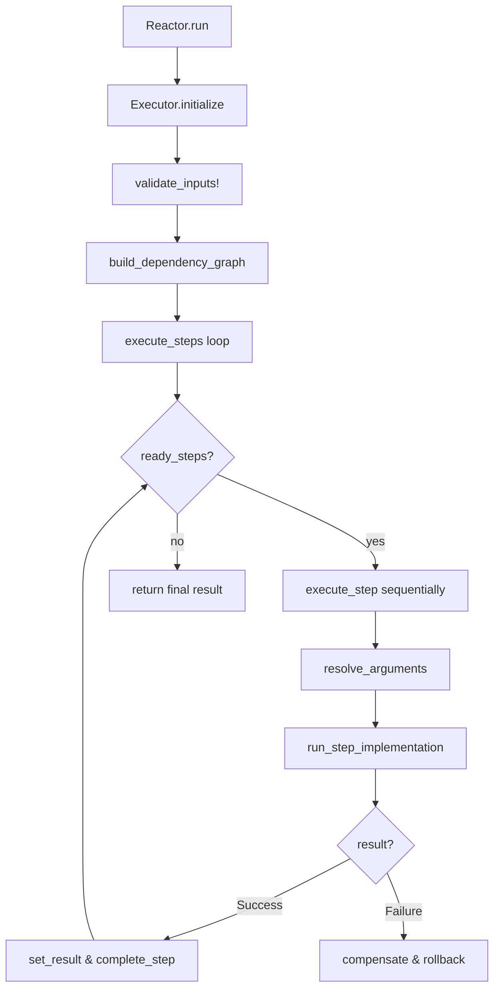
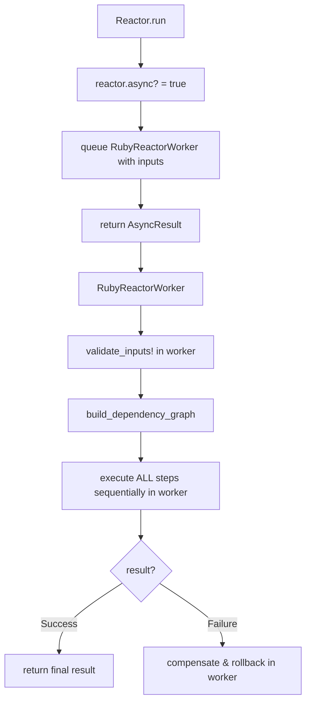
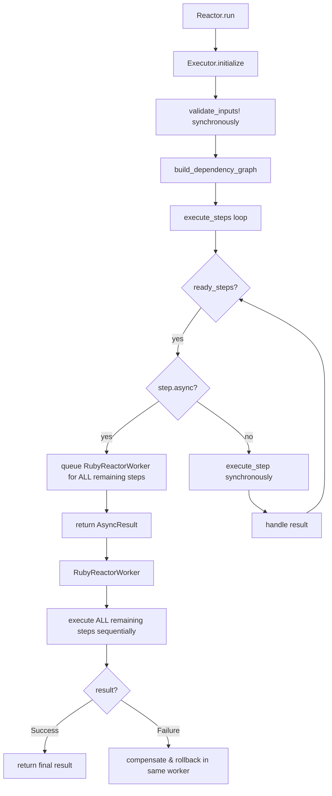

# Non-Blocking Retry Mechanism for RubyReactor Sidekiq Integration

## Executive Summary

This document provides the complete implementation plan for RubyReactor's Sidekiq integration with non-blocking retry mechanism. The integration introduces two distinct async execution models: full reactor async and step-level async, with a sophisticated retry system that requeues jobs instead of blocking worker threads.

**Key Principles:**
- **Sequential Execution**: No parallel execution of steps - everything remains sequential
- **Two Async Models**: Reactor-level async vs step-level async with different handoff behaviors
- **Non-Blocking Retries**: Jobs are requeued for retries instead of blocking with sleep()
- **Single Worker Model**: All execution after handoff happens in one worker
- **Reliability First**: Compensation and rollback work within appropriate execution contexts

**Two Types of Async:**

1. **Full Async Reactor**: When reactor is marked `async true`
   - Input validation happens in Sidekiq worker
   - All execution (validation + steps) in background

2. **Step-Level Async**: When individual steps are marked `async: true`
   - Reactor executes synchronously until first async step
   - First async step triggers handoff to single worker for all remaining execution
   - Compensations and undo run in the same worker if failure occurs

**Non-Blocking Retry Strategy:**
- **Step-Level Retry**: Configurable retry behavior per step (max_attempts, backoff, idempotency)
- **Job Requeuing**: Failed steps trigger job requeuing with calculated delays
- **Context Preservation**: Execution state maintained across requeues
- **Idempotency Focus**: Make individual steps idempotent rather than entire reactor

## Retry Configuration Design

### Step-Level Retry DSL

```ruby
class StepBuilder
  def retry(max_attempts: 3, backoff: :exponential, base_delay: 1.second, idempotent: false)
    @retry_config = {
      max_attempts: max_attempts,
      backoff: backoff, # :exponential, :linear, :fixed
      base_delay: base_delay,
      idempotent: idempotent
    }
  end

  def idempotent(idempotent = true)
    @retry_config ||= {}
    @retry_config[:idempotent] = idempotent
  end
end

class StepConfig
  attr_reader :retry_config

  def initialize(config)
    @retry_config = config[:retry_config] || { max_attempts: 1, idempotent: false }
  end

  def retryable?
    retry_config[:max_attempts] > 1
  end

  def idempotent?
    retry_config[:idempotent]
  end
end
```

### Reactor-Level Retry DSL

```ruby
module RubyReactor
  module Dsl
    module Reactor
      module ClassMethods
        def retry_defaults(max_attempts: 3, backoff: :exponential, base_delay: 1.second)
          @retry_defaults = {
            max_attempts: max_attempts,
            backoff: backoff,
            base_delay: base_delay
          }
        end

        def retry_defaults
          @retry_defaults ||= { max_attempts: 1, backoff: :exponential, base_delay: 1.second }
        end
      end
    end
  end
end
```

### Usage Examples

```ruby
class OrderProcessingReactor < RubyReactor::Reactor
  # Reactor-level defaults
  retry_defaults max_attempts: 5, backoff: :exponential, base_delay: 2.seconds

  step :validate_order do
    # Inherits reactor defaults: 5 attempts, exponential backoff
    run { validate_order_logic }
  end

  step :check_inventory, async: true do
    retries max_attempts: 10, backoff: :linear, base_delay: 5.seconds, idempotent: true
    # Custom retry: 10 attempts, linear backoff, marked as idempotent
    run { inventory_check }
  end

  step :process_payment do
    idempotent true  # Mark as idempotent but use reactor defaults
    run { payment_processing }
  end

  step :send_notification do
    # No retry - critical step that should fail fast
    run { send_email }
  end
end
```

## Non-Blocking Retry Implementation

### Retry Context Structure

```ruby
class RetryContext
  attr_accessor :step_attempts
  attr_accessor :current_step
  attr_accessor :failure_reason
  attr_accessor :next_retry_at

  def initialize
    @step_attempts = Hash.new(0)  # step_name => attempt_count
    @current_step = nil
    @failure_reason = nil
    @next_retry_at = nil
  end

  def retry_attempt_for_step(step_name)
    @step_attempts[step_name]
  end

  def increment_attempt_for_step(step_name)
    @step_attempts[step_name] += 1
  end

  def can_retry_step?(step_config)
    retry_attempt_for_step(step_config.name) < step_config.retry_config[:max_attempts]
  end
end
```

### Enhanced Context Serialization

```ruby
class Context
  attr_accessor :retry_context

  def initialize(inputs)
    @inputs = inputs
    @intermediate_results = {}
    @completed_steps = Set.new
    @step_results = {}
    @retry_context = RetryContext.new
    @execution_metadata = {
      job_id: nil,
      started_at: Time.now,
      reactor_class: nil
    }
  end

  def serialize_for_retry
    {
      inputs: @inputs,
      intermediate_results: @intermediate_results,
      completed_steps: @completed_steps.to_a,
      step_results: @step_results,
      retry_context: {
        step_attempts: @retry_context.step_attempts,
        current_step: @retry_context.current_step,
        failure_reason: @retry_context.failure_reason&.to_s,
        next_retry_at: @retry_context.next_retry_at
      },
      execution_metadata: @execution_metadata,
      reactor_class_name: @reactor_class.name
    }.to_json
  end

  def self.deserialize_from_retry(json_data)
    data = JSON.parse(json_data)
    context = new(data['inputs'])

    # Restore execution state
    context.instance_variable_set(:@intermediate_results, data['intermediate_results'])
    context.instance_variable_set(:@completed_steps, Set.new(data['completed_steps']))
    context.instance_variable_set(:@step_results, data['step_results'])
    context.instance_variable_set(:@execution_metadata, data['execution_metadata'])

    # Restore reactor class
    reactor_class = Object.const_get(data['reactor_class_name'])
    context.instance_variable_set(:@reactor_class, reactor_class)

    # Restore retry context
    retry_data = data['retry_context']
    context.retry_context.step_attempts = retry_data['step_attempts']
    context.retry_context.current_step = retry_data['current_step']
    context.retry_context.failure_reason = retry_data['failure_reason']
    context.retry_context.next_retry_at = retry_data['next_retry_at']

    context
  end
end
```

### Non-Blocking Executor

```ruby
class Executor
  def execute_step_with_retry(step_config, context)
    context.retry_context.current_step = step_config.name

    begin
      Sidekiq.logger.info("Executing step '#{step_config.name}' - attempt #{context.retry_context.retry_attempt_for_step(step_config.name) + 1}")

      result = execute_step_implementation(step_config, context)

      if result.success?
        Sidekiq.logger.info("Step '#{step_config.name}' completed successfully")
        mark_step_completed(step_config.name, result)
        context.retry_context.current_step = nil
        return result
      else
        raise StepExecutionError.new(result.error)
      end

    rescue StepExecutionError => e
      Sidekiq.logger.warn("Step '#{step_config.name}' failed: #{e.message}")

      if context.retry_context.can_retry_step?(step_config)
        requeue_job_for_step_retry(context, step_config, e)
        return RubyReactor::RetryQueuedResult.new(
          step: step_config.name,
          next_attempt_at: context.retry_context.next_retry_at
        )
      else
        Sidekiq.logger.error("Step '#{step_config.name}' exhausted all retry attempts")
        context.retry_context.current_step = nil
        raise e
      end
    end
  end

  def calculate_backoff_delay(retry_config, attempt)
    base_delay = retry_config[:base_delay]
    backoff = retry_config[:backoff]

    case backoff
    when :exponential
      base_delay * (2 ** (attempt - 1))
    when :linear
      base_delay * attempt
    when :fixed
      base_delay
    else
      base_delay
    end
  end

  private

  def requeue_job_for_step_retry(context, step_config, error)
    attempt = context.retry_context.retry_attempt_for_step(step_config.name) + 1
    delay = calculate_backoff_delay(step_config.retry_config, attempt)

    # Update retry context
    context.retry_context.increment_attempt_for_step(step_config.name)
    context.retry_context.failure_reason = error
    context.retry_context.next_retry_at = Time.now + delay

    # Serialize and requeue
    serialized_context = context.serialize_for_retry

    Sidekiq.logger.info("Requeuing job for step '#{step_config.name}' retry #{attempt} in #{delay} seconds")

    RubyReactorWorker.perform_in(delay, serialized_context)
  end
end
```

**Sidekiq Interface Visibility:**
- Each retry attempt is logged with `Sidekiq.logger`, making it visible in the Sidekiq web UI job details
- Logs include step name, attempt number, success/failure status, and retry delays
- This provides full visibility into step-level retry behavior without relying on Sidekiq's job-level retry mechanism

### Enhanced Sidekiq Worker

```ruby
class RubyReactorWorker
  include Sidekiq::Worker

  # Enable Sidekiq retries for infrastructure failures only
  sidekiq_options retry: 3, dead: false

  sidekiq_retries_exhausted do |msg, ex|
    # Handle infrastructure failures (network, Redis, etc.)
    log_infrastructure_failure(msg, ex)
  end

  def perform(serialized_context)
    context = Context.deserialize_from_retry(serialized_context)

    # Resume execution from the failed step
    executor = Executor.new(context.reactor_class, context.inputs)
    executor.resume_execution(context)
  rescue StandardError => e
    # Log unexpected errors but don't retry - our custom logic handles retries
    log_unexpected_error(e, context)
    raise
  end
end
```

### Execution Resume Logic

```ruby
class Executor
  def resume_execution(context)
    if context.retry_context.current_step
      # Resume from a specific failed step
      resume_from_failed_step(context)
    else
      # Normal execution continuation
      execute_steps(context)
    end
  end

  def resume_from_failed_step(context)
    failed_step_name = context.retry_context.current_step
    failed_step_config = find_step_config(failed_step_name)

    Sidekiq.logger.info("Resuming execution from failed step '#{failed_step_name}'")

    # Re-execute the failed step with retry logic
    result = execute_step_with_retry(failed_step_config, context)

    if result.is_a?(RubyReactor::RetryQueuedResult)
      # Another retry was queued
      return result
    elsif result.success?
      # Step succeeded, continue with remaining steps
      execute_remaining_steps(context)
    else
      # Step failed permanently
      handle_final_failure(context, result)
    end
  end
end
```

## Architecture Overview

### Execution Models

#### Synchronous Reactor (Current)


#### Full Async Reactor (Reactor-level async)


#### Step-Level Async Reactor (Individual steps marked async)


## Implementation Phases

### Phase 1: Core Infrastructure

#### 1.1 Add Dependencies
Update `ruby_reactor.gemspec`:
```ruby
spec.add_dependency "sidekiq", "~> 7.0"
spec.add_dependency "redis", "~> 5.0"
```

#### 1.2 Extend DSL for Async Support

**Reactor DSL Extension:**
```ruby
module RubyReactor
  module Dsl
    module Reactor
      module ClassMethods
        def async(async_flag = true)
          @async = async_flag
        end

        def async?
          @async ||= false
        end
      end
    end
  end
end
```

**Step DSL Extension:**
```ruby
class StepBuilder
  def initialize(name, impl = nil, async: false)
    @async = async
    # ... existing code
  end

  def async(async_flag = true)
    @async = async_flag
  end
end

class StepConfig
  attr_reader :async

  def initialize(config)
    @async = config[:async] || false
    # ... existing code
  end

  def async?
    @async
  end
end
```

## Conclusion

The non-blocking retry mechanism provides significant performance and scalability improvements over the current blocking approach. By requeuing jobs instead of sleeping within workers, we can achieve better resource utilization while maintaining precise control over retry behavior.

The implementation requires careful handling of context serialization and execution resumption, but provides a solid foundation for reliable async execution with sophisticated retry capabilities.

## Next Steps

1. Implement core serialization infrastructure
2. Prototype non-blocking retry logic
3. Performance testing against blocking approach
4. Integration with existing Sidekiq worker architecture

```ruby
def execute_step_with_retry(step_config, context)
  begin
    result = execute_step_implementation(step_config, context)
    return result if result.success?
  rescue StepExecutionError => e
    if step_config.retryable? && context.retry_attempt_for_step(step_config.name) < step_config.max_attempts
      # Requeue job instead of sleeping
      requeue_job_for_retry(context, step_config, e)
      return RubyReactor::AsyncResult.new(status: :retry_queued)
    else
      raise e
    end
  end
end
```

## Available Sidekiq Retry Enhancement Gems

Research found several gems that could enhance Sidekiq's retry system:

### 1. sidekiq-retries (105,992 downloads)
- **Purpose**: Enhanced retry logic for Sidekiq workers
- **Features**: Custom retry strategies, backoff algorithms
- **Relevance**: Could provide sophisticated retry scheduling

### 2. sidekiq_unique_retries (57,229 downloads)
- **Purpose**: Uniqueness for Sidekiq retries
- **Features**: Prevents duplicate retry jobs
- **Relevance**: Useful for idempotent operations

### 3. sidekiq-expected_failures (24,942 downloads)
- **Purpose**: Handle exceptions without relying on Sidekiq's retry behavior
- **Features**: Custom failure handling, tracking
- **Relevance**: Alternative to built-in retry mechanism

### 4. sidekiq-retry_exceptions (5,481 downloads)
- **Purpose**: Job retrying without the noise
- **Features**: Quieter retry logging
- **Relevance**: Better observability

### Recommendation: Build Custom Solution

Rather than depending on external gems, implement a custom non-blocking retry system that integrates tightly with RubyReactor's execution model.

## Implementation Architecture

### Retry Context Structure

```ruby
class RetryContext
  attr_accessor :step_attempts
  attr_accessor :current_step
  attr_accessor :failure_reason
  attr_accessor :next_retry_at

  def initialize
    @step_attempts = Hash.new(0)  # step_name => attempt_count
    @current_step = nil
    @failure_reason = nil
    @next_retry_at = nil
  end

  def retry_attempt_for_step(step_name)
    @step_attempts[step_name]
  end

  def increment_attempt_for_step(step_name)
    @step_attempts[step_name] += 1
  end

  def can_retry_step?(step_config)
    retry_attempt_for_step(step_config.name) < step_config.retry_config[:max_attempts]
  end
end
```

### Enhanced Context Serialization

```ruby
class Context
  attr_accessor :retry_context

  def initialize(inputs)
    @inputs = inputs
    @intermediate_results = {}
    @completed_steps = Set.new
    @step_results = {}
    @retry_context = RetryContext.new
    @execution_metadata = {
      job_id: nil,
      started_at: Time.now,
      reactor_class: nil
    }
  end

  def serialize_for_retry
    {
      inputs: @inputs,
      intermediate_results: @intermediate_results,
      completed_steps: @completed_steps.to_a,
      step_results: @step_results,
      retry_context: {
        step_attempts: @retry_context.step_attempts,
        current_step: @retry_context.current_step,
        failure_reason: @retry_context.failure_reason&.to_s,
        next_retry_at: @retry_context.next_retry_at
      },
      execution_metadata: @execution_metadata,
      reactor_class_name: @reactor_class.name
    }.to_json
  end

  def self.deserialize_from_retry(json_data)
    data = JSON.parse(json_data)
    context = new(data['inputs'])

    # Restore execution state
    context.instance_variable_set(:@intermediate_results, data['intermediate_results'])
    context.instance_variable_set(:@completed_steps, Set.new(data['completed_steps']))
    context.instance_variable_set(:@step_results, data['step_results'])
    context.instance_variable_set(:@execution_metadata, data['execution_metadata'])

    # Restore reactor class
    reactor_class = Object.const_get(data['reactor_class_name'])
    context.instance_variable_set(:@reactor_class, reactor_class)

    # Restore retry context
    retry_data = data['retry_context']
    context.retry_context.step_attempts = retry_data['step_attempts']
    context.retry_context.current_step = retry_data['current_step']
    context.retry_context.failure_reason = retry_data['failure_reason']
    context.retry_context.next_retry_at = retry_data['next_retry_at']

    context
  end
end
```

### Non-Blocking Executor

```ruby
class Executor
  def execute_step_with_retry(step_config, context)
    context.retry_context.current_step = step_config.name

    begin
      Sidekiq.logger.info("Executing step '#{step_config.name}' - attempt #{context.retry_context.retry_attempt_for_step(step_config.name) + 1}")

      result = execute_step_implementation(step_config, context)

      if result.success?
        Sidekiq.logger.info("Step '#{step_config.name}' completed successfully")
        mark_step_completed(step_config.name, result)
        context.retry_context.current_step = nil
        return result
      else
        raise StepExecutionError.new(result.error)
      end

    rescue StepExecutionError => e
      Sidekiq.logger.warn("Step '#{step_config.name}' failed: #{e.message}")

      if context.retry_context.can_retry_step?(step_config)
        requeue_job_for_step_retry(context, step_config, e)
        return RubyReactor::RetryQueuedResult.new(
          step: step_config.name,
          next_attempt_at: context.retry_context.next_retry_at
        )
      else
        Sidekiq.logger.error("Step '#{step_config.name}' exhausted all retry attempts")
        context.retry_context.current_step = nil
        raise e
      end
    end
  end

  private

  def requeue_job_for_step_retry(context, step_config, error)
    attempt = context.retry_context.retry_attempt_for_step(step_config.name) + 1
    delay = calculate_backoff_delay(step_config.retry_config, attempt)

    # Update retry context
    context.retry_context.increment_attempt_for_step(step_config.name)
    context.retry_context.failure_reason = error
    context.retry_context.next_retry_at = Time.now + delay

    # Serialize and requeue
    serialized_context = context.serialize_for_retry

    Sidekiq.logger.info("Requeuing job for step '#{step_config.name}' retry #{attempt} in #{delay} seconds")

    RubyReactorWorker.perform_in(delay, serialized_context)
  end
end
```

### Enhanced Sidekiq Worker

```ruby
class RubyReactorWorker
  include Sidekiq::Worker

  # Enable Sidekiq retries for infrastructure failures only
  sidekiq_options retry: 3, dead: false

  sidekiq_retries_exhausted do |msg, ex|
    # Handle infrastructure failures (network, Redis, etc.)
    log_infrastructure_failure(msg, ex)
  end

  def perform(serialized_context)
    context = Context.deserialize_from_retry(serialized_context)

    # Resume execution from the failed step
    executor = Executor.new(context.reactor_class, context.inputs)
    executor.resume_execution(context)
  rescue StandardError => e
    # Log unexpected errors but don't retry - our custom logic handles retries
    log_unexpected_error(e, context)
    raise
  end
end
```

### Execution Resume Logic

```ruby
class Executor
  def resume_execution(context)
    if context.retry_context.current_step
      # Resume from a specific failed step
      resume_from_failed_step(context)
    else
      # Normal execution continuation
      execute_steps(context)
    end
  end

  def resume_from_failed_step(context)
    failed_step_name = context.retry_context.current_step
    failed_step_config = find_step_config(failed_step_name)

    Sidekiq.logger.info("Resuming execution from failed step '#{failed_step_name}'")

    # Re-execute the failed step with retry logic
    result = execute_step_with_retry(failed_step_config, context)

    if result.is_a?(RubyReactor::RetryQueuedResult)
      # Another retry was queued
      return result
    elsif result.success?
      # Step succeeded, continue with remaining steps
      execute_remaining_steps(context)
    else
      # Step failed permanently
      handle_final_failure(context, result)
    end
  end
end
```

## Serialization Strategy for Retries

### Context Data Structure

```ruby
{
  "inputs": {
    "order_id": 123,
    "customer_id": 456
  },
  "intermediate_results": {
    "validate_order": {"status": "success", "order_data": {...}},
    "calculate_totals": {"status": "success", "total": 99.99}
  },
  "completed_steps": ["validate_order", "calculate_totals"],
  "step_results": {
    "validate_order": {...},
    "calculate_totals": {...}
  },
  "retry_context": {
    "step_attempts": {
      "check_inventory": 2,
      "process_payment": 0
    },
    "current_step": "check_inventory",
    "failure_reason": "Inventory service timeout",
    "next_retry_at": "2025-10-15T10:30:00Z"
  },
  "execution_metadata": {
    "job_id": "job_12345",
    "started_at": "2025-10-15T10:00:00Z",
    "reactor_class_name": "OrderProcessingReactor"
  }
}
```

### Serialization Considerations

1. **Complex Objects**: Use custom serialization for non-JSON-serializable objects
2. **Size Limits**: Redis has limits on job size - compress large contexts if needed
3. **Security**: Avoid serializing sensitive data, use references instead
4. **Versioning**: Include schema version for forward compatibility

### Custom Serialization Handlers

```ruby
class ContextSerializer
  def self.serialize_complex_object(obj)
    case obj
    when Time
      { "_type" => "time", "value" => obj.iso8601 }
    when BigDecimal
      { "_type" => "big_decimal", "value" => obj.to_s }
    when CustomDomainObject
      { "_type" => "custom_object", "id" => obj.id, "class" => obj.class.name }
    else
      obj
    end
  end

  def self.deserialize_complex_object(data)
    return data unless data.is_a?(Hash) && data["_type"]

    case data["_type"]
    when "time"
      Time.parse(data["value"])
    when "big_decimal"
      BigDecimal(data["value"])
    when "custom_object"
      Object.const_get(data["class"]).find(data["id"])
    else
      data
    end
  end
end
```

## Benefits of Non-Blocking Retry

### Performance Improvements

1. **Worker Efficiency**: Workers are freed immediately after requeuing, can process other jobs
2. **Scalability**: Handle more concurrent jobs with same worker pool
3. **Resource Utilization**: No threads blocked on sleep operations

### Reliability Improvements

1. **Timeout Prevention**: No risk of worker timeouts during long retry delays
2. **Better Monitoring**: Clear visibility into retry queues and delays
3. **Graceful Degradation**: Failed jobs don't consume worker resources indefinitely

### Operational Benefits

1. **Queue Management**: Retries visible in Sidekiq queues with proper scheduling
2. **Backoff Control**: Precise control over retry timing and backoff strategies
3. **Cancellation Support**: Ability to cancel retry chains if needed

## Implementation Phases

### Phase 1: Core Infrastructure
- Implement `RetryContext` class
- Add serialization methods to `Context`
- Create `RubyReactor::RetryQueuedResult` class

### Phase 2: Non-Blocking Executor
- Modify `execute_step_with_retry` to requeue instead of sleep
- Implement `requeue_job_for_step_retry` method
- Add `resume_execution` logic

### Phase 3: Enhanced Worker
- Update `RubyReactorWorker` to handle retry contexts
- Implement proper error handling and logging
- Add retry exhaustion handling

### Phase 4: Testing & Monitoring
- Unit tests for serialization/deserialization
- Integration tests for retry scenarios
- Monitoring and alerting for retry patterns

## Risk Assessment

### High Risk
1. **Context Size**: Large execution contexts may exceed Redis limits
   - **Mitigation**: Implement compression, use external storage for large contexts

2. **Serialization Complexity**: Complex objects may not serialize properly
   - **Mitigation**: Custom serialization handlers, avoid serializing complex objects

### Medium Risk
1. **Retry Storm**: Too many rapid retries could overwhelm system
   - **Mitigation**: Implement circuit breakers, rate limiting

2. **State Inconsistency**: Context state could become inconsistent across retries
   - **Mitigation**: Validate context integrity, implement checksums

## Success Criteria

1. **Performance**: 0 blocked worker threads during retry delays
2. **Reliability**: Successful retry execution after context serialization/deserialization
3. **Observability**: Full visibility into retry attempts and timing
4. **Backward Compatibility**: Existing sync reactors work unchanged
5. **Scalability**: Linear scaling with worker pool size

## Alternative Approaches Considered

### 1. Sidekiq Scheduled Jobs
Use Sidekiq's built-in scheduling instead of custom requeuing:
- **Pros**: Leverages existing Sidekiq infrastructure
- **Cons**: Less control over retry logic, harder to integrate with step-level retries

### 2. External Retry Service
Dedicated service for managing retries:
- **Pros**: Complete separation of concerns
- **Cons**: Additional complexity, network overhead

### 3. Hybrid Approach
Use Sidekiq retries for infrastructure failures, custom logic for business logic retries:
- **Pros**: Best of both worlds
- **Cons**: Complex interaction between retry mechanisms

## Conclusion

The non-blocking retry mechanism provides significant performance and scalability improvements over the current blocking approach. By requeuing jobs instead of sleeping within workers, we can achieve better resource utilization while maintaining precise control over retry behavior.

The implementation requires careful handling of context serialization and execution resumption, but provides a solid foundation for reliable async execution with sophisticated retry capabilities.

## Next Steps

1. Implement core serialization infrastructure
2. Prototype non-blocking retry logic
3. Performance testing against blocking approach
4. Integration with existing Sidekiq worker architecture