# Sidekiq Integration Implementation Plan - Two Async Models

## Executive Summary

This document provides a detailed implementation plan for Sidekiq integration in RubyReactor. The integration introduces two distinct async execution models: full reactor async and step-level async.

**Key Principles:**
- **Sequential Execution**: No parallel execution of steps - everything remains sequential
- **Two Async Models**: Reactor-level async vs step-level async with different handoff behaviors
- **Simplified Architecture**: Single worker handles execution after handoff points
- **Reliability First**: Compensation and rollback work within appropriate execution contexts

**Two Types of Async:**

1. **Full Async Reactor**: When reactor is marked `async true`
   - Input validation happens in Sidekiq worker
   - All execution (validation + steps) in background

2. **Step-Level Async**: When individual steps are marked `async: true`
   - Reactor executes synchronously until first async step
   - First async step triggers handoff to single worker for all remaining execution
   - Compensations and undo run in the same worker if failure occurs

**Retry Strategy:**
- **Step-Level Retry**: Configurable retry behavior per step (max_attempts, backoff, idempotency)
- **Reactor-Level Retry**: Default retry settings for entire reactor execution
- **Custom Retry Logic**: Our own retry implementation instead of Sidekiq's job-level retries
- **Idempotency Focus**: Make individual steps idempotent rather than entire reactor

## Retry Configuration Design

### Step-Level Retry DSL

```ruby
class StepBuilder
  def retry(max_attempts: 3, backoff: :exponential, base_delay: 1.second, idempotent: false)
    @retry_config = {
      max_attempts: max_attempts,
      backoff: backoff, # :exponential, :linear, :fixed
      base_delay: base_delay,
      idempotent: idempotent
    }
  end

  def idempotent(idempotent = true)
    @retry_config ||= {}
    @retry_config[:idempotent] = idempotent
  end
end

class StepConfig
  attr_reader :retry_config

  def initialize(config)
    @retry_config = config[:retry_config] || { max_attempts: 1, idempotent: false }
  end

  def retryable?
    retry_config[:max_attempts] > 1
  end

  def idempotent?
    retry_config[:idempotent]
  end
end
```

### Reactor-Level Retry DSL

```ruby
module RubyReactor
  module Dsl
    module Reactor
      module ClassMethods
        def retry_defaults(max_attempts: 3, backoff: :exponential, base_delay: 1.second)
          @retry_defaults = {
            max_attempts: max_attempts,
            backoff: backoff,
            base_delay: base_delay
          }
        end

        def retry_defaults
          @retry_defaults ||= { max_attempts: 1, backoff: :exponential, base_delay: 1.second }
        end
      end
    end
  end
end
```

### Usage Examples

```ruby
class OrderProcessingReactor < RubyReactor::Reactor
  # Reactor-level defaults
  retry_defaults max_attempts: 5, backoff: :exponential, base_delay: 2.seconds

  step :validate_order do
    # Inherits reactor defaults: 5 attempts, exponential backoff
    run { validate_order_logic }
  end

  step :check_inventory, async: true do
    retry max_attempts: 10, backoff: :linear, base_delay: 5.seconds, idempotent: true
    # Custom retry: 10 attempts, linear backoff, marked as idempotent
    run { inventory_check }
  end

  step :process_payment do
    idempotent true  # Mark as idempotent but use reactor defaults
    run { payment_processing }
  end

  step :send_notification do
    # No retry - critical step that should fail fast
    run { send_email }
  end
end
```

### Custom Retry Implementation

Instead of Sidekiq's job-level retries, implement our own retry logic:

```ruby
class Executor
  def execute_step_with_retry(step_config, context)
    attempt = 1
    max_attempts = step_config.retry_config[:max_attempts]

    loop do
      begin
        result = execute_step_implementation(step_config, context)

        if result.success?
          mark_step_completed(step_config.name, result)
          return result
        else
          raise StepExecutionError.new(result.error)
        end

      rescue StepExecutionError => e
        if attempt < max_attempts && step_config.retryable?
          delay = calculate_backoff_delay(step_config.retry_config, attempt)
          sleep(delay) if delay > 0
          attempt += 1

          # Log retry attempt
          log_retry_attempt(step_config.name, attempt, max_attempts, e)

          # Reset any step-specific state if needed
          reset_step_state_for_retry(step_config, context) if step_config.idempotent?

          next
        else
          # Max attempts reached or not retryable
          raise e
        end
      end
    end
  end

  def calculate_backoff_delay(retry_config, attempt)
    base_delay = retry_config[:base_delay]
    backoff = retry_config[:backoff]

    case backoff
    when :exponential
      base_delay * (2 ** (attempt - 1))
    when :linear
      base_delay * attempt
    when :fixed
      base_delay
    else
      base_delay
    end
  end
end
```

### Sidekiq Worker Changes

Disable Sidekiq's built-in retry mechanism and rely on our custom logic:

```ruby
class RubyReactorWorker
  include Sidekiq::Worker

  # Disable Sidekiq retries - we handle our own
  sidekiq_options retry: 0, dead: false

  def perform(data, reactor_class_name = nil)
    # Our custom retry logic will handle failures within the job
    # If the entire reactor execution fails, we don't retry the job
    begin
      execute_reactor(data, reactor_class_name)
    rescue StandardError => e
      # Log the failure but don't retry the job
      # The reactor's retry logic should have already been exhausted
      log_reactor_failure(e, data, reactor_class_name)
      raise # Re-raise to mark job as failed
    end
  end
end
```

### Benefits of Step-Level Retry

1. **Fine-Grained Control**: Different retry strategies per step
2. **Idempotency Focus**: Make individual steps idempotent rather than entire reactor
3. **Better Error Handling**: Some steps can fail fast, others can retry aggressively
4. **Resource Efficiency**: Don't retry non-idempotent operations
5. **Observability**: Track retry attempts per step, not just per job

### Challenges & Considerations

1. **State Management**: How to handle partial state during retries?
   - **Solution**: Context tracks completed steps, retry resets step-specific state

2. **Compensation Interaction**: What happens to compensation when retries occur?
   - **Solution**: Compensation only triggers after all retries exhausted

3. **Timeout Management**: How do step-level retries interact with worker timeouts?
   - **Solution**: Configure worker timeouts > max retry time, track retry duration

4. **Monitoring**: How to track retry metrics per step?
   - **Solution**: Add retry counters to context, log retry attempts

5. **Backoff Strategy**: Which backoff algorithms to support?
   - **Solution**: Support exponential, linear, and fixed backoff

6. **Idempotency Enforcement**: How to ensure steps marked as idempotent actually are?
   - **Solution**: Documentation, testing, and runtime checks

### Implementation Questions

1. **Should non-idempotent steps be allowed to configure retries?**
   - Probably not - we should warn or prevent this

2. **How to handle step timeouts during retries?**
   - Individual step timeouts vs overall reactor timeout

3. **Should retry configuration be inherited from reactor defaults?**
   - Yes, with step-level overrides

4. **How to handle circuit breaker patterns for external service calls?**
   - Could be an extension of the retry logic

What do you think about these challenges? Which one should we tackle first in the implementation?

### Challenges & Considerations

1. **State Management**: How to handle partial state during retries?
2. **Compensation**: What happens to compensation when retries occur?
3. **Timeout**: How do step-level retries interact with worker timeouts?
4. **Monitoring**: How to track retry metrics per step?

What do you think about this approach? Should we implement the retry configuration at the step level first, or would you prefer to start with reactor-level defaults?

## Architecture Overview

### Execution Models

#### Synchronous Reactor (Current)
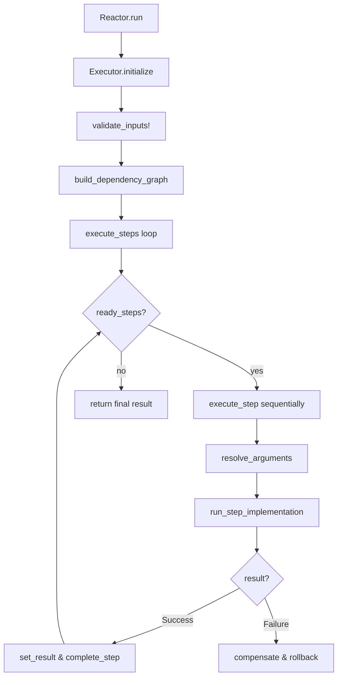

#### Full Async Reactor (Reactor-level async)
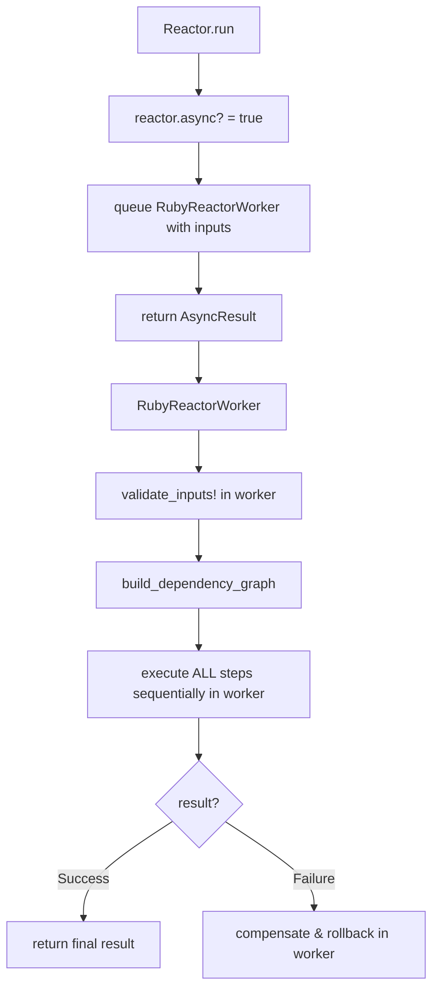

#### Step-Level Async Reactor (Individual steps marked async)
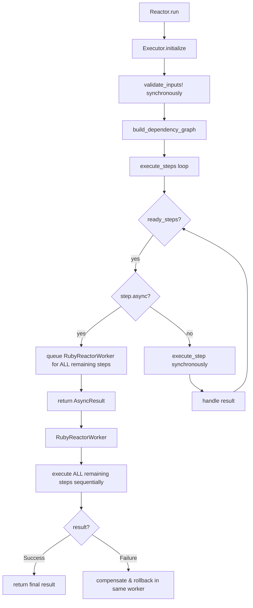

## Implementation Phases

### Phase 1: Core Infrastructure

#### 1.1 Add Dependencies
Update `ruby_reactor.gemspec`:
```ruby
spec.add_dependency "sidekiq", "~> 7.0"
spec.add_dependency "redis", "~> 5.0"
```

#### 1.2 Extend DSL for Async Support

**Reactor DSL Extension:**
```ruby
module RubyReactor
  module Dsl
    module Reactor
      module ClassMethods
        def async(async_flag = true)
          @async = async_flag
        end

        def async?
          @async ||= false
        end
      end
    end
  end
end
```

**Step DSL Extension:**
```ruby
class StepBuilder
  def initialize(name, impl = nil, async: false)
    @async = async
    # ... existing code
  end

  def async(async_flag = true)
    @async = async_flag
  end
end

class StepConfig
  attr_reader :async

  def initialize(config)
    @async = config[:async] || false
    # ... existing code
  end

  def async?
    @async
  end
end
```

#### 1.3 Context Serialization
```ruby
class Context
  def serialize
    {
      inputs: @inputs,
      intermediate_results: @intermediate_results,
      reactor_class: @reactor_class.name,
      completed_steps: @completed_steps.to_a,
      step_results: @step_results
    }.to_json
  end

  def self.deserialize(json_data)
    data = JSON.parse(json_data)
    context = new(data['inputs'])
    context.instance_variable_set(:@intermediate_results, data['intermediate_results'])
    context.instance_variable_set(:@reactor_class, Object.const_get(data['reactor_class']))
    context.instance_variable_set(:@completed_steps, Set.new(data['completed_steps']))
    context.instance_variable_set(:@step_results, data['step_results'])
    context
  end
end
```

#### 1.4 Create Sidekiq Worker
```ruby
class RubyReactorWorker
  include Sidekiq::Worker

  def perform(serialized_context)
    context = Context.deserialize(serialized_context)
    executor = Executor.new(context.reactor_class, context.inputs)
    executor.continue_execution(context)
  end
end
```

### Phase 2: Executor Modifications

#### 2.1 Two Async Models Implementation
```ruby
class Executor
  def execute
    if reactor_class.async?
      # Full async reactor: queue worker immediately, validation in worker
      queue_full_async_execution
      return RubyReactor::AsyncResult.new(job_id: job_id)
    else
      # Mixed/sync reactor: validate here, execute until first async step
      validate_inputs!
      build_dependency_graph
      validate_graph!
      execute_steps
    end
  end

  def execute_steps
    until dependency_graph.all_completed?
      ready_steps = dependency_graph.ready_steps

      if ready_steps.empty?
        raise Error::DependencyError.new(
          "No ready steps available but execution not complete",
          context: context
        )
      end

      # Check for async step - switch to background processing for ALL remaining steps
      async_step = ready_steps.find(&:async?)
      if async_step
        queue_step_async_execution
        return RubyReactor::AsyncResult.new(job_id: job_id)
      end

      # Execute sync steps sequentially (NO PARALLELISM)
      ready_steps.each do |step_config|
        execute_step_with_retry(step_config, context)
      end
    end

    # Return final result
    final_result
  end

  def continue_execution(restored_context)
    @context = restored_context
    @dependency_graph = build_dependency_graph_from_context

    # Execute ALL remaining steps in this single worker
    execute_steps
  end

  def execute_full_async
    # Called in worker for full async reactors
    validate_inputs!
    build_dependency_graph
    validate_graph!
    execute_steps
  end
end
```

#### 2.2 Worker Queuing Logic
```ruby
class Executor
  private

  def queue_full_async_execution
    # For full async reactors: pass inputs directly to worker
    serialized_inputs = context.inputs.to_json
    job_id = RubyReactorWorker.perform_async(serialized_inputs, reactor_class.name)

    # Store job_id for tracking
    context.set_job_id(job_id)
    job_id
  end

  def queue_step_async_execution
    # For step-level async: serialize full context after sync execution
    serialized_context = context.serialize
    job_id = RubyReactorWorker.perform_async(serialized_context)

    # Store job_id for tracking
    context.set_job_id(job_id)
    job_id
  end
end
```

#### 2.3 Updated Sidekiq Worker
```ruby
class RubyReactorWorker
  include Sidekiq::Worker

  def perform(data, reactor_class_name = nil)
    if reactor_class_name
      # Full async reactor: data is inputs, reactor_class_name provided
      reactor_class = Object.const_get(reactor_class_name)
      context = Context.new(JSON.parse(data))
      executor = Executor.new(reactor_class, context.inputs)
      executor.execute_full_async
    else
      # Step-level async: data is serialized context
      context = Context.deserialize(data)
      executor = Executor.new(context.reactor_class, context.inputs)
      executor.continue_execution(context)
    end
  end
end
```

### Phase 3: Execution Flows for Both Async Models

#### 3.1 Full Async Reactor Flow
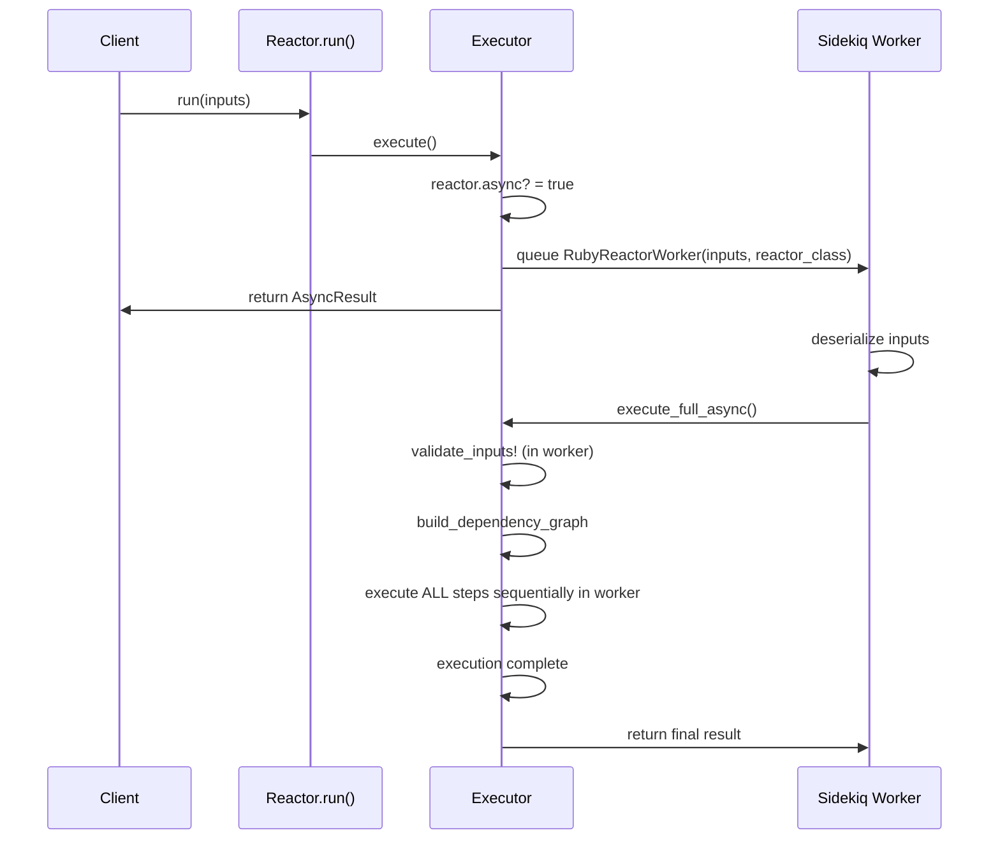

#### 3.2 Step-Level Async Reactor Flow
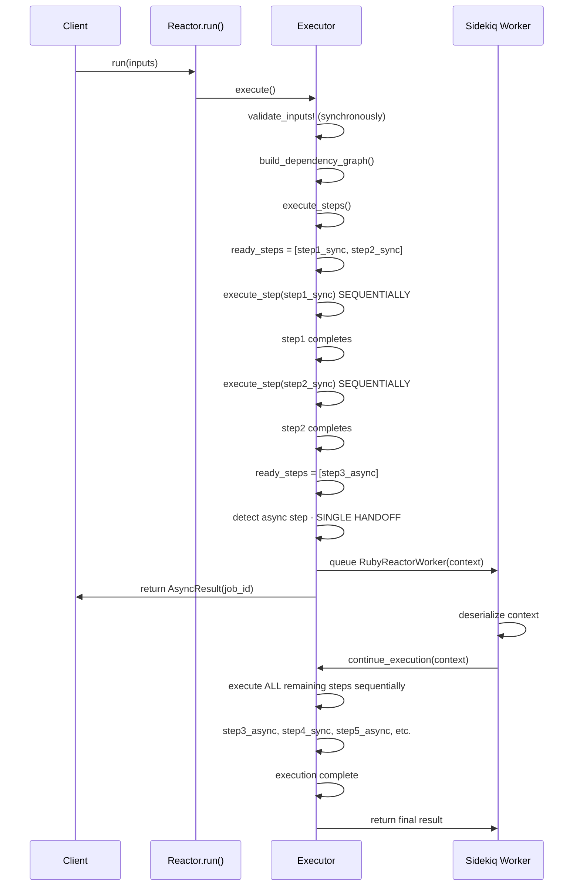

#### 3.3 Failure and Compensation Flow

**Full Async Reactor Failure:**
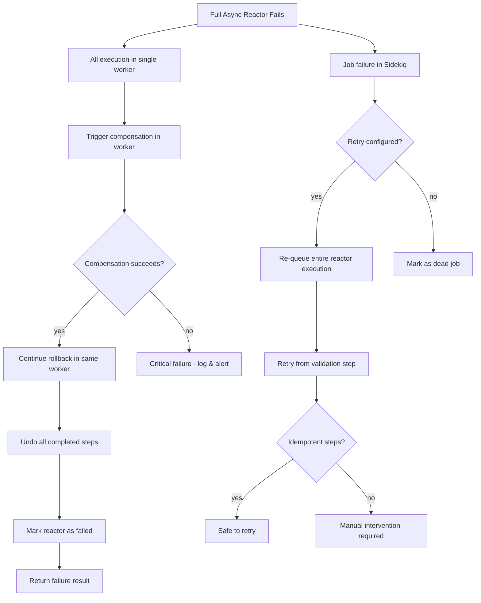

**Step-Level Async Reactor Failure:**
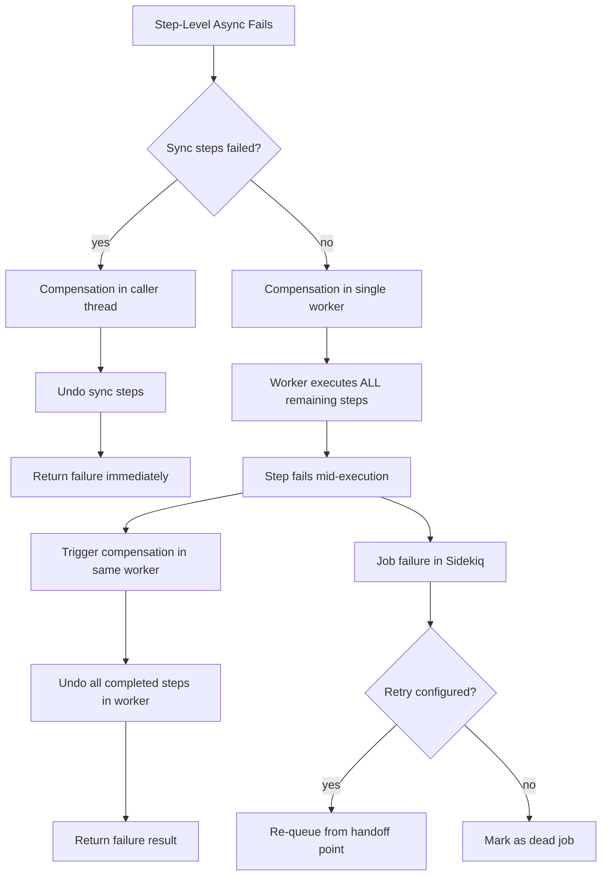

#### 3.4 Sequential Processing Guarantee
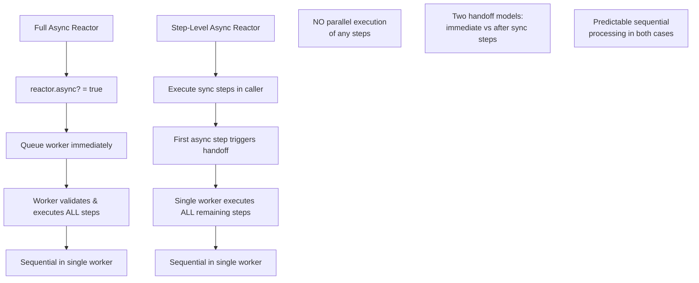

### Phase 4: Error Handling & Reliability

#### 4.1 Job Failure Handling
```ruby
class RubyReactorWorker
  include Sidekiq::Worker

  # Disable Sidekiq retries - we handle our own at step/reactor level
  sidekiq_options retry: 0, dead: false

  sidekiq_retries_exhausted do |msg, ex|
    # This should rarely happen since we handle retries internally
    # Log critical failure that bypassed our retry logic
    log_critical_failure(msg, ex)
  end

  def perform(data, reactor_class_name = nil)
    begin
      if reactor_class_name
        # Full async reactor: data is inputs, reactor_class_name provided
        reactor_class = Object.const_get(reactor_class_name)
        context = Context.new(JSON.parse(data))
        executor = Executor.new(reactor_class, context.inputs)
        executor.execute_full_async
      else
        # Step-level async: data is serialized context
        context = Context.deserialize(data)
        executor = Executor.new(context.reactor_class, context.inputs)
        executor.continue_execution(context)
      end
    rescue StandardError => e
      # Our custom retry logic should have handled all recoverable failures
      # This represents a critical failure that couldn't be recovered
      log_critical_reactor_failure(e, data, reactor_class_name)
      raise
    end
  end
end
```

#### 4.2 Context Persistence for Recovery
```ruby
class Context
  def save_to_redis(job_id)
    Redis.current.setex(
      "ruby_reactor:context:#{job_id}",
      24.hours.to_i,
      serialize
    )
  end

  def self.load_from_redis(job_id)
    json_data = Redis.current.get("ruby_reactor:context:#{job_id}")
    deserialize(json_data) if json_data
  end
end
```

### Phase 5: Testing Strategy

#### 5.1 Unit Tests
- Test DSL extensions (`async true`, `step :name, async: true`)
- Test context serialization/deserialization
- Test executor async detection logic
- Test single worker handoff behavior

#### 5.2 Integration Tests
- Test mixed sync/async reactor execution with single handoff
- Test fully async reactor execution
- Test failure and compensation within single worker context

#### 5.3 Async Test Helpers
```ruby
module AsyncTestHelper
  def wait_for_async_completion(job_id, timeout: 30)
    # Poll for completion or implement webhook/callback system
  end

  def assert_async_result(job_id, expected_result)
    # Verify final async execution result
  end
end
```

## DSL Usage Examples

### Full Async Reactor (Reactor-level async)
```ruby
class BatchProcessingReactor < RubyReactor::Reactor
  async true  # ENTIRE reactor runs in Sidekiq worker

  input :batch_id

  # ALL steps execute in worker, including input validation
  step :load_batch_data do
    argument :batch_id, input(:batch_id)
    run do |args|
      # External API call in worker
      load_data(args[:batch_id])
    end
  end

  step :process_items do
    argument :data, result(:load_batch_data)
    run do |args|
      # Processing in worker
      process_batch(args[:data])
    end
  end

  step :generate_report do
    argument :processed, result(:process_items)
    run do |args|
      # Report generation in worker
      create_report(args[:processed])
    end
  end

  returns :generate_report
end

# Usage:
result = BatchProcessingReactor.run(batch_id: 123)
# Returns AsyncResult immediately
# Input validation happens in worker
```

### Step-Level Async Reactor (Individual steps marked async)
```ruby
class OrderProcessingReactor < RubyReactor::Reactor
  # NO reactor-level async - validation happens synchronously

  input :order_id
  input :customer_id

  # Sync steps - execute in caller thread
  step :validate_order do
    argument :order_id, input(:order_id)
    run do |args|
      # Quick validation in caller
      RubyReactor.Success(order_data)
    end
  end

  step :calculate_totals do
    argument :order, result(:validate_order)
    run do |args|
      # Fast calculation in caller
      RubyReactor.Success(order_totals)
    end
  end

  # First async step - triggers handoff to single worker
  step :check_inventory, async: true do
    argument :order, result(:validate_order)
    run do |args|
      # Slow external API call - HANDOFF POINT
      # This and all subsequent steps run in worker
      inventory_check(args[:order])
    end
  end

  # All remaining steps execute in the single worker
  step :calculate_shipping do
    argument :inventory, result(:check_inventory)
    run do |args|
      # Fast calculation in worker
      RubyReactor.Success(shipping_cost)
    end
  end

  step :process_payment, async: true do
    argument :total, result(:calculate_shipping)
    run do |args|
      # External payment processing in worker
      payment_result(args[:total])
    end
  end

  step :send_confirmation do
    argument :payment, result(:process_payment)
    run do |args|
      # Send email in worker
      send_email(args[:payment])
    end
  end

  returns :send_confirmation
end

# Usage:
result = OrderProcessingReactor.run(order_id: 456, customer_id: 789)
# validate_order and calculate_totals run synchronously
# Returns AsyncResult after check_inventory is queued
# Remaining steps run in single worker
```

## Risk Mitigation

### High Priority Risks
1. **Context Serialization**: Complex objects may not serialize properly
   - **Mitigation**: Implement custom serialization for known complex types

2. **Worker Timeout**: Single worker executing many steps may timeout
   - **Mitigation**: Configure appropriate Sidekiq timeout, design reactors with reasonable total execution time

3. **Compensation Complexity**: Rolling back many steps in single worker
   - **Mitigation**: Maintain compensation stack, implement reliable rollback logic

### Monitoring & Observability
- Track async execution flows with correlation IDs
- Implement execution timeline logging
- Add health checks for worker queues
- Provide async execution status APIs

## Success Criteria

1. **Reliability**: Zero data corruption in async execution scenarios
2. **Performance**: Async overhead < 10% for typical use cases
3. **Observability**: Full visibility into async execution flows
4. **Error Handling**: Proper compensation and rollback in all failure scenarios
5. **Backward Compatibility**: All existing sync reactors work unchanged
6. **Simplicity**: Single worker model eliminates chaining complexity

## State Persistence Considerations

### Redis Storage Decision

**Current Proposal**: Store execution state in Redis for recovery and monitoring.

**Alternative**: Pass context as worker argument only, no Redis persistence.

**Analysis**:

**Arguments FOR Redis Storage:**
- **Job Recovery**: Failed jobs can be inspected and manually recovered
- **Monitoring**: Track progress of long-running async operations
- **Debugging**: Inspect state of failed operations
- **Retry Safety**: Complex retry scenarios with state inspection

**Arguments AGAINST Redis Storage:**
- **Simplicity**: Context argument is sufficient for sequential execution
- **Performance**: No additional Redis round-trips
- **Reduced Complexity**: One less failure point
- **Idempotency**: If steps are properly designed, retries don't need persisted state

**Recommendation**: Start with context-only approach. Add Redis persistence only if strong monitoring/debugging requirements emerge.

**Implementation without Redis:**
```ruby
class RubyReactorWorker
  include Sidekiq::Worker

  sidekiq_options retry: 3, dead: false  # No dead queue, fail fast

  def perform(serialized_context, attempt = 1)
    context = Context.deserialize(serialized_context)
    executor = Executor.new(context.reactor_class, context.inputs)

    # Add attempt tracking to context for idempotency
    context.attempt = attempt

    executor.continue_execution(context)
  rescue StandardError => e
    # Log failure with context for manual inspection if needed
    log_async_failure(context, e, attempt)
    raise
  end
end
```

## Rollback Scenarios & Execution Flows

## Rollback Scenarios & Execution Flows

### Full Async Reactor Scenarios

#### Scenario 1: Full Async Reactor Validation Fails

**Flow**: Input validation fails in worker → No execution, immediate failure

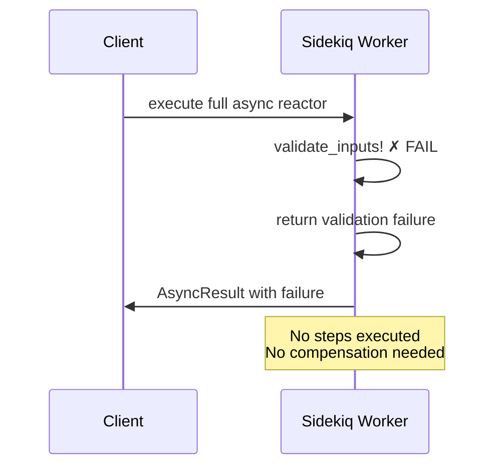

#### Scenario 2: Full Async Reactor Execution Fails

**Flow**: All execution in worker → Failure triggers compensation in same worker

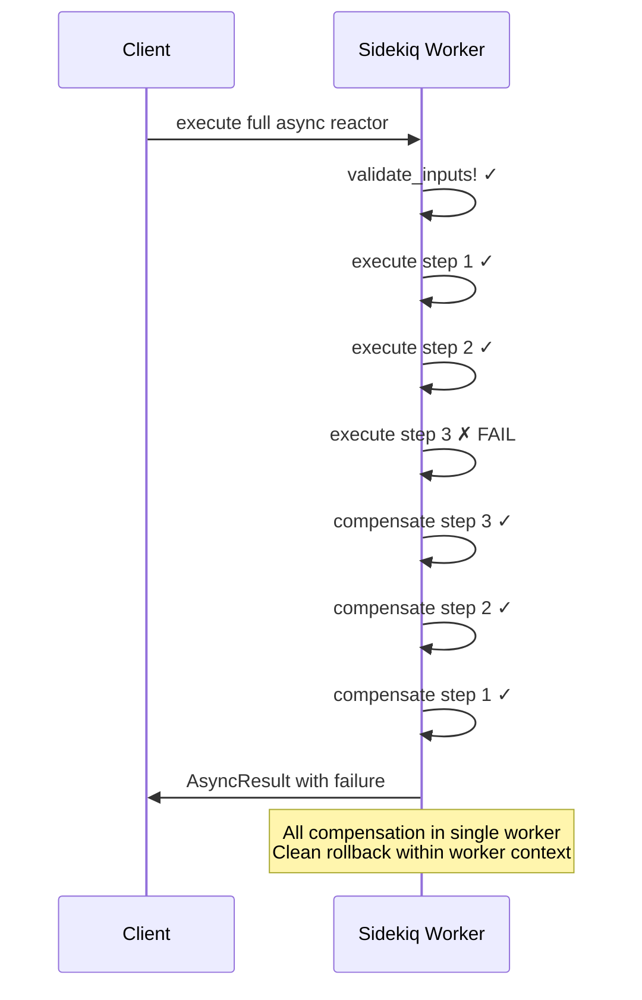

### Step-Level Async Reactor Scenarios

#### Scenario 3: Sync Steps Fail Before Handoff

**Flow**: Sync validation → Sync processing → **FAIL** → Rollback in caller thread

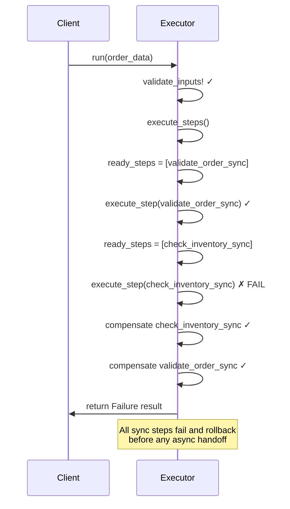

#### Scenario 4: Async Execution Fails After Handoff

**Flow**: Sync steps succeed → Handoff to worker → Worker execution fails → Compensation in worker

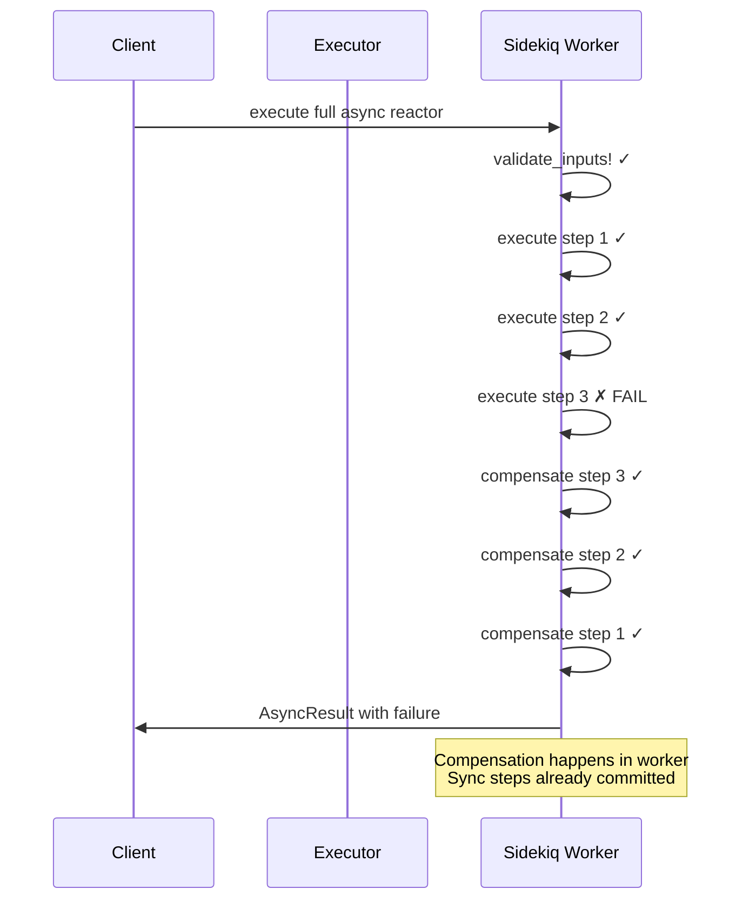

### Scenario 4: Complex Dependencies in Single Worker

**Flow**: Complex dependency graph executed sequentially in single worker

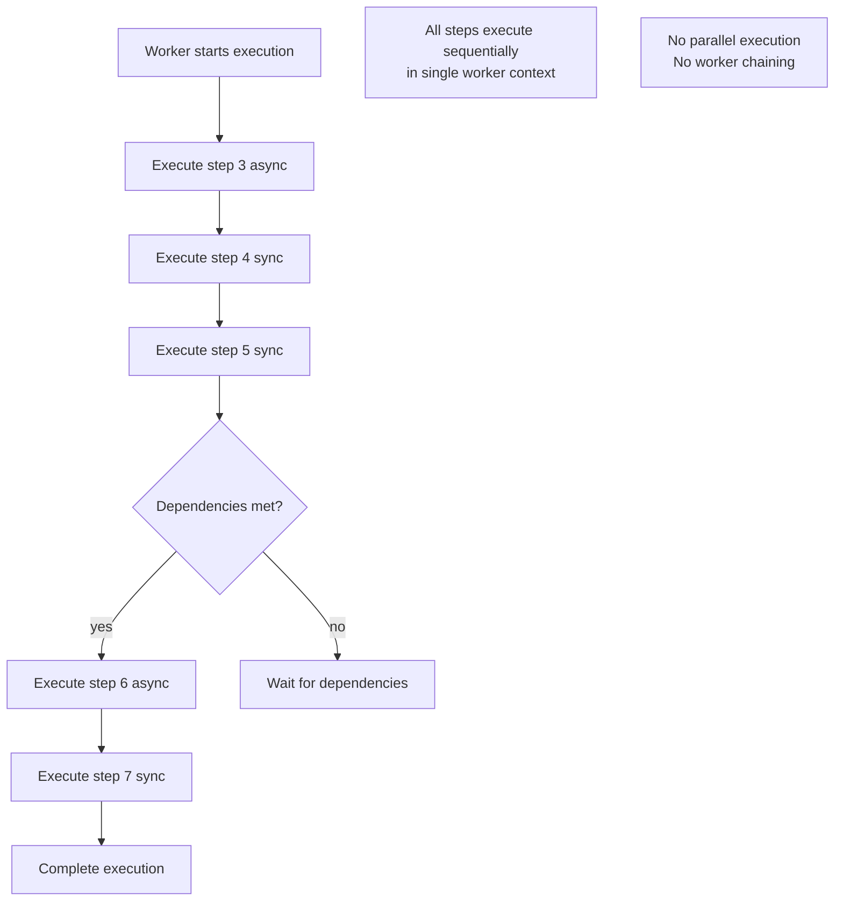

## Rollback Implementation Considerations

### Context Tracking for Compensation

```ruby
class Context
  def initialize(inputs)
    @completed_steps = []
    @compensation_stack = []
    @failure_context = nil
  end

  def mark_step_completed(step_name, result)
    @completed_steps << step_name
    @compensation_stack << {
      step: step_name,
      result: result,
      timestamp: Time.now
    }
  end

  def record_failure(step_name, error)
    @failure_context = {
      step: step_name,
      error: error,
      completed_steps: @completed_steps.dup,
      compensation_stack: @compensation_stack.dup
    }
  end
end
```

### Single Worker Compensation Strategy

```ruby
class Executor
  def handle_failure_in_worker(error, failed_step, context)
    # All compensation happens in the same worker
    rollback_completed_steps(context)
    RubyReactor::Failure("Step '#{failed_step}' failed: #{error}")
  end

  def rollback_completed_steps(context)
    context.compensation_stack.reverse_each do |step_info|
      undo_step(step_info[:step], step_info[:result])
    end
  end
end
```

## Risk Assessment - Single Worker Model

### High Risk Scenarios:
1. **Worker timeout with many steps**
   - **Impact**: Job failure after partial execution
   - **Mitigation**: Design reactors with reasonable execution time limits

2. **Compensation failure mid-rollback**
   - **Impact**: Inconsistent state
   - **Mitigation**: Implement robust compensation logic with error handling

### Medium Risk Scenarios:
1. **Large context serialization**
   - **Impact**: Memory and performance issues
   - **Mitigation**: Optimize serialization, consider Redis storage for large contexts

2. **Idempotency requirements**
   - **Impact**: Steps must be safely retryable
   - **Mitigation**: Design steps with idempotency in mind

## Benefits of Two Async Models

1. **Full Async Reactor**:
   - Immediate handoff for CPU-intensive or long-running reactors
   - Input validation in background (doesn't block caller)
   - All execution isolated in worker context
   - Suitable for batch processing, heavy computations

2. **Step-Level Async**:
   - Fast sync validation and initial processing in caller
   - Predictable handoff point based on step requirements
   - Mixed execution model for optimal performance
   - Suitable for user-facing operations with quick initial feedback

## Updated Implementation Timeline

**Week 1-2**: Core Infrastructure (DSL + Context Serialization + Step-Level Retry)
**Week 3**: Two Async Models Implementation
**Week 4**: Rollback Implementation & Testing
**Week 5**: Complex Scenarios & Performance Testing
**Week 6**: Retry Logic Integration & Idempotency Testing

## Decision Points

1. **Redis Storage**: Implement monitoring hooks but start without Redis persistence
2. **Compensation Strategy**: Implement synchronous compensation in workers
3. **Error Handling**: Fail fast on compensation failures with detailed logging
4. **Retry Logic**: Custom step-level retry instead of Sidekiq job-level retries
5. **Timeout Configuration**: Set reasonable worker timeouts based on expected execution times
6. **Idempotency**: Focus on making individual steps idempotent rather than entire reactors

Would you like me to proceed with implementing the step-level retry infrastructure first?</content>
<parameter name="filePath">/Users/artur.panach/dev/republic/ruby_reactor/tasks/sidekiq_integration_single_async.md
